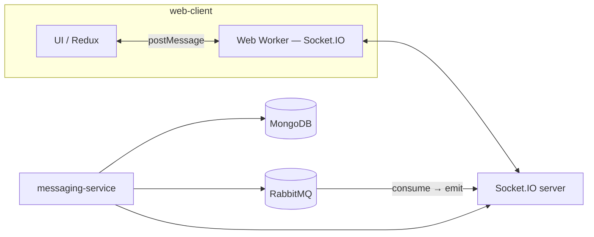
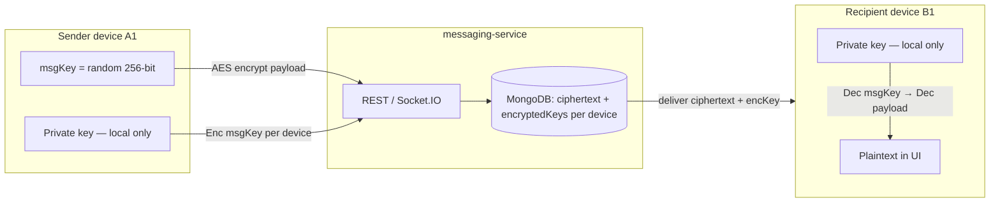
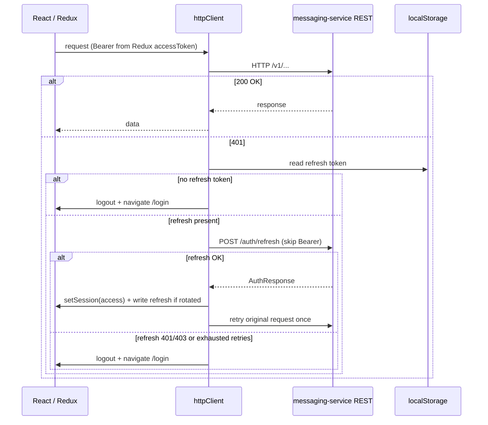
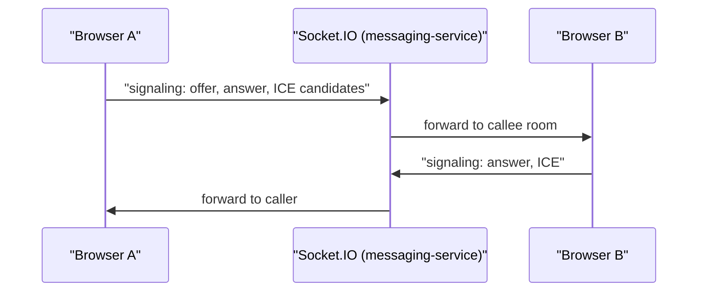
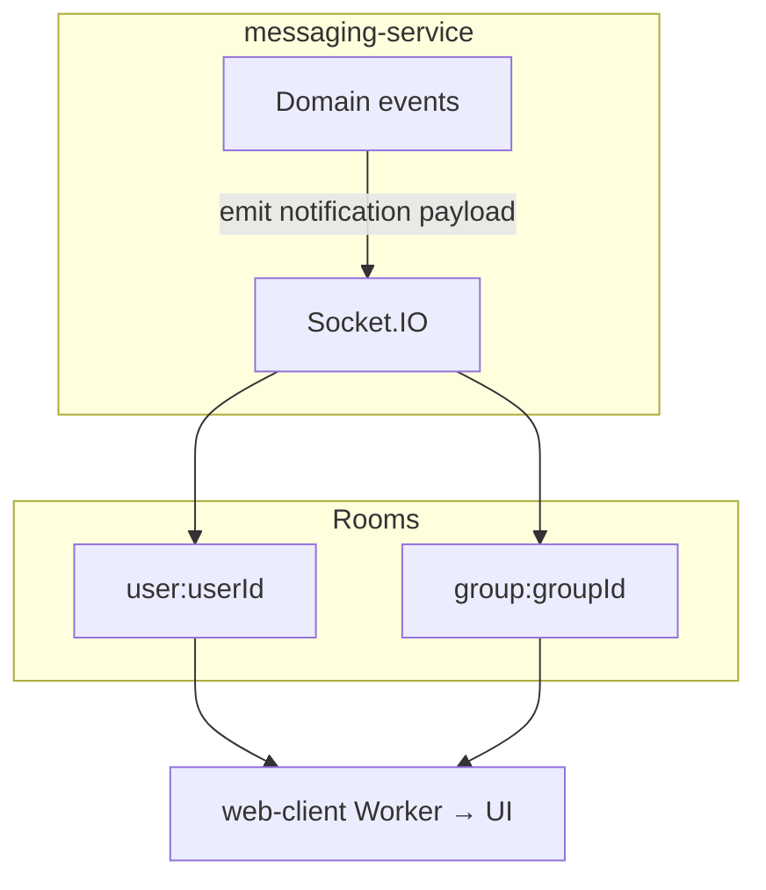

# Ekko

**Ekko is an open-source, end-to-end encrypted messaging platform** built for privacy-first teams and developers who want full control over their communication infrastructure. Self-host it on your own servers — your messages never touch a third-party service.

Real-time chat, presence indicators, media sharing, and 1:1 audio/video calls, with a horizontally scalable architecture that grows with you.

---

## Why Ekko?

Most messaging platforms ask you to trust them with your data. Ekko flips that model: private keys never leave devices, the server stores only ciphertext, and the entire stack is open source and auditable.

- **True E2EE** — AES-256-GCM message encryption; per-device keys; server is blind to message content
- **Self-hosted** — run on any Linux server; no vendor lock-in; your data, your rules
- **Horizontally scalable** — RabbitMQ-backed WebSocket fan-out means you add replicas without restructuring
- **OpenAPI-first** — every REST endpoint is formally specified; type-safe client generated from the spec
- **Production-ready stack** — MongoDB, Redis, RabbitMQ, S3-compatible storage, nginx — all wired together and documented

---

## Features

| Capability                                  | Status     |
| ------------------------------------------- | ---------- |
| Direct & group messaging                    | ✅ Live    |
| End-to-end encryption (hybrid, per-device)  | ✅ Live    |
| Real-time delivery via Socket.IO + RabbitMQ | ✅ Live    |
| Last-seen presence                          | ✅ Live    |
| Message delivery receipts                   | ✅ Live    |
| Media uploads (S3-compatible)               | ✅ Live    |
| User discovery                              | ✅ Live    |
| In-tab notifications                        | ✅ Live    |
| 1:1 audio/video (WebRTC, STUN/TURN)         | ✅ Live    |
| Guest sandbox sessions                      | ✅ Live    |
| JWT auth with refresh token rotation        | ✅ Live    |
| Rate limiting                               | ✅ Live    |
| Horizontal scaling (multi-replica)          | ✅ Live    |
| Group SFU video                             | 🗓 Roadmap |
| TLS termination (nginx)                     | 🗓 Roadmap |

---

## Architecture

Ekko is a two-app monorepo: a **React web client** and a single **Node.js microservice** (`messaging-service`). HTTP handles auth and CRUD; Socket.IO delivers live events. RabbitMQ sits between persistence and emission so multiple `messaging-service` replicas can share work without coupling the WebSocket layer to the database.

| Layer              | Technology                                                                                                                                               |
| ------------------ | -------------------------------------------------------------------------------------------------------------------------------------------------------- |
| **Client**         | React 18, Vite, TypeScript, Tailwind CSS, Redux Toolkit, React Router, Axios; Socket.IO client runs in a **Web Worker** to keep the UI thread responsive |
| **API**            | Node.js, Express, TypeScript; OpenAPI 3 spec in `docs/openapi/`; Swagger UI at `/api-docs`; `openapi-typescript` generates client types                  |
| **Real-time**      | Socket.IO server on `messaging-service`; chat, WebRTC signaling, and notifications on the same connection                                                |
| **Data**           | MongoDB (primary store), Redis (presence + rate limits), RabbitMQ (cross-replica message routing), S3-compatible object storage                          |
| **Infrastructure** | Docker Compose, nginx reverse proxy, optional coturn TURN server                                                                                         |

Full architecture, scaling strategy, and algorithms live in [`docs/PROJECT_PLAN.md`](docs/PROJECT_PLAN.md).

---

## Real-time messaging pipeline

Messages are written once to MongoDB, then routed through RabbitMQ so every replica can emit to local Socket.IO rooms — no Redis-backed room fan-out required. On the client, the Socket.IO connection runs in a Web Worker, communicating with Redux via `postMessage` to keep the UI thread free.



Adding replicas is a horizontal scale-out: each new `messaging-service` instance connects to RabbitMQ and can emit to any user or group room independently. See [`docs/PROJECT_PLAN.md §3.2`](docs/PROJECT_PLAN.md) for the full fan-out design.

---

## End-to-end encryption

Message payloads are opaque to the server at rest and on the wire. Each device generates a unique key pair locally. A random 256-bit symmetric key encrypts the message body once; that key is then wrapped separately for each recipient device using their public key. The server stores the single ciphertext plus a per-device map of encrypted message keys — it never holds a private key or plaintext.



Full protocol, send/receive flow, multi-device key re-sharing, and the sender-readable copy design are documented in [`docs/PROJECT_PLAN.md §7.1`](docs/PROJECT_PLAN.md).

---

## Authentication

Access tokens are held in memory (Redux). Refresh tokens use `localStorage`. The Axios client attaches `Authorization: Bearer` on every request, uses a mutex so concurrent 401s share one refresh attempt, retries up to three times with 1s spacing, and navigates to `/login` on hard failure.



---

## Audio & video calling (WebRTC)

1:1 calls use WebRTC with signaling over the same Socket.IO connection as chat — no separate signaling server needed. STUN is available by default; TURN is optional via the bundled coturn container or any managed provider.

| Mode      | Approach                                                  |
| --------- | --------------------------------------------------------- |
| **1:1**   | Offer / answer / ICE over Socket.IO; STUN + optional TURN |
| **Group** | SFU preferred at scale; mesh for small pilots (roadmap)   |



### WebRTC ports

| Surface                  | Default       | Protocol         | Notes                                             |
| ------------------------ | ------------- | ---------------- | ------------------------------------------------- |
| REST + Socket.IO (nginx) | `8080`        | TCP / WS upgrade | SPA, `/v1`, `/socket.io`, `/api-docs`             |
| WSS (production)         | `443`         | HTTPS / WSS      | TLS at nginx or load balancer                     |
| STUN / TURN (coturn)     | `3478`        | UDP + TCP        | Enable with `--profile turn`                      |
| TURN relay range         | `49152–49200` | UDP              | Must be open in firewall for restrictive networks |
| TURNS (optional prod)    | `5349`        | TCP / UDP        | Enable TLS in coturn for production               |

---

## In-tab notifications

There is no separate notification service. `messaging-service` emits a single Socket.IO event `notification` with a versioned, discriminated JSON payload (`schemaVersion`, `kind`, `notificationId`, `occurredAt`). The client Web Worker forwards payloads to the main thread. Scaling follows the same RabbitMQ fan-out pattern as messages.



---

## Getting started

### Requirements

- Node.js ≥ 20
- Docker + Docker Compose

### 1. Clone and install

```bash
git clone https://github.com/your-org/ekko.git
cd ekko
npm run install:all
```

Or install per app:

```bash
cd apps/web-client && npm install && cd ../..
cd apps/messaging-service && npm install && cd ../..
```

### 2. Configure environment

Copy the env templates and fill in your secrets:

```bash
cp apps/messaging-service/.env.example apps/messaging-service/.env
cp apps/web-client/.env.example apps/web-client/.env.development.local
cp infra/dev/.env.example infra/dev/.env
```

Key variables to set: `JWT_SECRET`, `MONGODB_URI`, `RABBITMQ_URL`, `REDIS_URL`. S3/MinIO, email, and WebRTC are pre-wired for local dev with defaults.

### 3. Build the client

```bash
cd apps/web-client && npm run build
```

This outputs static assets to `apps/web-client/dist/`, served by nginx.

### 4. Start the stack

```bash
docker compose -f infra/dev/docker-compose.yml up -d --build
```

| Service                    | URL                                            |
| -------------------------- | ---------------------------------------------- |
| Web app + API (nginx)      | http://localhost:8080                          |
| Swagger UI                 | http://localhost:8080/api-docs                 |
| Health check               | http://localhost:8080/v1/health                |
| messaging-service (direct) | http://localhost:3001                          |
| MongoDB                    | localhost:27017                                |
| Redis                      | localhost:6379                                 |
| RabbitMQ AMQP              | localhost:5672                                 |
| RabbitMQ management        | http://localhost:15672 (messaging / messaging) |
| MinIO S3 API               | localhost:9000                                 |
| MinIO console              | http://localhost:9001                          |

To enable WebRTC TURN locally:

```bash
docker compose -f infra/dev/docker-compose.yml --profile turn up -d
```

---

## Development

Per-app commands:

```bash
# web-client
cd apps/web-client
npm run dev          # Vite dev server
npm run typecheck
npm run lint
npm run build        # production build → dist/

# messaging-service
cd apps/messaging-service
npm run typecheck
npm run lint
npm run build
```

Root convenience scripts: `npm run lint:all`, `npm run typecheck:all`, `npm run format:check:all`.

**After changing the OpenAPI spec** (`docs/openapi/openapi.yaml`), regenerate client types:

```bash
cd apps/web-client && npm run generate:api
```

Use `npm run generate:api:check` in CI to catch drift.

---

## Testing

### Integration tests (automated)

Start the data services, then run the integration suite from `apps/messaging-service`:

```bash
docker compose -f infra/dev/docker-compose.yml up -d mongo redis rabbitmq

MESSAGING_INTEGRATION=1 npm run test:integration
```

The suite (`src/integration/messagingSocket.integration.test.ts`) creates two users, connects Socket.IO clients, sends messages via REST and the `message:send` event, and asserts the recipient receives `message:new` in real time — including multi-device E2EE key sync via `applyBatchSyncMessageKeys`.

If your local RabbitMQ credentials differ from the Compose defaults, set `MESSAGING_INTEGRATION_RABBITMQ_URL`.

### Manual testing (two browsers)

Start the full stack and open two browser profiles. Register and sign in as user A in one, user B in the other. Open a direct thread from A to B and send a message — B should receive it in real time. Confirm in DevTools → Network → WS → filter `socket.io`.

### Manual E2EE history test (same account, two devices)

Sign in as the same user in profile 1 (trusted device). Send at least one E2EE message. Open profile 2, sign in as the same user (registers a new device). Complete device key sync in profile 1. Return to profile 2 and confirm the earlier message decrypts correctly — verifying the full Web Crypto + IndexedDB path.

---

## Configuration reference

All secrets and runtime config are environment-variable driven. Never commit `.env` files.

| Scope                                                                                | File                                  |
| ------------------------------------------------------------------------------------ | ------------------------------------- |
| messaging-service (MongoDB, Redis, RabbitMQ, JWT, S3, rate limits, email, guest TTL) | `apps/messaging-service/.env.example` |
| web-client (public `VITE_*` variables, inlined at build time)                        | `apps/web-client/.env.example`        |
| Docker Compose (broker, MinIO, service wiring)                                       | `infra/dev/.env.example`              |

To add or rename a server-side variable: update `apps/messaging-service/src/config/env.ts` (Zod `loadEnv()`) and `apps/messaging-service/.env.example` together.

**E2EE and device keys** require a secure context (HTTPS or localhost) — Web Crypto and IndexedDB are browser security APIs.

## Load Test Results

Ekko was load tested on AWS (eu-north-1) using [k6](https://k6.io) with a custom Socket.IO driver, simulating real user behaviour: register, authenticate, open a WebSocket connection, send a message, and process the full delivery receipt chain (delivered → read → conversation:read).

### Infrastructure

| Component           | Instance              | Count                 |
| ------------------- | --------------------- | --------------------- |
| `messaging-service` | t3.small (2vCPU, 2GB) | 4 replicas behind ALB |
| MongoDB             | t3.small + gp3 EBS    | 1                     |
| RabbitMQ            | t3.small              | 1                     |
| Redis               | t3.small              | 1                     |

All replicas shared one RabbitMQ instance for cross-replica message fan-out. No Redis-backed Socket.IO room state — each replica subscribes to a per-user RabbitMQ queue on connect, enabling true stateless horizontal scaling.

### Methodology

Each k6 virtual user (VU) represents two real users — a sender (A) and a recipient (B). The test flow per VU:

1. Register and authenticate both users via REST
2. Open Socket.IO connections for both
3. A sends a message to B
4. B receives `message:new` and sends delivery receipts
5. A receives receipt confirmations

Tests were run in order with a gradual ramp-up, sustained load phase, and ramp-down.

### Results

| Load     | Max VUs | Check pass rate | Message delivery | Send p99 | E2E delivery p99 |
| -------- | ------- | --------------- | ---------------- | -------- | ---------------- |
| Baseline | 500     | 100%            | 100%             | 79ms     | 259ms            |
| 2× load  | 1,000   | 100%            | 100%             | 95ms     | 261ms            |
| 5× load  | 2,500   | 99.98%          | 100%             | 147ms    | 190ms            |
| 10× load | 5,000   | 99.99%          | 100%             | 231ms    | —                |

**Message send latency (`message:send` ack round-trip)**

| Percentile | 500 VUs | 1,000 VUs | 2,500 VUs | 5,000 VUs |
| ---------- | ------- | --------- | --------- | --------- |
| p50        | 31ms    | 31ms      | 32ms      | 46ms      |
| p90        | 41ms    | 41ms      | 57ms      | 98ms      |
| p95        | 51ms    | 52ms      | 80ms      | 129ms     |
| p99        | 79ms    | 95ms      | 147ms     | 231ms     |

**End-to-end message delivery (`message:new` received at recipient)**

| Percentile | 500 VUs | 1,000 VUs | 2,500 VUs | 5,000 VUs |
| ---------- | ------- | --------- | --------- | --------- |
| p50        | 4ms     | 7ms       | 11ms      | 9ms       |
| p90        | 32ms    | 34ms      | 34ms      | 38ms      |
| p95        | 38ms    | 39ms      | 39ms      | 45ms      |
| p99        | 43ms    | 44ms      | 46ms      | 73ms      |

**WebSocket connection time**

| Percentile | 500 VUs | 1,000 VUs | 2,500 VUs | 5,000 VUs |
| ---------- | ------- | --------- | --------- | --------- |
| avg        | 75ms    | 45ms      | 47ms      | 75ms      |
| p95        | 96ms    | 59ms      | 59ms      | 156ms     |
| p99        | 107ms   | 74ms      | 89ms      | 310ms     |

**Throughput**

| Metric                      | 500 VUs | 1,000 VUs | 2,500 VUs | 5,000 VUs |
| --------------------------- | ------- | --------- | --------- | --------- |
| WebSocket messages received | 25,705  | 50,072    | 184,970   | 289,314   |
| WebSocket messages sent     | 17,962  | 35,834    | 151,810   | 261,536   |
| Receipt events processed    | 5,964   | 11,868    | 15,623    | 10,662    |

### Key findings

**What scaled linearly:** Message delivery remained 100% at every load level. End-to-end delivery p95 held flat at 38–45ms from 500 to 5,000 VUs — the RabbitMQ fan-out and Socket.IO emission path showed no degradation under load. WebSocket connection time stayed under 160ms p95 even at 5,000 concurrent users.

**Where degradation appeared:** The HTTP authentication layer became the bottleneck at scale. Login p99 grew from 360ms at 500 VUs to 2,699ms at 5,000 VUs — MongoDB handling simultaneous auth requests from 5,000 users registering and logging in within the ramp-up window. The messaging core itself remained fast throughout.

**Identified scaling ceiling:** The current single MongoDB instance on a gp3 EBS volume (3,000 IOPS baseline) is the hard constraint. At 5,000 VUs the auth workload saturates the connection pool. The WebSocket and RabbitMQ layers have headroom well beyond this point.

**Next scaling step:** A Redis-backed JWT validation cache would eliminate most MongoDB auth reads, pushing the ceiling significantly higher without any changes to the messaging architecture. Separating the auth service from the messaging service is the natural next split.

### Why encryption is not a server-side cost

All message encryption and decryption happens on the client — AES-256-GCM keys never leave devices and the server stores and routes opaque ciphertext only. This means the server CPU profile during the load test is almost entirely I/O-bound (MongoDB writes, RabbitMQ publish/consume, Socket.IO emit) with no cryptographic overhead. The latency numbers above reflect pure transport performance.

---

## Scaling Analysis and Future Scope

The load test results informed a precise understanding of where the architecture scales well and where investment would have the highest return. This section documents both — what was proven under load and what comes next.

### What the load test proved

The messaging core scaled without degradation across all load levels. RabbitMQ queue depth held at zero throughout every test — consumers kept pace with producers at every concurrency level. Socket.IO active connections ramped and held cleanly, memory per replica stayed flat at ~165–170MB heap regardless of connection count, and message:send returned zero errors at 5,000 VUs. The architectural decision to use per-user RabbitMQ queue subscriptions instead of Redis-backed Socket.IO room state proved correct — replicas scaled independently with no shared in-memory state, and a replica restart reconnects to RabbitMQ and resumes from zero coordination overhead.

### Identified bottleneck

The HTTP authentication layer became the constraint at scale. At 5,000 concurrent users registering and logging in during the ramp-up window, HTTP p95 latency climbed to 2.5 seconds while message:send p95 remained under 130ms. The root cause is Argon2 password hashing — Argon2 is intentionally CPU-intensive by design, and under concurrent load Node.js's single-threaded event loop queues hash operations, which backs up the MongoDB connection pool and degrades all auth-adjacent reads simultaneously. This is not a flaw — Argon2 is the correct choice for password security — it is a scaling characteristic that requires architectural handling at higher concurrency.

### Improvement roadmap

**Authentication scaling**

The highest-leverage improvement is a Redis-backed JWT validation cache. After a user authenticates, their validated token is cached in Redis with a TTL matching the access token lifetime. Subsequent requests — including the Socket.IO namespace connect — skip MongoDB and Argon2 entirely, reducing auth to a single Redis GET (~1ms). This pushes the auth ceiling by an order of magnitude without changing the security model. As a second step, separating the auth service from the messaging service would isolate Argon2 CPU pressure from the message write path and allow independent horizontal scaling of each.

**Infrastructure**

The gp3 EBS volume capped MongoDB at 3,000 baseline IOPS during the load test. Upgrading to an io2 volume with provisioned IOPS removes this storage-layer ceiling and pushes the MongoDB write capacity above 10,000 msg/sec. Running load tests on a dedicated EC2 instance rather than a local machine would also remove k6 client-side scheduling variance from the results.

---

## Documentation

This repository uses exactly three Markdown documents:

| File                     | Purpose                                                                  |
| ------------------------ | ------------------------------------------------------------------------ |
| `README.md`              | Product overview, features, architecture, quickstart (this file)         |
| `docs/PROJECT_PLAN.md`   | Vision, algorithms, engineering standards, E2EE protocol, scaling design |
| `docs/TASK_CHECKLIST.md` | Delivery backlog and feature status                                      |

The OpenAPI contract lives in `docs/openapi/openapi.yaml`. Socket.IO event shapes are documented there in prose. Do not add other `.md` files — extend these three.

---

## Contributing

Ekko is open source and welcomes contributions. Before opening a PR, read the engineering standards in [`docs/PROJECT_PLAN.md §14`](docs/PROJECT_PLAN.md) — they cover TypeScript conventions, test expectations, OpenAPI discipline, and commit style.

---

## License

[MIT](LICENSE)
