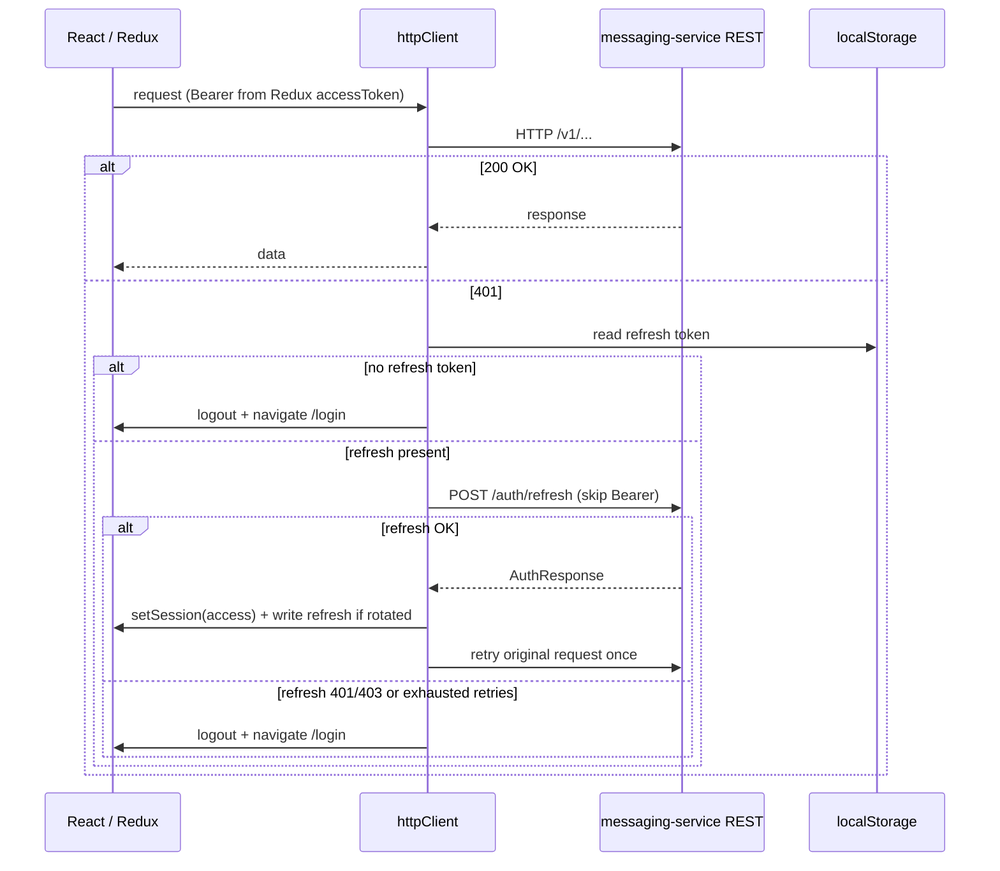
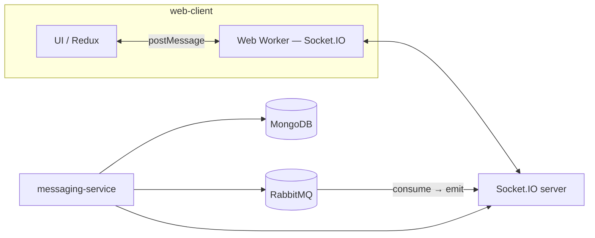
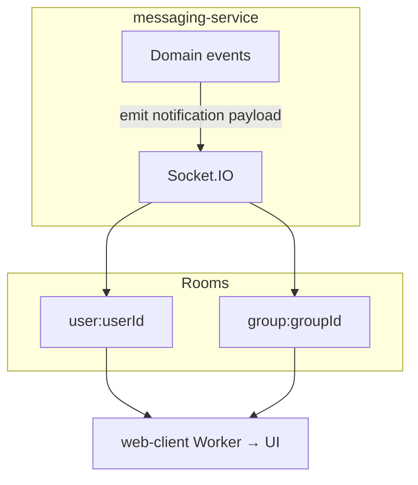

# Messaging platform

TypeScript **web client** and **Node.js microservice** for real-time **chat**, **presence**, **in-app notifications**, and **WebRTC-oriented** calling. The stack is **OpenAPI-first** (REST contract, codegen to the client, Zod validation on the server), with **Socket.IO** for browser transport and **RabbitMQ** for routing persisted work across processes and replicas. **Docker Compose** runs the full dependency set locally.

| Layer | Technology |
|-------|------------|
| **Client** | React 18, Vite, TypeScript, Tailwind CSS, Redux Toolkit, React Router, Axios; Socket.IO client in a **Web Worker** so the UI thread stays responsive |
| **API** | Node.js, Express, TypeScript; OpenAPI 3 spec in **`docs/openapi/`**, Swagger UI, **`openapi-typescript`** for **`apps/web-client/src/generated/`** |
| **Data** | MongoDB (primary store), Redis (presence / hot paths), RabbitMQ (post-persist routing), S3-compatible object storage (MinIO in development) |
| **Real time** | Socket.IO server on **messaging-service** (chat, signaling channel, notification transport) |

Detailed vision, scaling assumptions, and phased delivery: **[`docs/PROJECT_PLAN.md`](docs/PROJECT_PLAN.md)**. Task tracking: **[`docs/TASK_CHECKLIST.md`](docs/TASK_CHECKLIST.md)**. Engineering conventions: **[`docs/PROJECT_GUIDELINES.md`](docs/PROJECT_GUIDELINES.md)**. Guest / try-the-platform **product rules** (TTL, limits, blocked surfaces): **[`docs/GUEST_PRODUCT_RULES.md`](docs/GUEST_PRODUCT_RULES.md)**.

---

## Overview

The service is designed so **HTTP** handles CRUD and auth, while **Socket.IO** delivers live updates. **RabbitMQ** sits between **MongoDB** persistence and **Socket.IO** emission so multiple instances of **messaging-service** can share work: messages are written once, routed through the broker, then emitted to the correct **user** or **group** rooms. That split is what allows horizontal scaling without treating the WebSocket layer as the system of record.

Documentation in **`docs/`** is the source of truth for behavior; this README summarizes scope, current delivery, and core diagrams.

---

## Product scope

Target capabilities include **direct and group messaging**, **last-seen presence**, **user discovery**, **in-tab notifications** (new messages and incoming calls), and **audio/video** (1:1 and group) with a **TURN** path for restrictive networks. Horizontal scaling leans on **RabbitMQ** (each replica consumes and runs **local in-memory** Socket.IO **`io.to(room).emit`** — **`docs/PROJECT_PLAN.md` §3.2.2**). Full narrative: **`docs/PROJECT_PLAN.md` §1–§3**.

---

## Delivery status

| Area | Specification | Repository today |
|------|----------------|-------------------|
| **Identity** | Register, login, verification, reset; JWT access + refresh | REST APIs per OpenAPI on **messaging-service**; **web-client**: Redux session, shared **`httpClient`**, refresh-on-401 flow — [`apps/web-client/src/common/api/httpClient.ts`](apps/web-client/src/common/api/httpClient.ts) |
| **Messaging** | Persist → RabbitMQ → Socket.IO rooms | Broker + Socket.IO + MongoDB integrated on the service; end-user chat UI and full pipeline items tracked in **`TASK_CHECKLIST.md`** |
| **Presence** | Redis while connected; flush **last seen** to Mongo | **Live**: heartbeat (~5 s), Redis, **`presence:getLastSeen`** resolution |
| **Media** | Server-mediated upload to object storage | **`POST /v1/media/upload`** implemented; multipart UX in client backlog |
| **Notifications** | Single Socket.IO event **`notification`**, versioned payload — **`PROJECT_PLAN.md` §8** | Contract defined; **emit from domain** (checklist Feature 7) **outstanding**. No separate notification microservice; no Redis Streams for in-tab delivery |
| **Calls** | 1:1 signaling via Socket.IO; TURN; group SFU at scale | **coturn** optional in Compose; signaling / UI / SFU per **`PROJECT_PLAN.md` §6** |
| **Operations** | Compose, nginx, documented env | Stack exposed on **8080** via nginx; TLS and static **web-client** **`dist/`** serving called out as follow-up work |

---

## Authentication — HTTP client (web)

Access tokens are held **in memory** (Redux). Refresh tokens use **`localStorage`** (key **`messaging-refresh-token`**). The Axios instance attaches **`Authorization: Bearer`** on each request. On **401**, it calls **`POST /v1/auth/refresh`** (request path skips Bearer), uses a **mutex** so concurrent failures share one refresh, retries the refresh **up to three** times with **1 s** spacing between attempts when the error is not an immediate **401/403** from the refresh endpoint, updates the session and rotated refresh token on success, **retries the original request once**, and on hard failure clears storage and navigates to **`/login`**. Environment notes: [`docs/ENVIRONMENT.md`](docs/ENVIRONMENT.md).



---

## Real-time messaging pipeline

After a message is **persisted** in MongoDB, **messaging-service** **publishes** to **RabbitMQ**. Consumers forward to **Socket.IO** rooms so connected clients receive updates. On the client, the Socket.IO connection runs in a **Web Worker** and communicates with the UI via **`postMessage`**. **Direct** traffic uses **user-scoped** routing; **group** traffic uses **group-scoped** keys with **one broker publish per message** (see **`docs/PROJECT_PLAN.md` §3.2–§3.2.1**). Adding service replicas uses **RabbitMQ** so each node can **`io.to(room).emit`** locally; **room membership is not stored in Redis** (**§3.2.2**).



---

## WebRTC (calls)

| Mode | Direction |
|------|-----------|
| **1:1** | Offer / answer / ICE over the same Socket.IO connection; **STUN** publicly; **TURN** via optional **coturn** (`docker compose --profile turn`, **`infra/docker-compose.yml`**) |
| **Group** | Prefer an **SFU** for fan-out at scale; mesh only for small pilots — **`docs/PROJECT_PLAN.md` §6** |

End-to-end calling product work is **not** complete; the table reflects **architecture intent** from the plan.

---

## In-tab notifications

There is **no** separate notification service and **no** Redis Streams for tab-open delivery. The server emits a **single** Socket.IO event **`notification`** with a **versioned, discriminated** JSON body (`schemaVersion`, `kind`, `notificationId`, `occurredAt`, plus fields per **`kind`**). Typical rooms: **`user:<userId>`** and, where applicable, **`group:<groupId>`**. The client worker forwards payloads to the main thread for UI. Schema: **`docs/PROJECT_PLAN.md` §3.3 & §8**. Emitting from domain logic after message/call events is tracked as **Feature 7** in **`TASK_CHECKLIST.md`**. Scaling follows the same pattern as the rest of the service: more **messaging-service** instances and, if needed, a dedicated gateway later (**§3.3**).



---

## Local development

**Layout:** **`apps/web-client`** and **`apps/messaging-service`** each have their own **`package.json`**, lockfile, and **`node_modules`** (no workspace hoisting). See [`docs/TOOLING.md`](docs/TOOLING.md).

**Requirements:** Node.js **≥ 20**, **npm** (10.x recommended).

**Install**

```bash
cd apps/web-client && npm install && cd ../..
cd apps/messaging-service && npm install && cd ../..
```

Or from the repo root: `npm run install:all`.

**Commands (per app)**

```bash
cd apps/web-client
npm run dev          # Vite
npm run typecheck
npm run lint
npm run build        # dist/ for nginx

cd apps/messaging-service
npm run typecheck
npm run lint
npm run build
```

| App | Path |
|-----|------|
| web-client | `apps/web-client/` |
| messaging-service | `apps/messaging-service/` |

Root convenience scripts: `npm run lint:all`, `npm run typecheck:all`, `npm run format:check:all`.

**OpenAPI:** After changing **`docs/openapi/openapi.yaml`**, run `npm run generate:api` in **`apps/web-client`**; use `npm run generate:api:check` in CI.

**Swagger:** With **messaging-service** running, open **`http://localhost:<PORT>/api-docs`** (default port **3000**). Spec path: **`OPENAPI_SPEC_PATH`** or repo default — [`docs/ENVIRONMENT.md`](docs/ENVIRONMENT.md).

---

## Docker Compose

```bash
docker compose -f infra/docker-compose.yml up -d --build
```

| Service | Default access |
|---------|----------------|
| HTTP, Swagger, Socket.IO (via nginx) | **`http://localhost:8080`** — e.g. **`/api-docs`**, **`/v1/health`** |
| messaging-service (host port) | **`http://localhost:3001`** |
| MongoDB | `localhost:27017` |
| Redis | `localhost:6379` |
| RabbitMQ AMQP | `localhost:5672` |
| RabbitMQ management UI | **`http://localhost:15672`** (default user **`messaging`** / **`messaging`**) |
| MinIO S3 API / console | `9000` / **`http://localhost:9001`** |

**TURN (WebRTC):** `docker compose -f infra/docker-compose.yml --profile turn up -d` — UDP/TCP **3478**; development credentials in **`infra/coturn/turnserver.conf`**.

Copy **`infra/.env.example`** to **`.env`** at the compose working directory to override broker/storage defaults.

---

## Documentation index

| Topic | Location |
|-------|----------|
| Environment variables | [`docs/ENVIRONMENT.md`](docs/ENVIRONMENT.md) |
| Architecture, WebRTC, notifications, deployment | [`docs/PROJECT_PLAN.md`](docs/PROJECT_PLAN.md) |
| Code and review standards | [`docs/PROJECT_GUIDELINES.md`](docs/PROJECT_GUIDELINES.md) |
| Backlog and delivery checklist | [`docs/TASK_CHECKLIST.md`](docs/TASK_CHECKLIST.md) |

Do not commit secrets in **`.env`** files.
