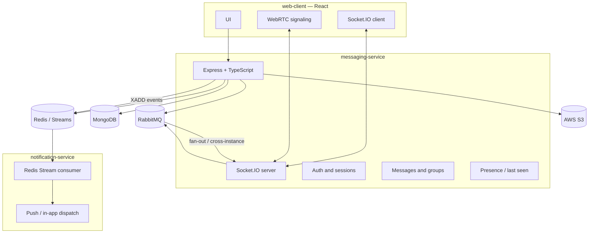

# Messaging Platform — Project Plan

## 1. Vision and scope

Build a **scalable messaging web application** with a **React** client and **two Node.js (Express) microservices** written in **TypeScript**. The system supports direct and group chat, presence (last seen), user discovery, rich notifications, and real-time **audio/video** and **group calls**, with **MongoDB** as the primary data store, **Redis** for presence and notification fan-out, **RabbitMQ** for reliable message delivery to online recipients, and **AWS S3** for media.

---

## 2. Feature checklist (mapped to capabilities)

| #   | Feature                                               | Primary systems                                                                                                           |
| --- | ----------------------------------------------------- | ------------------------------------------------------------------------------------------------------------------------- |
| 1   | One-to-one text messaging                             | **messaging-service**, MongoDB, **Socket.IO** (client transport) **in sync with RabbitMQ** (routing / cross-node fan-out) |
| 2   | Sign up / log in with email & password + verification | Auth service, email provider, JWT/session store                                                                           |
| 3   | Video/audio call (1:1)                                | Signaling (WebSocket/WebRTC), optional TURN/STUN                                                                          |
| 4   | Group call                                            | Same as 3 + SFU/MCU or mesh strategy (see §6)                                                                             |
| 5   | Search users by email                                 | User index in MongoDB, privacy rules                                                                                      |
| 6   | Last seen per user                                    | Redis (TTL or explicit updates), exposed via API                                                                          |
| 7   | Typed notifications (calls vs messages)               | Notification service + Redis Streams + clients (push/in-app)                                                              |
| 8   | Group messaging                                       | Groups in MongoDB; **Socket.IO** + **RabbitMQ** for delivery and scaling                                                  |
| 9   | Create groups                                         | Messaging API + membership ACL                                                                                            |
| 10  | Contact list (add users)                              | Contacts collection + APIs                                                                                                |

---

## 3. High-level architecture



### 3.1 Microservice responsibilities

| Service                  | Role                                                                                                                                                                                                                                                                                                                                                                                                                                      |
| ------------------------ | ----------------------------------------------------------------------------------------------------------------------------------------------------------------------------------------------------------------------------------------------------------------------------------------------------------------------------------------------------------------------------------------------------------------------------------------- |
| **messaging-service**    | HTTP APIs (auth, users, contacts, groups, messages, search, media upload URLs), **Socket.IO** for real-time chat and call signaling to **web-client**, writes **last seen** to Redis, **publishes persisted messages to RabbitMQ** and **consumes / correlates RabbitMQ deliveries with Socket.IO** so online clients receive traffic in sync with the broker; appends **notification events** to **Redis Streams** for async processing. |
| **notification-service** | Consumes **Redis Streams** (consumer groups for scale), maps event types (message, incoming_call, missed_call, etc.) to channels (browser push, email digest if needed, future mobile), idempotent handling, retries.                                                                                                                                                                                                                     |

### 3.2 Socket.IO and RabbitMQ (messaging)

Real-time messaging uses **Socket.IO** on **messaging-service** together with **RabbitMQ**—they are complementary, not alternatives:

| Concern          | Socket.IO                                                                   | RabbitMQ                                                                                                                                                                                                   |
| ---------------- | --------------------------------------------------------------------------- | ---------------------------------------------------------------------------------------------------------------------------------------------------------------------------------------------------------- |
| **Role**         | Bidirectional transport to browsers (rooms, acknowledgements, reconnection) | Durable routing, per-user or per-conversation fan-out, **cross-instance** delivery when multiple messaging-service replicas run                                                                            |
| **Typical flow** | Client emits/receives chat events over Socket.IO                            | After **MongoDB persist**, publish to RabbitMQ; service workers (or the same process) **consume** and **emit to the correct Socket.IO room(s)** so recipients get messages even if handled on another node |

Design the **exchange / queue topology** (e.g. per-user or per-conversation bindings) so RabbitMQ remains the **source of truth for “who must receive what”** after persistence, while Socket.IO remains the **last-mile** to connected clients. Use a **Redis adapter** for Socket.IO if horizontal scaling of Socket.IO nodes is required (optional; document in infra).

_Optional later split:_ extract a dedicated **Socket.IO gateway** if traffic grows; keep domain logic and persistence in **messaging-service**.

---

## 4. Technology choices (as specified)

| Layer                                 | Choice                                 | Usage                                                                                                   |
| ------------------------------------- | -------------------------------------- | ------------------------------------------------------------------------------------------------------- |
| Runtime                               | Node.js + **Express** + **TypeScript** | **messaging-service** and **notification-service**                                                      |
| Real-time messaging transport         | **Socket.IO**                          | Server on **messaging-service**; client in **web-client**; pairs with RabbitMQ per §3.2                 |
| Cache / presence                      | **Redis**                              | Last seen, session hints, rate limits; optional **Socket.IO Redis adapter** for multi-node              |
| Async notifications                   | **Redis Streams**                      | Durable queue from messaging-service → **notification-service**                                         |
| Message fan-out & cross-instance sync | **RabbitMQ**                           | After persist, route deliveries; **messaging-service** aligns broker consumers with **Socket.IO** emits |
| Primary DB                            | **MongoDB**                            | Users, conversations, messages, groups, contacts                                                        |
| Media                                 | **AWS S3**                             | Presigned uploads; store keys in MongoDB                                                                |
| Client                                | **React** (**web-client**)             | SPA, Socket.IO client, WebRTC for calls                                                                 |

---

## 5. Data model (conceptual)

- **Users**: email (unique, indexed), password hash, verification status, profile fields, `lastSeenAt` (optional mirror in Redis for hot path).
- **Contacts**: `(ownerId, contactUserId)`, status (pending/accepted), timestamps.
- **Conversations**: direct (participant pair) vs group; `groupId` for groups.
- **Groups**: name, createdBy, members[], settings.
- **Messages**: `conversationId`, sender, type (text/media/system), S3 key for media, timestamps, delivery metadata as needed.
- **Sessions / refresh tokens**: MongoDB or Redis depending on revocation strategy.

---

## 6. Real-time and calls

| Concern       | Approach                                                                                                                                                                           |
| ------------- | ---------------------------------------------------------------------------------------------------------------------------------------------------------------------------------- |
| Chat delivery | **Socket.IO** between **web-client** and **messaging-service**; **RabbitMQ** for persisted-message routing and multi-instance fan-out **in sync** with Socket.IO emits (see §3.2). |
| 1:1 WebRTC    | Offer/answer/ICE via **Socket.IO** (or dedicated channel on the same server); **STUN** (public); **TURN** for restrictive NATs (managed service or coturn).                        |
| Group calls   | Prefer **SFU** (e.g., mediasoup, Janus, or a managed CPaaS) for scalability; document as phase 2 if starting with mesh for MVP.                                                    |

---

## 7. Security and compliance

- Passwords: **argon2** or **bcrypt**; never log secrets.
- **JWT** (short-lived access) + **refresh tokens**; HTTPS only.
- Email verification: signed tokens, expiry, resend limits.
- **S3**: presigned PUT, bucket policies, virus scanning optional.
- Rate limiting on auth and search; audit logs for sensitive actions.

---

## 8. Notification types (requirement 7)

Define a small **event schema** in Redis Streams, e.g. `type`: `message_received`, `call_incoming`, `call_missed`, `group_invite`, etc. Notification service branches on `type` and user preferences (mute group, DND).

---

## 9. Phased delivery plan

### Phase 0 — Foundation (week 1–2)

- Monorepo layout per §10 (`apps/*` only). **messaging-service**, **notification-service**, and **web-client** each carry **their own** `package.json`, **`package-lock.json`**, **`node_modules`**, TypeScript, ESLint, and Prettier (**no npm workspaces**—install per app). **No** repo-root tooling for all apps, **no** shared backend tooling package, **no** `packages/shared`—**API types** come from **OpenAPI codegen** (see `PROJECT_GUIDELINES.md`).
- Docker Compose: MongoDB, Redis, RabbitMQ, local S3 (MinIO) for dev.
- **messaging-service**: health checks, config, logging, error model; **Socket.IO** server bootstrap.
- **notification-service**: skeleton + Redis Stream consumer loop (no-op handler).

### Phase 1 — Identity (requirement 2)

- Register, login, email verification, password reset flow.
- JWT issuance; protected routes on **messaging-service**.

### Phase 2 — Users, contacts, search, presence (5, 6, 10)

- Contact requests and list APIs.
- User search by email (exact or prefix; privacy: only if allowed).
- **Last seen**: update on activity + periodic heartbeat; read from Redis with MongoDB fallback if needed.

### Phase 3 — Messaging core (1, 8, 9)

- Direct conversations and messages in MongoDB.
- **Groups**: create, add members, group conversations.
- **RabbitMQ** topology: design exchanges/queues (e.g., per-user or per-conversation) aligned with access patterns.
- **Socket.IO** + **RabbitMQ** in sync: persist message → publish to broker → consume and emit to Socket.IO rooms; verify multi-replica behaviour when scaling **messaging-service**.

### Phase 4 — Media (S3)

- Presigned upload; message types for image/file; size and MIME checks.

### Phase 5 — Notifications (7)

- **messaging-service** appends events to **Redis Streams** after message persist / call events.
- **notification-service**: consume, dedupe, integrate **Web Push** (VAPID) and/or in-app only for v1.

### Phase 6 — Calls (3, 4)

- Signaling channel; 1:1 WebRTC MVP.
- Group call: SFU integration or documented interim limitation.

### Phase 7 — Hardening

- Load testing, monitoring (metrics/traces), backup strategy for MongoDB, runbooks.

---

## 10. Repository layout (suggested)

Top-level apps use **clear names**: **`web-client`**, **`messaging-service`**, **`notification-service`**. Each app keeps its **own** structural folders—**`types/`**, **`utils/`**, **`controllers/`** (or route handlers), **`hooks/`** (where applicable), **`services/`**, **`repositories/`**, etc.—so concerns stay **isolated per deployable**. Cross-cutting **REST contracts** are defined in **`docs/openapi/`** (OpenAPI 3); **web-client** uses **generated** types from that spec, not a shared `packages` library. **Tooling:** each deployable has **its own** **`package.json`**, **TypeScript**, **ESLint**, and **Prettier** (including **both** microservices independently—no shared backend config package); **no** single repo-root TypeScript/ESLint/Prettier for the entire monorepo.

```
messaging-system/
  apps/
    web-client/
      src/
        components/
        hooks/           # React hooks — only in web-client
        types/           # UI/domain view types — scoped to client
        utils/
        store/           # e.g. Redux (see PROJECT_GUIDELINES.md)
        generated/       # TypeScript from OpenAPI codegen (see docs/openapi/)
        ...
    messaging-service/
      src/
        controllers/     # HTTP (and Socket.IO attachment points if colocated)
        types/           # service-local types (REST DTOs align with docs/openapi/)
        utils/
        services/
        repositories/
        ...
    notification-service/
      src/
        controllers/     # if any HTTP admin/health beyond worker
        types/
        utils/
        services/
        consumers/       # Redis Stream / worker entrypoints
        ...
  infra/
    docker-compose.yml
  docs/
    openapi/           # OpenAPI 3 spec (source of truth for REST + codegen)
    PROJECT_PLAN.md
```

**Rule of thumb:** if code is only used inside one app, it lives under that app’s `src/` tree. **REST DTO alignment** uses **`docs/openapi/`** plus **client codegen** and **server-side Zod** (or equivalent)—not a shared TypeScript package.

---

## 11. Risks and decisions to lock early

| Topic                                     | Decision needed                                                                                                         |
| ----------------------------------------- | ----------------------------------------------------------------------------------------------------------------------- |
| **Socket.IO** + **RabbitMQ** alignment    | Exact exchange/queue naming, consumer ownership (same process vs worker pool), and ordering guarantees per conversation |
| Horizontal scale of **messaging-service** | **Socket.IO Redis adapter** vs sticky load balancing; how RabbitMQ consumers map to Socket.IO rooms across nodes        |
| Group calls                               | Mesh (simple, poor scale) vs SFU (ops cost)                                                                             |
| Push                                      | Web Push only vs adding FCM for future native apps                                                                      |
| Search                                    | Exact email only vs full-text (Atlas Search) later                                                                      |

---

## 12. Success criteria (MVP)

- **messaging-service** and **notification-service** run in Docker Compose with **web-client**; users can register, verify email, log in, add a contact, exchange 1:1 messages over **Socket.IO** with **RabbitMQ-backed** delivery, see last seen, search by email, create a group and send group messages, upload small media to S3, receive differentiated in-app/push notifications for messages and call events, and complete a 1:1 call in supported browsers.

---

## 13. Documentation entry point and deployment

- **Repository root [`README.md`](../README.md)** is the short entry point: Node/npm version, **per-app** `npm install` / `npm run …` (each app has its own lockfile; optional root **`install:all` / `lint:all` / `typecheck:all`** helpers). It links here for everything else.
- **Architecture, feature scope, stack, and repository layout** are defined in this document (**§1–§10**).
- **Deployment and operations** (how the system is meant to run in containers and behind nginx) are specified here; **implementation tasks** (Compose file, nginx config, TLS, env files) live in **`TASK_CHECKLIST.md`** under **Project setup → Docker Compose, nginx, TLS, deployment**.

### Target deployment shape

- **`infra/docker-compose.yml`** (or equivalent) runs **messaging-service**, **notification-service**, **MongoDB**, **Redis**, **RabbitMQ**, S3-compatible storage (e.g. **MinIO**), **nginx** (reverse proxy for REST + **Socket.IO**, static **web-client** `dist/`, TLS termination), and optionally **coturn** for WebRTC TURN.
- Document hostnames, ports, and env files so the stack can be brought up with one command once implemented.
- **web-client** is built to static assets consumed by nginx; backends expose HTTP/Socket.IO as described in **§3** and **§6**.

---

_Document version: 1.6 — Isolated npm projects per app (no workspaces)._
