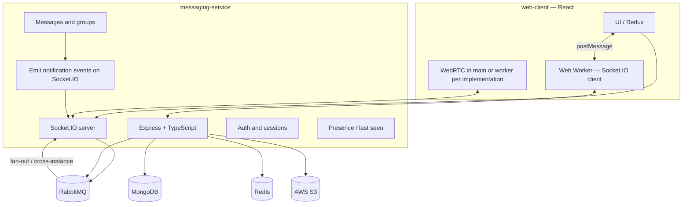

# Ekko — Project Plan

## 1. Vision and scope

**Ekko** is a **scalable messaging web application** with a **React** client and **one Node.js (Express) microservice** (**messaging-service**) written in **TypeScript**. The system supports direct and group chat, presence (last seen), user discovery, **in-tab** notifications for **new messages** and **incoming calls**, and real-time **audio/video** and **group calls**, with **MongoDB** as the primary data store, **Redis** for presence (last seen, rate limits, runtime config cache—not for Socket.IO room state), **RabbitMQ** for reliable message delivery to online recipients, and **AWS S3** for media.

**Notifications:** There is **no separate notification-service** and **no Redis Streams** for notification fan-out. **Typed notification events** (e.g. new message, incoming call) are **emitted over the same Socket.IO connection** as chat and signaling, targeting the appropriate **user** / **group** rooms on **messaging-service**. On the **web-client**, the **Socket.IO client runs in a dedicated Web Worker** so the connection stays responsive without blocking the UI thread; the worker forwards events to the main thread (e.g. `postMessage`) for Redux/UI.

### MVP scope (product)

This subsection defines a **bounded release target** for an initial production-ready slice. The rest of this document still describes the **full** platform (groups, contacts, group calls, and so on). For planning and checklists, treat the items below as the **MVP product boundary** unless the team explicitly expands scope.

**In scope**

| Capability | Plan reference (see §2) | Notes |
| ---------- | ------------------------- | ----- |
| **One-to-one messaging** | Feature **1** (direct / DM only) | Excludes **group** messaging (**Feature 8**) and **create groups** (**Feature 9**) for this MVP. |
| **File sharing** | Media pipeline (**§3**, S3); attachments in thread | User uploads via **messaging-service**; no AWS SDK in the browser. |
| **Settings** | **Feature 2** (profile / account) | e.g. display name, status, avatar via **`PATCH` profile**; not a separate “encryption management” surface (see **§7** / **§14** E2EE product rules). |
| **Login, logout, register** | **Feature 2** | Email + password, session/refresh, optional verification per env/runtime config. |
| **Login as guest** | **Feature 2a** | Temporary guest sessions; **guest ↔ guest** messaging and directory rules per **`README.md`** and **§7** guest subsections. |
| **One-to-one video/audio call** | **Feature 3** | Signaling on Socket.IO / WebRTC; **Feature 4** (group call) is **out** of this MVP. |
| **Notifications** | **Feature 7** | **In-tab** **`notification`** events on Socket.IO (**§8**); optional Web Push is **not** required for MVP. |

**Out of scope for this MVP** (remain in the overall plan; ship later unless pulled forward): group messaging (**Feature 8**), group calls (**Feature 4**), create/manage groups (**Feature 9**), contact list / add-by-contact (**Feature 10**), and any **search/discovery** work beyond what **Feature 1** + **Feature 2** + **Feature 2a** need for starting 1:1 threads.

**Tracking:** Implementation status for this slice and the wider plan lives in **`docs/TASK_CHECKLIST.md`**. **§12** below states success criteria for a **broader** checklist-style MVP (includes groups and contacts); use **this subsection** when aligning stakeholders on a **narrower** MVP.

---

## 2. Feature checklist (mapped to capabilities)

| #   | Feature                                               | Primary systems                                                                                                           |
| --- | ----------------------------------------------------- | ------------------------------------------------------------------------------------------------------------------------- |
| 1   | One-to-one text messaging                             | **messaging-service**, MongoDB, **Socket.IO** (client transport) **in sync with RabbitMQ** (routing / cross-node fan-out) |
| 2   | Sign up / log in with email & password + verification | **messaging-service** (auth APIs), email provider, JWT/session store                                                       |
| 3   | Video/audio call (1:1)                                | Signaling (Socket.IO/WebRTC), optional TURN/STUN                                                                           |
| 4   | Group call                                            | Same as 3 + SFU/MCU or mesh strategy (see §6)                                                                             |
| 5   | Search users by email                                 | User index in MongoDB, privacy rules                                                                                      |
| 6   | Last seen per user                                    | Redis (TTL or explicit updates), exposed via API                                                                          |
| 7   | Typed in-tab notifications (calls vs messages)       | **messaging-service** **Socket.IO** events to user/group rooms; **web-client** worker + UI                                 |
| 8   | Group messaging                                       | Groups in MongoDB; **Socket.IO** + **RabbitMQ** for delivery and scaling                                                  |
| 9   | Create groups                                         | **Ekko** HTTP API + membership ACL                                                                                        |
| 10  | Contact list (add users)                              | Contacts collection + APIs                                                                                                |

---

## 3. High-level architecture



### 3.1 Microservice responsibilities

| Service               | Role                                                                                                                                                                                                                                                                                                                                                                                                                                      |
| --------------------- | ----------------------------------------------------------------------------------------------------------------------------------------------------------------------------------------------------------------------------------------------------------------------------------------------------------------------------------------------------------------------------------------------------------------------------------------- |
| **messaging-service** | HTTP APIs (auth, users, contacts, groups, messages, search, media upload URLs), **Socket.IO** for real-time **chat**, **call signaling**, and **in-tab notification events** (single event **`notification`**, payload **`kind`** in §8) to **web-client**; writes **last seen** to **Redis**; **publishes persisted messages to RabbitMQ** and **consumes / correlates RabbitMQ deliveries with Socket.IO** per §3.2 and §3.2.1. |

### 3.2 Socket.IO and RabbitMQ (messaging)

Real-time messaging uses **Socket.IO** on **messaging-service** together with **RabbitMQ**—they are complementary, not alternatives:

| Concern          | Socket.IO                                                                   | RabbitMQ                                                                                                                                                                                                   |
| ---------------- | --------------------------------------------------------------------------- | ---------------------------------------------------------------------------------------------------------------------------------------------------------------------------------------------------------- |
| **Role**         | Bidirectional transport to browsers (rooms, acknowledgements, reconnection) | Durable routing with **user-scoped** and **group-scoped** keys (§3.2.1); **cross-instance** delivery when multiple messaging-service replicas run                                                         |
| **Typical flow** | Client emits/receives chat events over Socket.IO                            | After **MongoDB persist**, publish to RabbitMQ; service workers (or the same process) **consume** and **emit to the correct Socket.IO room(s)** so recipients get messages even if handled on another node |

Design the **exchange / queue topology** so bindings align with **§3.2.1** (separate routing for **direct** vs **group** messages). RabbitMQ remains the **durable routing** layer after persistence; Socket.IO remains the **last-mile** to connected clients. **Do not** use Redis to store or synchronize Socket.IO **room** membership—that model is **§3.2.2**.

### 3.2.1 Routing keys: direct vs group (scaling)

**Scaling constraint:** Fanning out **N RabbitMQ publishes per group message** (one per member) does **not** scale with group size. Prefer **one broker publish per persisted group message** and **subscription-based** delivery on the client.

| Mode | RabbitMQ (after MongoDB persist) | Socket.IO rooms / subscriptions |
| ---- | --------------------------------- | -------------------------------- |
| **Direct (1:1)** | **Single** publish per message with a routing key scoped to the **recipient’s user id** (e.g. `message.user.<recipientUserId>`). | Each client is joined (server-side) to a room for **their own user id** (e.g. `user:<userId>`). Incoming direct messages are emitted only to that recipient’s room. |
| **Group** | **Single** publish per message with a routing key scoped to the **group id** (e.g. `message.group.<groupId>`). **Do not** publish one broker message per group member for the same chat event. | Each client is joined to a room per **group id** they belong to (e.g. `group:<groupId>`), **in addition** to their **user id** room. **Membership changes** (join/leave group) must **add or remove** the corresponding group room subscription on the server (and client state must stay in sync). |

**Client UI:** Clients may receive a **group** message on the **group** channel even when the **sender** is the current user (e.g. authoritative echo from the server). **Deduplicate and update the UI** using **`messageId`** as the source of truth; use **`sender_id` vs current user id** (and optimistic send state) to **avoid duplicate bubbles** or conflicting optimistic vs server-rendered rows.

### 3.2.2 Socket.IO rooms are in-memory per server (not Redis)

**Rooms** (`socket.join('user:…')`, `socket.join('group:…')`, `io.to(room).emit(…)`) are **in-process, in-memory** data structures inside each **Socket.IO server** (each **messaging-service** Node process). They record which **local** socket connections belong to which logical channel. **Redis is not used** to replicate or share room membership across nodes.

**Why this is enough for horizontal scale:** After a message is persisted, **RabbitMQ** delivers the event to **each** replica’s consumer (per-instance queues or equivalent). Each replica runs **`io.to('user:<recipientId>').emit(…)`** (or the group room) **on its own process**. Only replicas that actually have **connected clients** joined to that room in **local memory** will send to anyone; other replicas issue an emit to an **empty** room (no harm). So **cross-node fan-out is carried by the broker**, not by synchronizing rooms through Redis.

**What Redis is still for:** last-seen presence, rate-limit counters, optional runtime-config cache, refresh-token storage—**not** Socket.IO room state.

**`@socket.io/redis-adapter`:** Not part of the intended architecture for room delivery (it would duplicate routing already solved by RabbitMQ and can **double-deliver** if combined with per-instance broker consumers). Keep **`SOCKET_IO_REDIS_ADAPTER`** **off** unless a separate, explicitly justified use case appears; see **`README.md`** (configuration) and **`TASK_CHECKLIST.md`**.

### 3.2.3 Chat message envelope and logging (E2EE)

- **Wire shape:** After MongoDB insert, **`publishMessage`** queues JSON identical to the **`Message`** OpenAPI schema (**`messageDocumentToApi`**): **`id`**, **`conversationId`**, **`senderId`**, **`createdAt`**, optional **`mediaKey`**, and — for hybrid E2EE — opaque **`body`**, **`iv`**, **`encryptedMessageKeys`**, **`algorithm`**. **Socket.IO** **`message:new`** and **`message:send`** acks use the **same** object; there is no separate “transport envelope.”
- **No server decrypt:** The broker and Socket layers treat the E2EE fields as **opaque blobs** only.
- **No plaintext logging:** Application code must **not** log **`body`**, **`iv`**, **`encryptedMessageKeys`**, or **`algorithm`** (they may contain ciphertext or wrapped keys). Diagnostic logs should use **`message.id`**, **`conversationId`**, **`routingKey`**, and room names — see **`MESSAGING_REALTIME_DELIVERY_LOGS`** in **`messaging-service`** (`rabbitmq.ts`).
- **In-tab toasts:** **`notification`** **`kind: message`** **`preview`** must not echo ciphertext; **`messageNotification.ts`** maps hybrid and legacy E2EE rows to a generic **“Encrypted message”** label.

### 3.3 In-tab notifications (no separate service)

- **Server:** After relevant domain events (e.g. message persisted for another user, incoming call offer), **emit** a single Socket.IO event **`notification`** (see **§8**) to the recipient’s **`user:<userId>`** room (and, when applicable, to **`group:<groupId>`** for group-thread visibility — same payload shape). **MVP:** deliver to every user in scope; **no** server-side DND/mute filtering.
- **Client:** The **Socket.IO client runs in a Web Worker**; the worker **listens** for **`notification`** and **posts** the JSON payload to the main thread for toasts/banners/Redux. Use **`kind`** (e.g. **`message`** vs **`call_incoming`**) and any future **local** preferences to choose **alert audio** (e.g. different sounds for messages vs calls). **No second WebSocket** to a notification service; **no Redis Streams** for this path.

_Optional later split:_ extract a dedicated **Socket.IO gateway** if traffic grows; keep domain logic and persistence in **messaging-service**.

---

## 4. Technology choices (as specified)

| Layer                                 | Choice                                 | Usage                                                                                                   |
| ------------------------------------- | -------------------------------------- | ------------------------------------------------------------------------------------------------------- |
| Runtime                               | Node.js + **Express** + **TypeScript** | **messaging-service** only (backend)                                                                  |
| Real-time messaging transport         | **Socket.IO**                          | Server on **messaging-service**; client in **web-client** **Web Worker**; pairs with RabbitMQ per §3.2 |
| Cache / presence                      | **Redis**                              | Last seen, session hints, rate limits, runtime config cache — **not** Socket.IO rooms (rooms are in-memory per process; **§3.2.2**) |
| Message fan-out & cross-instance sync | **RabbitMQ**                           | After persist, route deliveries; **messaging-service** aligns broker consumers with **Socket.IO** emits |
| Primary DB                            | **MongoDB**                            | Users, conversations, messages, groups, contacts                                                        |
| Media                                 | **AWS S3**                             | Uploads via AWS SDK in **messaging-service**; keys in MongoDB                                           |
| Client                                | **React** (**web-client**)             | SPA; **Socket.IO in Web Worker**; WebRTC for calls                                                      |

---

## 5. Data model (conceptual)

- **Users**: email (unique, indexed), password hash, verification status, profile fields, `lastSeenAt` (optional mirror in Redis for hot path).
- **Contacts**: `(ownerId, contactUserId)`, status (pending/accepted), timestamps.
- **Conversations**: direct (participant pair) vs group; `groupId` for groups.
- **Groups**: name, createdBy, members[], settings.
- **Messages**: `conversationId`, sender, type (text/media/system), S3 key for media, timestamps, delivery metadata as needed.
- **Sessions / refresh tokens**: MongoDB or Redis depending on revocation strategy.

---

## 6. Real-time and calls

| Concern       | Approach                                                                                                                                                                           |
| ------------- | ---------------------------------------------------------------------------------------------------------------------------------------------------------------------------------- |
| Chat delivery | **Socket.IO** between **web-client** and **messaging-service**; **RabbitMQ** for persisted-message routing (**user-scoped** keys for direct, **group-scoped** keys for groups — one publish per message; see §3.2.1) and multi-instance delivery **in sync** with Socket.IO emits. |
| In-tab alerts | **Socket.IO** events from **messaging-service** (§3.3); client **Web Worker** forwards to UI.                                                                                      |
| 1:1 WebRTC    | Offer/answer/ICE via **Socket.IO** (or dedicated channel on the same server); **STUN** (public); **TURN** for restrictive NATs (managed service or coturn).                        |
| Group calls   | Prefer **SFU** (e.g., mediasoup, Janus, or a managed CPaaS) for scalability; document as phase 2 if starting with mesh for MVP.                                                    |

---

## 7. Security and compliance

- Passwords: **argon2** or **bcrypt**; never log secrets.
- **JWT** (short-lived access) + **refresh tokens**; HTTPS only.
- Email verification: signed tokens, expiry, resend limits.
- **S3**: server-side upload via AWS SDK, bucket policies, virus scanning optional.
- Rate limiting on auth and search; audit logs for sensitive actions.

### Guest sessions (temporary access — Feature 2a)

Short-lived access **without** full Feature 2 registration (email, password, verification). Intended for demo / playground; **on/off** via **`guestSessionsEnabled`** in MongoDB **`system_config`** (see **`README.md`** — Runtime configuration).

**Session & token TTL:** Guest access JWT lifetime and opaque refresh token storage in Redis both use **`GUEST_ACCESS_TOKEN_TTL_SECONDS`** and **`GUEST_REFRESH_TOKEN_TTL_SECONDS`** (defaults **1800** s = **30 minutes** each), separate from registered-user **`ACCESS_TOKEN_TTL_SECONDS`** / **`REFRESH_TOKEN_TTL_SECONDS`**. Configure in **`README.md`** (Configuration).

**Persistence:** Guest **identity** is stored in **`users`** with **`isGuest: true`**, **`username`**, optional **`displayName`**, and **no** **`email`** field. **`GUEST_DATA_TTL_ENABLED`** / **`system_config.guestDataTtlEnabled`** (default **on**) controls whether **`guestDataExpiresAt`** is written for MongoDB TTL on guest **`users`**, guest↔guest **`conversations`**, and **`messages`**.

**Product rules (locked):**

- **Guest ↔ guest messaging only:** guests **must not** message **registered** users. Only **guest ↔ guest** threads are allowed. Enforce on **message send** (**Socket.IO** / **`sendMessageForUser`**), **conversation lazy-create**, and any **`recipientUserId`** / peer resolution so a guest cannot address a registered account.
- **Username before `POST /auth/guest`:** a **username** is **required** before the service issues a guest session (OpenAPI **`POST /v1/auth/guest`** when implemented). This is **not** full registration; optional **display name** may be collected per product rules.
- **Guest-only search directory:** for a **guest** caller, **`GET /v1/users/search`** (and any **user directory** used to pick someone for a new DM) **returns only other guests** (e.g. **`isGuest: true`**). **Registered users must not appear** in guest search results, so guests can start threads **only** with other guests found in that sandbox.
- **No guest → registered messaging:** any description implying guests “search and DM registered users” is **superseded** — guests do **not** use the full user directory to contact registered accounts; **registration** is the path to that graph. Implementation tasks: **`docs/TASK_CHECKLIST.md`** Feature 2a.

### 7.1 End-to-End Encrypted Multi-Device Messaging

This system implements end-to-end encryption (E2EE) with seamless multi-device support using a hybrid cryptographic model.

Each user device generates a unique public-private key pair. When a message is sent, the client generates a random symmetric **message key** to encrypt the message payload. This message key is then encrypted separately for each recipient device (including the sender’s other devices) using their public keys.

The server stores:

* A single encrypted message (ciphertext)
* A mapping of encrypted message keys per device

This design ensures:

* Messages are encrypted only once (efficient)
* Access control is managed via per-device encrypted keys (scalable)
* The server never has access to plaintext data

#### Cryptographic algorithms (per-device hybrid)

- **Payload:** The message body is encrypted with **AES-256-GCM** using a fresh random **256-bit message key** (`msgKey`) and a unique **IV / nonce** per message (stored or transmitted alongside ciphertext per **`Message`** / OpenAPI, e.g. an `iv` field).
- **Per-device wrapping:** `msgKey` is never sent in the clear. For **each** device that must read the message (every relevant **recipient** device plus **each of the sender’s other devices**), the sender encrypts `msgKey` to that device’s **P-256 ECDH public key** using an **ECIES**-style construction (or equivalent: **ECDH**-derived shared secret + **AES Key Wrap** / AEAD). Only the holder of that device’s **private key** can unwrap `msgKey`.
- **Storage shape:** The server stores one opaque **ciphertext** for the body and a map **`encryptedMessageKeys: { [deviceId]: wrappedKey }`**. It treats both as opaque blobs; it **does not** decrypt message bodies or unwrap `msgKey`.
- **Media locator (hybrid):** The **inner** AES-GCM plaintext (what **`body`** decrypts to on clients) uses a **versioned JSON** form (**v1**): optional caption **`t`** and optional **`m.k`** (S3-compatible object key). Clients encrypt that UTF-8 JSON as the hybrid plaintext; **`Message.mediaKey`** on the server is **`null`** so the object key is not visible to storage or sync pipelines. Plaintext-only hybrid messages may continue to use a raw UTF-8 string (no JSON) for backward compatibility. See **`docs/openapi/openapi.yaml`** **`Message`**, web **`messageHybridPlaintext.ts`**.
- **Device keys:** Each device generates its own **P-256** key pair in the browser (**Web Crypto**). **Private keys never leave the device** (e.g. **IndexedDB**, optionally passphrase-wrapped).

#### Device identity (`deviceId`) lifecycle

- **Register on first use:** After **login** (or restored session), the client generates a device key pair on **first authenticated use** of that browser/profile, obtains a stable **`deviceId`** (e.g. returned by **`POST /v1/users/me/devices`** when registering the device public key), and persists `deviceId` locally with the private key.
- **Registry:** The server stores **`(userId, deviceId) → publicKey`** (and metadata). Only **public** keys are stored server-side.
- **Revoke on logout or device removal:** The client **may** call **`DELETE /v1/users/me/devices/:deviceId`** on **logout** or when the user removes a device. **Authorization:** only the signed-in user may delete **their own** device rows (no cross-user or admin path). The server deletes the **`user_device_public_keys`** row only.
- **Registry vs message hygiene:** The service **does not** backfill or scrub **`encryptedMessageKeys[deviceId]`** on existing **`Message`** documents when a device is revoked. Doing so would require wide scans and many updates (cost, concurrency with new sends). The tradeoff is **opaque stale map entries** in historical messages versus simpler storage and immutability-friendly behavior; senders discover current devices via **`GET …/devices/public-keys`** and must not wrap keys for revoked devices. **Historical** messages may still list wrapped keys for removed devices; clients cannot unwrap without that device’s private key. Recovery on a **new** device is covered by **New Device Sync Flow** below.

#### Same-browser sign-out — policy: same device vs new device

**Product decision (current implementation):**

- **Same browser profile, user signs out (Settings / `useAuth` logout):** Treat as **the same logical device** for E2EE continuity. The web client **does not** wipe **IndexedDB** (`deviceIdentity` / private keyring) on sign-out; **`deviceId`** and key material **remain** locally. On the next sign-in, **`ensureUserKeypairReadyForMessaging`** (**`apps/web-client`**) rehydrates **`deviceId`** from storage and **`POST /v1/users/me/devices`** **re-registers** the device with the **same client-supplied `deviceId`** when the server registry row is absent (e.g. after optional **`DELETE /v1/users/me/devices/:deviceId`** when **`VITE_REVOKE_DEVICE_ON_LOGOUT=true`**). That **re-register** path **aligns** the server registry with persisted **`deviceId`** so **`encryptedMessageKeys[deviceId]`** on stored messages remains the correct lookup for this browser — **clearing IndexedDB on logout is not required** (and not implemented). **Feature 13** (multi-device key sync) is **not** part of this nominal path — history should remain decryptable **without** a trusted-device sync round trip, provided local keys load correctly.
- **Actual new device or wiped profile:** Another browser profile, cleared site data / lost IndexedDB, or a fresh install with **no** local keyring is treated as a **new device**: past messages lack **`encryptedMessageKeys` for that `deviceId`** until **Feature 13** runs from an existing trusted device **or** only **new** traffic after registration includes wrapped keys for the new id.
- **Bootstrap guarantees:** **`ensureUserKeypairReadyForMessaging`** does **not** mint a new **`crypto.randomUUID()` `deviceId`** when a **keyring** already exists locally — it **reuses** **`deviceIdentity`**. After each successful **`POST /v1/users/me/devices`**, **`evaluateDeviceSyncBootstrapState`** may set **`syncState: 'pending'`** when **multiple** devices are registered and this **`deviceId`** has **no** wrapped keys on the first sync page — **Feature 13** flow. See **`docs/repro-decrypt-after-relogin.md`** (**New `deviceId` without sync**).

See **`docs/repro-decrypt-after-relogin.md`** (bootstrap trace, logout side effects, revoke vs IndexedDB) for implementation-aligned debugging notes.

#### Threat model and server trust boundaries

- **What the server must not store:** **Private keys**, **plaintext `msgKey`**, or **plaintext message content**. Violations break the E2EE guarantee.
- **What the server may store:** Ciphertext, per-device wrapped keys, and routing metadata (conversation ids, user ids, timestamps). It acts as an **untrusted relay and storage layer** for opaque blobs.
- **Honest-but-curious server:** Should not be able to derive plaintext from stored data without breaking **AES-256-GCM** or the **ECDH**-based wrapping, or without a **compromised client device**.
- **Database leak:** Exposes ciphertext and wrapped keys; confidentiality depends on **device private keys** remaining on devices.
- **Client compromise:** A compromised device can expose that user’s keys and local plaintext; it does not by itself imply other users’ plaintext on their devices.

#### Multi-device Sync

When a new device is added, it cannot decrypt past messages by default. To enable access:

An existing trusted device decrypts stored message keys using its private key and re-encrypts them for the new device. These updated encrypted keys are stored on the server without modifying the original message ciphertext.

This approach:

* Avoids re-encrypting full message history
* Minimizes bandwidth and computation
* Preserves strict end-to-end encryption guarantees

#### Key Principles

* **Messages are immutable**
* **Access is dynamically extendable via key distribution**
* **Server acts only as a relay and storage layer**

This architecture is inspired by modern secure messaging systems such as Signal and WhatsApp.

#### Message Send / Receive Flow

```
┌──────────────────────┐
│ Sender Device (A1)   │
└─────────┬────────────┘
          │
          │ 1. Fetch recipient device public keys
          ▼
┌──────────────────────────────┐
│ Server returns:              │
│ B1.pub, B2.pub, A2.pub...    │
└─────────┬────────────────────┘
          │
          │ 2. Generate message key
          ▼
┌──────────────────────────────┐
│ msgKey = random(256-bit)     │
└─────────┬────────────────────┘
          │
          │ 3. Encrypt message
          ▼
┌──────────────────────────────┐
│ ciphertext = AES-GCM(msgKey,msg) │
└─────────┬────────────────────┘
          │
          │ 4. Encrypt msgKey per device
          ▼
┌──────────────────────────────┐
│ encKey_B1 = Enc(msgKey,B1)   │
│ encKey_B2 = Enc(msgKey,B2)   │
│ encKey_A2 = Enc(msgKey,A2)   │
└─────────┬────────────────────┘
          │
          │ 5. Send to server
          ▼
┌──────────────────────────────┐
│ Store:                       │
│ ciphertext                   │
│ encryptedKeys{deviceId:key}  │
└─────────┬────────────────────┘
          │
          │ 6. Deliver to devices
          ▼
┌──────────────────────────────┐
│ Receiver Device (B1/B2)      │
└─────────┬────────────────────┘
          │
          │ 7. Decrypt msgKey
          ▼
┌──────────────────────────────┐
│ msgKey = Dec(encKey, priv)   │
└─────────┬────────────────────┘
          │
          │ 8. Decrypt message
          ▼
┌──────────────────────────────┐
│ message = AES⁻¹(msgKey)      │
└──────────────────────────────┘
```

#### New Device Sync Flow (Key Re-sharing)

```
┌──────────────────────┐
│ New Device (A2)      │
└─────────┬────────────┘
          │
          │ 1. Generate keypair
          ▼
┌──────────────────────────────┐
│ pubA2, privA2                │
└─────────┬────────────────────┘
          │
          │ 2. Register pubA2
          ▼
┌──────────────────────────────┐
│ Server stores device         │
└─────────┬────────────────────┘
          │
          │ 3. Trigger sync request
          ▼
┌──────────────────────┐
│ Existing Device (A1) │
└─────────┬────────────┘
          │
          │ 4. Fetch message metadata
          ▼
┌──────────────────────────────┐
│ messageId + encKey[A1]       │
└─────────┬────────────────────┘
          │
          │ 5. For each message:
          ▼
┌──────────────────────────────┐
│ msgKey = Dec(encKey[A1])     │
│ newKey = Enc(msgKey, pubA2)  │
└─────────┬────────────────────┘
          │
          │ 6. Batch send new keys
          ▼
┌──────────────────────────────┐
│ [{messageId, encKey_A2}]     │
└─────────┬────────────────────┘
          │
          │ 7. Server updates
          ▼
┌──────────────────────────────┐
│ encryptedKeys[A2] = newKey   │
└─────────┬────────────────────┘
          │
          │ 8. A2 fetches messages
          ▼
┌──────────────────────────────┐
│ Decrypt via privA2           │
└──────────────────────────────┘
```

---

## 8. Notification event shapes (requirement 7)

In-tab notifications use **one** Socket.IO event name and a **versioned, discriminated JSON object** so the web-client can `switch (payload.kind)` without parallel event namespaces.

### 8.1 Event name

| Event name        | Direction | Purpose |
| ----------------- | --------- | ------- |
| **`notification`** | Server → client | In-app toast/banner payload for **new messages** (direct or group) and **incoming calls** (audio or video). |

**Rooms:** Implementations typically emit to **`user:<recipientUserId>`** so each user gets at most one copy. **Post-MVP:** optional per-recipient **DND** / mute (deprioritized — **not** MVP; see **`docs/TASK_CHECKLIST.md`** Feature 7). For **group** threads, an alternative is a single emit to **`group:<groupId>`** (all joined clients receive it); the client must **skip** UI when **`senderUserId`** is the current user. **Incoming calls** use **`user:<calleeUserId>`** (and optionally the same pattern for group calls).

### 8.2 Envelope (all notifications)

Every payload includes:

| Field            | Type     | Required | Description |
| ---------------- | -------- | -------- | ----------- |
| **`schemaVersion`** | `integer` | yes | **Start at `1`.** Bump when breaking field renames/removals; clients may ignore unknown fields. |
| **`kind`**       | `string` | yes | Discriminator: **`"message"`** or **`"call_incoming"`**. |
| **`notificationId`** | `string` | yes | **Stable id** for deduplication and analytics (e.g. UUID). Same logical alert should not get two different ids on retry. |
| **`occurredAt`** | `string` | yes | ISO-8601 **`date-time`** when the server decided to notify (not necessarily message `createdAt` if delayed). |

### 8.3 `kind: "message"` — new message (1:1 or group)

Emitted when another user’s message is persisted and the recipient should see an in-tab alert (client chooses **audio** / UI by **`kind`**). **DND/mute** suppression is **post-MVP** (deprioritized — **`docs/TASK_CHECKLIST.md`**). **Do not** use this for the sender’s own optimistic echo — chat delivery uses separate message events; this is **notification UI only**.

| Field | Type | Required | Description |
| ----- | ---- | -------- | ----------- |
| **`threadType`** | `"direct" \| "group"` | yes | **One-to-one** vs **group** thread. |
| **`conversationId`** | `string` | yes | Conversation id (same as REST/chat). |
| **`messageId`** | `string` | yes | Persisted message id — **dedupe** with chat stream. |
| **`senderUserId`** | `string` | yes | Who sent the message. |
| **`senderDisplayName`** | `string \| null` | no | Display name for title/summary; omit or null if unknown. |
| **`preview`** | `string` | no | Short plaintext preview for the toast (truncate server-side if needed). |
| **`groupId`** | `string` | if `threadType === "group"` | Group id. |
| **`groupTitle`** | `string \| null` | no | Group name for UI when `threadType === "group"`. |

**Example (direct):**

```json
{
  "schemaVersion": 1,
  "kind": "message",
  "notificationId": "550e8400-e29b-41d4-a716-446655440000",
  "occurredAt": "2026-04-02T12:00:00.000Z",
  "threadType": "direct",
  "conversationId": "conv_abc",
  "messageId": "msg_xyz",
  "senderUserId": "user_peer",
  "senderDisplayName": "Alex",
  "preview": "Are we still on for later?"
}
```

**Example (group):**

```json
{
  "schemaVersion": 1,
  "kind": "message",
  "notificationId": "6ba7b810-9dad-11d1-80b4-00c04fd430c8",
  "occurredAt": "2026-04-02T12:00:01.000Z",
  "threadType": "group",
  "conversationId": "conv_grp",
  "messageId": "msg_grp1",
  "senderUserId": "user_peer",
  "senderDisplayName": "Alex",
  "preview": "Uploaded the doc.",
  "groupId": "grp_123",
  "groupTitle": "Project Alpha"
}
```

### 8.4 `kind: "call_incoming"` — incoming audio or video call

Emitted when the callee should ring/show an incoming-call UI. **Signaling** (offer/answer/ICE) stays on separate call events; this object is for **notification + routing** (who, which call, what media).

| Field | Type | Required | Description |
| ----- | ---- | -------- | ----------- |
| **`media`** | `"audio" \| "video"` | yes | **Audio-only** vs **video** call. |
| **`callScope`** | `"direct" \| "group"` | yes | **1:1** vs **group** call. |
| **`callId`** | `string` | yes | **Correlation id** shared with signaling so UI can join the same session. |
| **`callerUserId`** | `string` | yes | User initiating the call. |
| **`callerDisplayName`** | `string \| null` | no | Shown on incoming UI. |
| **`conversationId`** | `string` | no | Direct thread id when `callScope === "direct"` (recommended). |
| **`groupId`** | `string` | if `callScope === "group"` | Group id for group calls. |
| **`groupTitle`** | `string \| null` | no | Group name when `callScope === "group"`. |

**Example (1:1 video):**

```json
{
  "schemaVersion": 1,
  "kind": "call_incoming",
  "notificationId": "7c9e6679-7425-40de-944b-e07fc1f90ae7",
  "occurredAt": "2026-04-02T12:00:02.000Z",
  "media": "video",
  "callScope": "direct",
  "callId": "call_sess_001",
  "callerUserId": "user_peer",
  "callerDisplayName": "Alex",
  "conversationId": "conv_abc"
}
```

**Example (group audio):**

```json
{
  "schemaVersion": 1,
  "kind": "call_incoming",
  "notificationId": "8d3e7780-8536-51ef-a55c-f18fd2f91bf8",
  "occurredAt": "2026-04-02T12:00:03.000Z",
  "media": "audio",
  "callScope": "group",
  "callId": "call_grp_002",
  "callerUserId": "user_peer",
  "callerDisplayName": "Alex",
  "groupId": "grp_123",
  "groupTitle": "Project Alpha"
}
```

### 8.5 Future kinds

Additional **`kind`** values (e.g. `call_missed`, `group_invite`) should be added in a backward-compatible way (new discriminator values, same envelope fields). **No Redis Streams** for in-tab delivery; optional **Web Push** is a separate product decision (not required for tab-open MVP).

---

## 9. Phased delivery plan

### Phase 0 — Foundation (week 1–2)

- Monorepo layout per §10 (`apps/*` only). **messaging-service** and **web-client** each carry **their own** `package.json`, **`package-lock.json`**, **`node_modules`**, TypeScript, ESLint, and Prettier (**no npm workspaces**—install per app). **No** repo-root tooling for all apps, **no** shared backend tooling package, **no** `packages/shared`—**API types** come from **OpenAPI codegen** (see **§14** below).
- Docker Compose: MongoDB, Redis, RabbitMQ, local S3 (MinIO) for dev.
- **messaging-service**: health checks, config, logging, error model; **Socket.IO** server bootstrap.
- **web-client**: scaffold; plan **Socket.IO client in Web Worker** early (bundling, auth token handoff, `postMessage` protocol).

### Phase 1 — Identity (requirement 2)

- Register, login, email verification, password reset flow.
- JWT issuance; protected routes on **messaging-service**.

### Phase 2 — Users, contacts, search, presence (5, 6, 10)

- Contact requests and list APIs.
- User search by email (exact or prefix; privacy: only if allowed).
- **Last seen**: update on activity + periodic heartbeat; read from Redis with MongoDB fallback if needed.

### Phase 3 — Messaging core (1, 8, 9)

- Direct conversations and messages in MongoDB.
- **Groups**: create, add members, group conversations.
- **RabbitMQ** topology: design exchanges/queues (e.g., per-user or per-conversation) aligned with access patterns.
- **Socket.IO** + **RabbitMQ** in sync: persist message → publish to broker → consume and emit to Socket.IO rooms; verify multi-replica behaviour when scaling **messaging-service**.

### Phase 4 — Media (S3)

- **messaging-service** uploads via AWS SDK; message types for image/file; size and MIME checks.

### Phase 5 — In-tab notifications (7)

- **messaging-service**: emit **Socket.IO** notification events on message/call events to the right rooms; document payload schema.
- **web-client**: worker receives events → main thread → toasts/banners / Redux; **distinct alert sounds** per **`kind`** (message vs call); optional local-only preferences later.

### Phase 6 — Calls (3, 4)

- Signaling channel; 1:1 WebRTC MVP.
- Group call: SFU integration or documented interim limitation.

### Phase 7 — Hardening

- Load testing, monitoring (metrics/traces), backup strategy for MongoDB, runbooks.

---

## 10. Repository layout (suggested)

Top-level apps use **clear names**: **`web-client`** and **`messaging-service`**. Each app keeps its **own** structural folders—**`types/`**, **`utils/`**, **`controllers/`** (or route handlers), **`hooks/`** (where applicable), **`services/`**, **`repositories/`**, etc.—so concerns stay **isolated per deployable**. Cross-cutting **REST contracts** are defined in **`docs/openapi/`** (OpenAPI 3); **web-client** uses **generated** types from that spec, not a shared `packages` library. **Tooling:** each deployable has its **own** **`package.json`**, **TypeScript**, **ESLint**, and **Prettier**; **no** single repo-root TypeScript/ESLint/Prettier for the entire monorepo.

### 10.1 Web-client — `common/` + `modules/` (target layout)

**Goal:** Separate **cross-cutting client code** (reused everywhere) from **feature- or page-scoped code** (owned by a single route or product area). **Shared** building blocks live under **`src/common/`**; each **feature / page area** lives under **`src/modules/<module-id>/`** with its own **components**, **stores**, **api**, **constants**, **utils**, and **types** so modules stay **encapsulated** and easier to navigate as the app grows.

| Area | Purpose |
|------|---------|
| **`src/common/`** | Code reused across the SPA: **`api/`** (HTTP client, **`API_PATHS`**, OpenAPI-typed REST modules), **`components/`** (shared UI), **`constants/`**, **`types/`**, **`utils/`**. Optional: **`hooks/`** for shared React hooks if not placed under **`utils`**. |
| **`src/modules/<module-id>/`** | One folder per **feature or page** (e.g. `home`, `settings`, `auth-login`). Each module may contain **`components/`**, **`stores/`** (Redux slices or local state owned by the module), **`api/`** (thin wrappers over **`common/api`** when calls are module-specific), **`constants/`**, **`utils/`**, **`types/`**, and **`pages/`** (route entry components) or a single **`Page.tsx`** at the module root — **team convention** should stay consistent. |
| **`src/store/`** | Global Redux **`configureStore`**, root reducer wiring, **registering slices** exported from **`modules/*/stores`**. |
| **`src/routes/`** | Router shell, **`ProtectedRoute`**, **path constants** (e.g. **`paths.ts`** / **`ROUTES`**) — **only** location for SPA pathname strings; see **§14.4.0** below. |
| **`src/generated/`** | OpenAPI codegen output — **unchanged** path for **`openapi-typescript`**. |
| **`src/workers/`** | Web Worker entries (e.g. Socket.IO) per §3.3. |
| **`src/main.tsx`**, **`App.tsx`**, **`index.css`** | Application bootstrap at **`src/`** root. |

**Example (illustrative — not exhaustive):**

```
apps/web-client/src/
  main.tsx
  App.tsx
  index.css
  common/
    api/              # httpClient, paths, authApi, usersApi, …
    components/       # Shared presentational / layout components
    constants/
    types/
    utils/
    hooks/            # Shared React hooks (e.g. useAuth, usePresenceConnection)
    realtime/         # Socket.IO main-thread bridge + protocol (pairs with workers/)
    theme/            # ThemeProvider, useTheme, storage
  modules/
    home/
      components/
      stores/
      api/
      constants/
      utils/
      types/
      pages/          # e.g. HomePage.tsx
    settings/
      components/
      stores/
      api/
      constants/
      utils/
      types/
      pages/
    auth-login/
      …
  store/
  routes/
  generated/
  workers/
```

**Rules of thumb:** (1) If a file is **only** used by one feature, it belongs in that **module**. (2) If it is imported from **two or more** modules or from **`App`**, it belongs in **`common/`** (or **`store/`** / **`routes/`** as appropriate). (3) **REST DTO types** still come from **`generated/`** + **`common/api`**; module **`types/`** are for **view/UI** shapes specific to that module.

**Legacy note:** Remaining migration items are tracked in **`TASK_CHECKLIST.md`**. Pages live under **`src/modules/<module-id>/pages/`**; REST client under **`src/common/api/`**; shared Socket.IO bridge + theme under **`src/common/realtime/`** and **`src/common/theme/`**; auth Redux and helpers under **`src/modules/auth/`**.

```
messaging-system/
  apps/
    web-client/
      src/
        …            # see §10.1 for target tree; legacy layout may persist during migration
    messaging-service/
      src/
        controllers/     # HTTP (and Socket.IO attachment points if colocated)
        types/           # service-local types (REST DTOs align with docs/openapi/)
        utils/
        services/
        repositories/
        ...
  infra/
    docker-compose.yml
  docs/
    openapi/           # OpenAPI 3 spec (source of truth for REST + codegen)
    PROJECT_PLAN.md
```

**Rule of thumb:** if code is only used inside one app, it lives under that app’s `src/` tree. **REST DTO alignment** uses **`docs/openapi/`** plus **client codegen** and **server-side Zod** (or equivalent)—not a shared TypeScript package.

---

## 11. Risks and decisions to lock early

| Topic                                     | Decision needed                                                                                                         |
| ----------------------------------------- | ----------------------------------------------------------------------------------------------------------------------- |
| **Socket.IO** + **RabbitMQ** alignment    | Exact exchange/queue naming, consumer ownership (same process vs worker pool), and ordering guarantees per conversation |
| Horizontal scale of **messaging-service** | **RabbitMQ** to every replica + **local in-memory** `io.to(room).emit` (§3.2.2); **no** Redis-backed Socket.IO room sync; optional **sticky** load balancer only if needed for long-lived WebSocket affinity—not for room replication        |
| **Web Worker** + Socket.IO                  | Bundling (`vite-plugin-web-worker` or equivalent), passing JWT/cookies to worker, reconnection UX from UI               |
| Group calls                               | Mesh (simple, poor scale) vs SFU (ops cost)                                                                             |
| Search                                    | Exact email only vs full-text (Atlas Search) later                                                                      |

---

## 12. Success criteria (MVP)

- **Narrow product MVP:** the **bounded** release target is defined in **§1 — MVP scope (product)** (1:1 messaging, file sharing, settings, auth, guest login, 1:1 calls, in-tab notifications).
- **Broader checklist MVP (full vertical slice in `TASK_CHECKLIST.md`):** **messaging-service** runs in Docker Compose with **web-client**; users can register, verify email, log in, add a contact, exchange 1:1 messages over **Socket.IO** with **RabbitMQ-backed** delivery, see last seen, search by email, create a group and send group messages, upload small media to S3, receive **in-tab** notifications for messages and call events over **Socket.IO** (worker + UI), and complete a 1:1 call in supported browsers.

---

## 13. Documentation entry point and deployment

- **Repository root [`README.md`](../README.md)** is the short entry point: Node/npm version, **per-app** `npm install` / `npm run …` (each app has its own lockfile; optional root **`install:all` / `lint:all` / `typecheck:all`** helpers). It links here for everything else.
- **Architecture, feature scope, stack, and repository layout** are defined in this document (**§1–§10**).
- **Deployment and operations** (how the system is meant to run in containers and behind nginx) are specified here; **implementation tasks** (Compose file, nginx config, TLS, env files) live in **`TASK_CHECKLIST.md`** under **Project setup → Docker Compose, nginx, TLS, deployment**.

### Target deployment shape

- **`infra/docker-compose.yml`** (or equivalent) runs **messaging-service**, **MongoDB**, **Redis**, **RabbitMQ**, S3-compatible storage (e.g. **MinIO**), **nginx** (reverse proxy for REST + **Socket.IO**, static **web-client** `dist/`, TLS termination), and optionally **coturn** for WebRTC TURN.
- Document hostnames, ports, and env injection so the stack can be brought up with one command once implemented; align variable names with **`README.md`** (environment variables).
- **web-client** is built to static assets consumed by nginx; backend exposes HTTP/Socket.IO as described in **§3** and **§6**.

---

---

## 14. Engineering standards

*This section consolidates the former `PROJECT_GUIDELINES.md`. Subsections **§1–§6** below are legacy numbering within §14 (Node/React/process), not the top-level sections §1–§13 above.*

## How to use these documents

| Document | Role |
|----------|------|
| `PROJECT_PLAN.md` | Architecture, tech choices, feature scope |
| `TASK_CHECKLIST.md` | What to build, in what order; check off as you ship |
| **§14 in this file** | **How** to build it: TypeScript, Node, MongoDB, APIs, React, tests, and process |

If something here conflicts with a one-off prompt, **these guidelines win** unless the team explicitly updates this file.

---

## 1. Node.js and TypeScript

### 1.1 Language and compiler

- Enable **strict** TypeScript (`"strict": true`, including `strictNullChecks`). Do not disable strictness to “make it compile.”
- Prefer **`unknown`** over `any`. If you must use `any`, document why in a short comment and narrow at the boundary.
- Use **explicit return types** on exported functions, public class methods, and module boundaries so refactors stay safe.
- Prefer **`async`/`await`** for readability; always handle rejections (try/catch or `.catch()` at boundaries). Do not leave floating promises in request handlers.
- Use the **`node:`** prefix for Node built-in imports (e.g. `node:fs`, `node:path`) for clarity and forward compatibility.
- **Do not** introduce or rely on **deprecated** APIs: Node.js built-ins, browser/DOM, **React**/**React DOM**, or third-party packages. Prefer **current** documented replacements; respect **`@deprecated`** in typings and library changelogs. When touching legacy code, **migrate** to the supported API (or isolate behind a small adapter with a tracked follow-up) rather than copying deprecated patterns.

### 1.2 Project layout and boundaries

- Organize by **feature** or by **layer** consistently within each app (e.g. `routes` → `services` → `repositories`). Do not mix unrelated concerns in one giant file.
- **web-client (`apps/web-client`):** follow **`PROJECT_PLAN.md` §10.1** — shared code under **`src/common/`** (`api`, `components`, `constants`, `types`, `utils`; optional **`hooks/`**), feature- or page-scoped code under **`src/modules/<module-id>/`** (each module may include `components`, `stores`, `api`, `constants`, `utils`, `types`, `pages/`). App shell pieces stay at **`src/`** root (`main.tsx`, `App.tsx`, `store/`, `routes/`, `generated/`, `workers/`). **Concrete import, testing path, one-component-per-file, `utils/`, and `types/<ComponentName>-types.ts` rules** are in **§4.0** and **§4.1.3** below.
- **HTTP contract:** the **OpenAPI 3** document in `docs/openapi/` is the source of truth for REST. **web-client** generates TypeScript types with **`openapi-typescript`** (`npm run generate:api` in `apps/web-client`)—**no** `packages/shared` package for DTOs. **messaging-service** validates with **Zod** (or equivalent) at the boundary; keep schemas aligned with the OpenAPI spec in the same PR when routes change.
- **Configuration**: validate all required environment variables **at startup** (e.g. with Zod or a small env schema). Fail fast with clear errors if misconfigured.
- **Secrets**: never commit secrets or tokens. Use environment variables or a secrets manager; document required vars in **`README.md (configuration section)`** (per microservice) and keep them aligned with Docker Compose / deployment.

### 1.3 Express / HTTP services

- Use a **consistent error model**: application errors carry a stable `code`, HTTP status, and safe `message` for clients; map unknown errors to a generic 500 in production without leaking stack traces to clients.
- Apply **security middleware** appropriate to the app: e.g. `helmet`, sensible CORS policy, body size limits, and **rate limiting** on auth and abuse-prone routes.
- Implement **graceful shutdown**: on `SIGTERM`/`SIGINT`, stop accepting new connections, drain in-flight work, close DB/Redis/RabbitMQ connections, then exit.
- Keep **route handlers thin**: parse/validate input, call a service, map result or error to HTTP. Avoid SQL/ODM calls directly inside route files when the same logic is reused.
- **`messaging-service` layout (`apps/messaging-service/src/`):** Top-level folders are **`config/`**, **`controllers/`**, **`routes/`**, **`data/`**, **`middleware/`**, **`validation/`**, and **`utils/`**. **`data/`** holds persistence and domain stores (MongoDB **`data/db/`**, **`data/redis/`**, **`data/messaging/`** (RabbitMQ), **`data/conversations/`**, **`data/messages/`**, **`data/users/`**, **`data/userPublicKeys/`**, **`data/presence/`**, **`data/storage/`**). **`utils/`** holds cross-cutting helpers (**`utils/auth/`**, **`utils/email/`**, **`utils/errors/`**, **`utils/logger.ts`**, **`utils/readiness.ts`**, **`utils/swagger.ts`**, **`utils/realtime/`** (Socket.IO), **`utils/rateLimit/`**, **`utils/types/`**). **`app.ts`** and **`index.ts`** stay at **`src/`** as the HTTP app factory and process entrypoint. **Routes** wire **`Router`** only (one **`controllers/`** file per **`routes/`** file); controllers call **validation**, **data**, and **utils** as needed.

### 1.4 Async and reliability

- For Redis, RabbitMQ, and MongoDB: use **timeouts**, **retries** where appropriate (with backoff), and **idempotency** for consumers that may redeliver messages.
- **Logging**: structured logs (JSON in production), correlation/request IDs on inbound HTTP and WebSocket traffic, log levels used consistently. Never log passwords, tokens, or full PII.

### 1.5 Dependencies and quality

- Prefer **well-maintained** dependencies; pin versions in lockfiles; run security audits as part of release hygiene.
- **ESLint** (with TypeScript and React rules where applicable) must pass. Fix violations or justify with a rare, documented eslint-disable and follow-up issue.
- **Formatting**: Prettier (or team formatter) **per deployable** (`messaging-service`, `web-client`) — no style debates in review; automate. This repo does **not** use one Prettier (or TypeScript/ESLint) config at the monorepo root for all apps; **each** deployable keeps **its own** config files (see `TASK_CHECKLIST.md` project setup).

### 1.6 Design patterns (backend — use deliberately)

Apply **named patterns only when they reduce coupling, clarify boundaries, or enable testing**—not for ceremony.

| Pattern / technique | When to use |
|---------------------|-------------|
| **Layered architecture** | Keep HTTP, domain rules, and persistence separate: **routes** (wire only) → **controllers** (HTTP handlers in `messaging-service`) → **services** (use cases) → **repositories** (data access). Route files do not embed request body/query logic — that lives in **`controllers/`** per **§14.1.3**. |
| **Repository** | Abstract MongoDB (or Redis) access per aggregate/collection so services stay persistence-agnostic and unit tests can mock storage. |
| **Service / use-case layer** | One place for business rules (who may message whom, group membership, idempotency). |
| **Strategy** | Swappable implementations (e.g. email provider, push provider, storage backend) selected by config. |
| **Adapter** | Isolate third-party SDKs (S3, email API) behind a small interface owned by the app. |
| **Middleware chain (Express)** | Cross-cutting HTTP concerns: auth, rate limit, validation, error translation — ordered and documented. |
| **Factory** | Complex object creation (e.g. RabbitMQ topology, Redis clients) with shared options and teardown. |

- Prefer **composition** over deep inheritance hierarchies.
- If a pattern choice is non-obvious, add a **one-paragraph rationale** in the PR or a short note in **`PROJECT_PLAN.md`** / **`README.md`** so future changes stay consistent.

---

## 2. Database design and query patterns (MongoDB)

These patterns apply to **MongoDB** as the primary store for users, conversations, messages, groups, and contacts.

### 2.0 Access-pattern-first design (required)

**Schema, indexes, and queries follow from documented access patterns—not the reverse.**

- **`messaging-service`:** For each MongoDB collection, keep **one** **`*.collection.ts`** module under **`apps/messaging-service/src/data/<logical-name>/`** (e.g. **`conversations.collection.ts`**, **`users.collection.ts`**, **`system_config/system_config.collection.ts`**) containing the **collection name constant**, the **document type(s)** for that store, a short **field-level schema** description in JSDoc, and **`ensure…Indexes`** (plus any idempotent **backfill** helpers) in the **same file**. Use a separate **`users.types.ts`**-style module only for **API-facing** shapes that are not the persisted document (e.g. **`UserApiShape`**). **`repo.ts`** remains the place for queries and mutations.

- Before locking a collection shape, list **concrete read/write paths**: e.g. “list messages for conversation X newest-first, page size 50,” “find user by email for login,” “list groups for user U.”
- For each pattern, note **frequency**, **latency expectation**, and **cardinality** (one vs many documents).
- **Every index and query shape** should map to at least one named access pattern. If you add a query for a new screen or API, update the pattern list or add a short note in the same PR.
- Avoid **random** embed vs reference decisions: choose based on **read atomicity**, **update fan-out**, and **document size growth**; write the reasoning in code review or ADR when the tradeoff matters.
- When two designs seem equivalent, prefer the one with **fewer round-trips** for the hot path and **clearer invariants**—and record why.

### 2.1 Modelling

- Prefer **clear ownership** of documents: which service writes which collection; avoid two writers mutating the same field without a defined strategy.
- **Embed** when data is read together, bounded in size, and does not require independent querying across documents (e.g. small metadata on a parent).
- **Reference** (by `ObjectId`) when sub-documents grow unbounded, need independent indexes, or are shared across aggregates (e.g. user profile referenced from many places).
- Store **denormalized fields** only when read patterns justify it; document the invariant and how you keep them consistent (e.g. display name on a message snapshot).

### 2.2 Indexing

- Create **indexes to match real queries**: filter fields, sort fields, and compound queries in the order the query uses (familiarity with **ESR** — Equality, Sort, Range — helps for compound indexes).
- Enforce **uniqueness** at the database layer where the domain requires it (e.g. unique index on `email`).
- Add **partial indexes** when queries always filter on a predicate (e.g. only non-deleted documents).
- Review **index usage** when adding new slow queries; avoid redundant indexes that bloat writes.

### 2.3 Query habits

- **No unbounded reads**: list endpoints must use **pagination** (cursor-based preferred for large collections; offset/limit acceptable for small, stable sets). Always cap `limit` server-side.
- Use **projections** (`select` / second argument to `find`) to return only fields the client needs; large message bodies and media metadata should not be over-fetched by default.
- Avoid **N+1** patterns: batch loads with `$in`, a single aggregation with `$lookup` when appropriate, or denormalize judiciously — measure if `$lookup` is heavy.
- Use **transactions** when multiple documents must commit or roll back together; keep transactions short.
- Prefer **idempotent writes** where external systems or retries exist (e.g. dedupe keys, upserts with clear conditions).

### 2.4 Data lifecycle

- Define policy for **soft delete** vs hard delete and how it interacts with indexes and unique constraints.
- **Migrations** (index creation, backfills) should be **scripted**, **reviewed**, and **tested** on a copy of production-like data when possible; avoid one-off manual edits in production as the norm.

### 2.5 Redis (presence, rate limits — not Socket.IO rooms)

- Use **Redis** for hot, ephemeral, or rate-limit data (e.g. last seen) with explicit **TTL** or update strategy to avoid unbounded growth.
- **Global per-IP REST cap** (fixed-window counter, configurable **500/min** default): **README.md** (global REST rate limit) — bursts, clock skew, stacking with route limits.
- **In-tab notifications** (calls, messages) are delivered via **Socket.IO** on **messaging-service** (`PROJECT_PLAN.md` §3.3), not Redis Streams. **Socket.IO rooms** stay **in-memory per process**; **cross-node** fan-out uses **RabbitMQ**, not Redis-backed Socket.IO clustering (**`PROJECT_PLAN.md` §3.2.2**).

---

## 3. API and domain conventions

- **OpenAPI and Swagger**: maintain an **OpenAPI 3** specification as the source of truth for REST; serve **Swagger UI** from **messaging-service** (see `TASK_CHECKLIST.md`) for interactive docs. Any new or changed REST endpoint must **update the OpenAPI document in the same PR** as the implementation.
- **Versioning**: prefix routes (e.g. `/v1/...`) or document a single API version strategy; avoid breaking changes without a version bump or deprecation path.
- **Validation**: validate every write at the boundary (Zod or equivalent); reject invalid input with **400** and structured error details suitable for clients.
- **Authorization**: authenticate first, then authorize every operation (resource ownership, membership in group/conversation). Do not trust IDs from the client without checks.
- **Idempotency**: for operations that may be retried (e.g. message send with client idempotency key), document and implement deduplication.
- **Pagination response shape**: consistent fields (e.g. `items`, `nextCursor` / `hasMore`) across list endpoints.

---

## 4. React UI and testing (mandatory order)

### 4.0 Web-client file layout, imports, and test paths

**Authoritative tree:** [`PROJECT_PLAN.md`](./PROJECT_PLAN.md) **§10.1**. Use this section for **how** files are named and where tests live after the **`common/` + `modules/`** layout is adopted (during migration, legacy paths may still exist — prefer the target paths for new work).

| Area | Path (under `apps/web-client/src/`) | Contents |
|------|-------------------------------------|----------|
| **Shared UI, HTTP, types, utils, hooks, realtime, theme** | **`common/api/`**, **`common/components/`**, **`common/constants/`**, **`common/types/`**, **`common/utils/`**, **`common/hooks/`**, **`common/realtime/`**, **`common/theme/`** | Anything imported from **more than one** module or from the app shell: OpenAPI-typed REST modules (`httpClient`, `API_PATHS`, `authApi`, …), reusable components, shared React hooks (`useAuth`, …), Socket.IO bridge + protocol (with **`src/workers/`**), app-wide theming (**`ThemeProvider`** / **`useTheme`**), cross-cutting constants and client-only types, pure helpers. **Do not** put feature-only code here. |
| **Feature / page** | **`modules/<module-id>/`** | Each folder is one product area or route group. Subfolders: **`components/`**, **`stores/`** (Redux slices owned by the module), **`api/`** (thin wrappers when calls are module-specific), **`constants/`**, **`utils/`**, **`types/`**, **`pages/`** (route entry components such as `HomePage.tsx`) — or a single **`Page.tsx`** at module root if the team standardizes on that. |
| **App shell** | **`store/`**, **`routes/`**, **`generated/`**, **`workers/`**, **`main.tsx`**, **`App.tsx`** | Global Redux wiring, router definitions, codegen output, Web Workers — unchanged role; see §10.1. |
| **Tests & mocks (cross-cutting)** | **`common/integration/`**, **`common/mocks/`**, **`common/test-utils/`**, **`setupTests.ts`** (at **`src/`** root) | Shared MSW + RTL harness under **`common/`**; **`setupTests.ts`** stays beside **`main.tsx`** (not inside each module’s tree unless you colocate a test with a file — see §4.1.2). |

**Component files and `utils/` / `types/`:** For **one component per file**, where to put **non-component functions**, and **`types/<ComponentName>-types.ts`** naming, see **§4.1.3** (applies to **`common/`** and each **`modules/<module-id>/`**).

**Route path constants (decided):** **SPA pathname strings** (e.g. **`/login`**, **`/home`**) and exported objects like **`ROUTES`** live **only** under **`src/routes/`** — typically **`paths.ts`** (or **`routePaths.ts`**) colocated with **`navigation.ts`**, **`ProtectedRoute`**, and **`App.tsx`** route definitions. **Do not** maintain a second copy under **`common/constants/routes`**. Modules, **`common/`**, and tests **import** path constants from **`routes/`** (e.g. `import { ROUTES } from '../../routes/paths'` or an alias to **`src/routes/paths`**). *Rationale:* route segments are part of the **router shell**, not generic reusable constants; keeping one source avoids drift and matches **`react-router`** configuration.

**Imports:**

- **Pages, layouts, and module components** import shared APIs and UI via paths into **`common/`** (e.g. `import { usersApi } from '@/common/api'` or relative `../../../common/api` — match **`vite.config.ts` / `tsconfig`** aliases).
- **REST boundary:** UI and hooks **outside** `common/api` do **not** import `httpClient`, `axios`, or ad-hoc URLs directly — use **`common/api`** modules and **`API_PATHS`** (see **`TASK_CHECKLIST.md`** and ESLint `no-restricted-imports`).
- **Module internals** use **relative imports** within the same **`modules/<module-id>/`** tree when it keeps coupling obvious; promote duplicated logic to **`common/`** when a second module needs it.

**Testing paths:**

- **Colocated UI tests:** **`ComponentName.test.tsx`** sits **next to** **`ComponentName.tsx`** — e.g. **`modules/settings/pages/SettingsPage.tsx`** + **`SettingsPage.test.tsx`**; **`common/components/ThemeToggle.tsx`** + **`ThemeToggle.test.tsx`**.
- **Integration / MSW:** keep **`src/common/integration/*.test.tsx`**, **`src/common/mocks/`**, **`src/common/test-utils/`**; update import paths when source files move (mocks still intercept the same HTTP paths).

### 4.1 Tests before implementation for each UI component

- For **each new or substantially changed React UI file** (**`*.tsx`** — components, pages, layouts), write **unit tests first**, then implement the UI to satisfy those tests (**test-first** workflow). **§4.1.1** defines what is *out of scope* for mandatory tests and coverage.
- **Do not** use **`VITE_*`** or other client env vars to inject **user IDs**, tokens, or “dev identities” for Socket.IO or APIs—those ship in the bundle and invite abuse. Identity must come from **authenticated session** data; exercise real-time flows with **integration or E2E** tests or a controlled test environment instead.
- Tests should describe **behavior** users care about (rendering, interactions, edge cases), not implementation details. Prefer **React Testing Library** with **Vitest** or **Jest** as configured in the repo.
- Cover **accessibility** expectations where relevant: roles, labels, keyboard interaction for critical paths.
- After implementation, ensure tests pass and **ESLint** passes. Refactor only when tests stay green.

### 4.1.1 Scope of unit/integration tests and coverage (web-client)

- **Mandatory** unit and integration tests (and the test-first rule in §4.1) apply **only** to **`*.tsx`** files that implement **React UI** (components, pages, route layouts). Do **not** treat plain **`*.ts`** modules as requiring matching **`*.test.ts`** or **`*.test.tsx`** by default—e.g. Redux slices, non-UI hooks, **`httpClient`**, config, utilities, Web Workers, or generated code—unless a task or PR explicitly asks for tests there.
- **Test coverage** expectations and any CI coverage thresholds apply **only** to those **`*.tsx`** UI sources; do **not** use or enforce coverage targets for **`*.ts`**-only files under this rule.

### 4.1.2 One colocated test file per UI module (web-client)

- **Practice (entire web-client):** For each **`apps/web-client/src/**/*.tsx`** file that exports a **primary** React component (**`modules/*/pages/`** or **`modules/*/`** page entries, **layouts**, **`common/components/`**, route shells), maintain a **paired** test file in the **same directory** with the same basename: **`ComponentName.test.tsx`** beside **`ComponentName.tsx`** (e.g. **`common/components/ThemeToggle.tsx`** + **`ThemeToggle.test.tsx`**; **`modules/home/pages/HomePage.tsx`** + **`HomePage.test.tsx`**).
- **Scope of each test file:** Tests in **`Foo.test.tsx`** cover **only** the UI and behaviour of **`Foo.tsx`** (and its colocated helpers if any). Do **not** combine unrelated components into one **`*.test.tsx`** file; use **`describe`** blocks for scenarios, not for unrelated components.
- **Cross-cutting or multi-route tests** (e.g. MSW integration across APIs, **`src/common/integration/*.test.tsx`**) are **additive** — they do not replace per-component **`*.test.tsx`** files when those components ship user-facing UI.
- **Exceptions (no paired file required, or optional):** **`main.tsx`** (bootstrap only); type-only **`*.tsx`**; generated sources under **`src/generated/`**; files that export **only** non-component utilities; existing **`*.test.tsx`** / **`*.spec.tsx`**. When adding a **new** UI file, add its **`*.test.tsx`** in the **same PR** (test-first per §4.1).

### 4.1.3 Web-client: one component per file, `utils/`, and `types/<ComponentName>-types.ts`

These rules apply to **new** work and **refactors** in **`apps/web-client`**. Legacy files may still bundle helpers until touched; prefer aligning with this structure when editing.

| Rule | Requirement |
|------|-------------|
| **One component per file** | A **`*.tsx`** file that exports a React **component** (under **`common/components/`**, **`modules/<module-id>/components/`**, **`modules/<module-id>/pages/`**, etc.) should contain **at most one** primary UI component. Do **not** define multiple top-level components in the same file. Small private subcomponents used only by that file are discouraged—extract to their own file or to a clearly named child file if they grow. |
| **Non-component functions** | Pure helpers, formatters, predicates, and other **non-component** exports belong in **`utils/`** for that scope: **`src/common/utils/`** for helpers shared across modules, **`src/modules/<module-id>/utils/`** for module-only helpers. One concern per file (e.g. **`formatMessageStatusTime.ts`**, **`describeOutboundReceiptStatus.ts`**). The component file **imports** from **`utils/`**; do not grow component files with large free-function blocks. |
| **Types (except component props)** | Types **other than** the component’s **props** (and trivial local UI state) live in a **`-types`** file named after the component: **`types/<ComponentName>-types.ts`**, under the same scope as the component — **`src/common/types/`** for shared types, **`src/modules/<module-id>/types/`** for module-specific types. Example: **`ReceiptTicks.tsx`** pairs with **`types/ReceiptTicks-types.ts`**. **Props** for that component (`FooProps`, etc.) may stay **in** **`Foo.tsx`**. Do **not** duplicate **OpenAPI / `generated/`** DTOs in `*-types.ts` unless you need a thin UI-only alias or branded type. |
| **Where to put files** | **`common/`** and each **`modules/<module-id>/`** may each have its own **`utils/`** and **`types/`** directories; use **`common/`** when two or more modules need the same helper or type. |

**Exceptions:** **`main.tsx`**, **`App.tsx`**, route files that only wire children, **`index.ts`** barrels (re-exports only), tests, and **`src/generated/`**.

### 4.2 UI quality (existing standards)

- **Pixel-perfect**, **soothing** theme: intentional colour, contrast, spacing, and typography.
- **Smooth scroll / section animations** where specified; motion should not harm readability or focus.
- **Accessibility**: keyboard support, visible focus, no keyboard traps, semantic HTML, ARIA when needed, screen-reader-friendly structure.
- **Strong UI/UX**: clarity and hierarchy first; avoid flashy effects that hurt usability.
- **No unnecessary duplication**: small reusable components or data-driven UIs where it reduces repeat markup without over-abstracting.
- **One component per file; `utils/`; `types/<ComponentName>-types.ts`:** follow **§4.1.3** for **web-client** (single primary component per file, helpers under **`utils/`**, non-prop types under **`types/<ComponentName>-types.ts`**). Pair with **§4.1.2** — one **`ComponentName.test.tsx`** per **`ComponentName.tsx`**.

### 4.2.1 Responsive layouts (mobile and tablet / iPad)

- **Required:** Every **new or substantially changed** layout and **UI component** in **web-client** must be designed and implemented to **adapt across viewport sizes** — at minimum **phone, tablet (including iPad in portrait and landscape), and desktop**. Do not ship layouts that only work at desktop widths unless the product explicitly excludes smaller surfaces and that exception is documented (e.g. in a PR or **`TASK_CHECKLIST.md`** note).
- **Implementation:** Use **responsive styling** (e.g. **Tailwind** breakpoints `sm:` / `md:` / `lg:` / `xl:`, container queries when they clarify a component), **flexbox** or **CSS grid**, **fluid typography and spacing**, and **min/max widths** so content reflows instead of overflowing horizontally. Prefer **mobile-first** defaults and add larger-viewport enhancements.
- **Touch and ergonomics:** On phones and tablets, ensure **adequate tap targets**, spacing between controls, and scroll behaviour that does not trap focus or hide critical actions. Consider **safe areas** (notches) where the UI touches screen edges.
- **Verification:** Before merge, **check** representative widths (e.g. narrow phone ~390px, tablet ~768px, desktop ~1024px+) or add automated tests where high value. Fix clipping, unreadable text, and unusable controls at those sizes.

### 4.3 State management — Redux and scalable structure

- Use **Redux** via **Redux Toolkit (`@reduxjs/toolkit`)** and **`react-redux`** for **global, cross-cutting client state** (auth session, current user, conversation list caches, notification preferences, connection status, etc.) so the app can grow without ad hoc prop drilling.
- **Redux middleware**: use the store’s **middleware pipeline** for cross-cutting concerns that belong next to dispatches—e.g. structured logging, analytics, **API error normalization**, offline queue hooks (if introduced later)—without scattering that logic across components.
- Organize state by **feature slices** (`createSlice`) under **`modules/<module-id>/stores/`**; **`src/store/`** holds **`configureStore`**, root reducer composition, and registration of slices imported from modules. Prefer **RTK** patterns (`extraReducers`, `createAsyncThunk` when appropriate) over manual boilerplate.
- **Typed hooks**: export typed `useAppDispatch` and `useAppSelector` from a single module (e.g. **`src/store/hooks.ts`**) and use them instead of raw `useDispatch`/`useSelector` for type safety.
- **Reusable hooks**: place **custom hooks** shared across modules under **`common/hooks/`** (or **`common/utils/`** if the team prefers); **module-only** hooks may live under **`modules/<module-id>/`** next to components or in a **`hooks/`** subfolder inside that module. Examples: `useAuth()`, `useConversation(conversationId)` — thin wrappers over selectors, dispatch, and router params. Components should stay presentational where possible; hooks carry composition and subscription logic.
- **Local vs global**: keep **UI-only** state (open/close modal, field focus, transient form state) in **component state** or colocated context when it does not need Redux. Do not put every keystroke in the global store.
- **Testing**: follow §4.1 / §4.1.1 — mandatory tests and coverage apply to **`*.tsx`** UI only; Redux slices, hooks, and other **`*.ts`** modules are **not** required to carry unit/integration tests unless explicitly requested.

---

## 5. Process and collaboration

### 5.1 Scope and prompts

- Do **not** write code beyond what was requested; avoid speculative features unless explicitly asked.
- Prefer **one clear feature or change** per request so it can be completed and reviewed fully.
- Describe **desired outcomes** (behaviour, UX); let implementation follow these guidelines unless a technical constraint is given.
- Prefer **incremental** changes (“add X to Y”) over large rewrites unless planned.
- For new pages/features/APIs, align on **structure** (URLs, shapes, static vs dynamic) with the plan before deep implementation.

### 5.2 Checklists and tasks

- Use **`TASK_CHECKLIST.md`**: capture work as tasks with subtasks **before** large implementation; mark parent tasks done only when **all** subtasks are done.
- Do not start substantial feature execution until the work is represented in **`TASK_CHECKLIST.md`** as a task with numbered subtasks where applicable (pairs with project rules if present).

### 5.3 Regression and review

- New work must **not break** existing behaviour unless the change is explicitly a replacement; verify related flows still work.
- After changes: **ESLint clean**, **tests** relevant to the area passing, **no extra** unrequested features.

### 5.4 Reference docs in prompts

- When requesting work, point to **`PROJECT_PLAN.md`** (§1–§13 architecture, **§14** standards), **`README.md`**, and **`TASK_CHECKLIST.md`**.

---

## 6. Quick compliance checklist (before merge)

- [ ] TypeScript strict; no unjustified `any`
- [ ] Env validated at startup; no secrets in repo
- [ ] Backend: layers respected; patterns used **with clear purpose** (not gratuitous abstractions)
- [ ] Errors and HTTP status codes consistent; authz on mutating routes
- [ ] Database: **access patterns** documented or updated for schema/index/query changes; decisions **reasoned**, not arbitrary
- [ ] MongoDB queries bounded (pagination, projections); indexes match those access patterns
- [ ] New list APIs paginated; limits enforced server-side
- [ ] **OpenAPI** spec updated in the same PR as any REST route change; **Swagger UI** still accurate for dev
- [ ] **web-client UI (`*.tsx`):** **tests written first** for new/changed components, then implementation; **coverage** only for **`*.tsx`** (see §4.1.1); **colocated** **`ComponentName.test.tsx`** per **`ComponentName.tsx`** (see §4.1.2); **one component per file**, **`utils/`**, and **`types/<ComponentName>-types.ts`** per §4.1.3; **paths** under **`common/`** and **`modules/`** per §4.0 / **`PROJECT_PLAN.md` §10.1**
- [ ] **Responsive:** new/changed UI works on **mobile and tablet (iPad)** as well as desktop (§4.2.1)
- [ ] Frontend: **Redux (RTK)** used for appropriate global state; **reusable hooks** for shared client logic; middleware used for cross-cutting dispatch-side concerns where applicable
- [ ] ESLint passes; accessibility considered for interactive UI
- [ ] `TASK_CHECKLIST.md` updated if feature-level work was scoped there

---

*Update **§14** in this file when team standards evolve.*

---

_Document version: 2.11 — §7.1: bootstrap + Feature 13 (`evaluateDeviceSyncBootstrapState`); §7.1: revoke + IDB alignment via re-register (same `deviceId`); §7.1: same-browser sign-out policy (same device vs new device / Feature 13); §3.2.3: Socket.IO + RabbitMQ carry opaque **`Message`** JSON (hybrid E2EE fields); no plaintext/ciphertext logging; §7.1: per-device hybrid design (AES-256-GCM payload + ECDH/ECIES wrapping per device), `deviceId` lifecycle, threat model / server trust boundaries; §14: engineering standards merged from former `PROJECT_GUIDELINES.md`; documentation policy: `README.md` + this file + `TASK_CHECKLIST.md` only._
