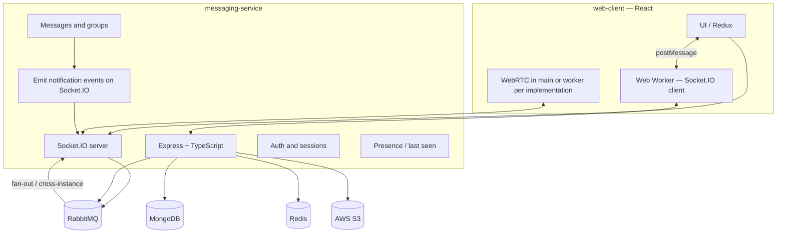

# Messaging Platform — Project Plan

## 1. Vision and scope

Build a **scalable messaging web application** with a **React** client and **one Node.js (Express) microservice** (**messaging-service**) written in **TypeScript**. The system supports direct and group chat, presence (last seen), user discovery, **in-tab** notifications for **new messages** and **incoming calls**, and real-time **audio/video** and **group calls**, with **MongoDB** as the primary data store, **Redis** for presence (last seen, rate limits, runtime config cache—not for Socket.IO room state), **RabbitMQ** for reliable message delivery to online recipients, and **AWS S3** for media.

**Notifications:** There is **no separate notification-service** and **no Redis Streams** for notification fan-out. **Typed notification events** (e.g. new message, incoming call) are **emitted over the same Socket.IO connection** as chat and signaling, targeting the appropriate **user** / **group** rooms on **messaging-service**. On the **web-client**, the **Socket.IO client runs in a dedicated Web Worker** so the connection stays responsive without blocking the UI thread; the worker forwards events to the main thread (e.g. `postMessage`) for Redux/UI.

---

## 2. Feature checklist (mapped to capabilities)

| #   | Feature                                               | Primary systems                                                                                                           |
| --- | ----------------------------------------------------- | ------------------------------------------------------------------------------------------------------------------------- |
| 1   | One-to-one text messaging                             | **messaging-service**, MongoDB, **Socket.IO** (client transport) **in sync with RabbitMQ** (routing / cross-node fan-out) |
| 2   | Sign up / log in with email & password + verification | **messaging-service** (auth APIs), email provider, JWT/session store                                                       |
| 3   | Video/audio call (1:1)                                | Signaling (Socket.IO/WebRTC), optional TURN/STUN                                                                           |
| 4   | Group call                                            | Same as 3 + SFU/MCU or mesh strategy (see §6)                                                                             |
| 5   | Search users by email                                 | User index in MongoDB, privacy rules                                                                                      |
| 6   | Last seen per user                                    | Redis (TTL or explicit updates), exposed via API                                                                          |
| 7   | Typed in-tab notifications (calls vs messages)       | **messaging-service** **Socket.IO** events to user/group rooms; **web-client** worker + UI                                 |
| 8   | Group messaging                                       | Groups in MongoDB; **Socket.IO** + **RabbitMQ** for delivery and scaling                                                  |
| 9   | Create groups                                         | Messaging API + membership ACL                                                                                            |
| 10  | Contact list (add users)                              | Contacts collection + APIs                                                                                                |

---

## 3. High-level architecture



### 3.1 Microservice responsibilities

| Service               | Role                                                                                                                                                                                                                                                                                                                                                                                                                                      |
| --------------------- | ----------------------------------------------------------------------------------------------------------------------------------------------------------------------------------------------------------------------------------------------------------------------------------------------------------------------------------------------------------------------------------------------------------------------------------------- |
| **messaging-service** | HTTP APIs (auth, users, contacts, groups, messages, search, media upload URLs), **Socket.IO** for real-time **chat**, **call signaling**, and **in-tab notification events** (single event **`notification`**, payload **`kind`** in §8) to **web-client**; writes **last seen** to **Redis**; **publishes persisted messages to RabbitMQ** and **consumes / correlates RabbitMQ deliveries with Socket.IO** per §3.2 and §3.2.1. |

### 3.2 Socket.IO and RabbitMQ (messaging)

Real-time messaging uses **Socket.IO** on **messaging-service** together with **RabbitMQ**—they are complementary, not alternatives:

| Concern          | Socket.IO                                                                   | RabbitMQ                                                                                                                                                                                                   |
| ---------------- | --------------------------------------------------------------------------- | ---------------------------------------------------------------------------------------------------------------------------------------------------------------------------------------------------------- |
| **Role**         | Bidirectional transport to browsers (rooms, acknowledgements, reconnection) | Durable routing with **user-scoped** and **group-scoped** keys (§3.2.1); **cross-instance** delivery when multiple messaging-service replicas run                                                         |
| **Typical flow** | Client emits/receives chat events over Socket.IO                            | After **MongoDB persist**, publish to RabbitMQ; service workers (or the same process) **consume** and **emit to the correct Socket.IO room(s)** so recipients get messages even if handled on another node |

Design the **exchange / queue topology** so bindings align with **§3.2.1** (separate routing for **direct** vs **group** messages). RabbitMQ remains the **durable routing** layer after persistence; Socket.IO remains the **last-mile** to connected clients. **Do not** use Redis to store or synchronize Socket.IO **room** membership—that model is **§3.2.2**.

### 3.2.1 Routing keys: direct vs group (scaling)

**Scaling constraint:** Fanning out **N RabbitMQ publishes per group message** (one per member) does **not** scale with group size. Prefer **one broker publish per persisted group message** and **subscription-based** delivery on the client.

| Mode | RabbitMQ (after MongoDB persist) | Socket.IO rooms / subscriptions |
| ---- | --------------------------------- | -------------------------------- |
| **Direct (1:1)** | **Single** publish per message with a routing key scoped to the **recipient’s user id** (e.g. `message.user.<recipientUserId>`). | Each client is joined (server-side) to a room for **their own user id** (e.g. `user:<userId>`). Incoming direct messages are emitted only to that recipient’s room. |
| **Group** | **Single** publish per message with a routing key scoped to the **group id** (e.g. `message.group.<groupId>`). **Do not** publish one broker message per group member for the same chat event. | Each client is joined to a room per **group id** they belong to (e.g. `group:<groupId>`), **in addition** to their **user id** room. **Membership changes** (join/leave group) must **add or remove** the corresponding group room subscription on the server (and client state must stay in sync). |

**Client UI:** Clients may receive a **group** message on the **group** channel even when the **sender** is the current user (e.g. authoritative echo from the server). **Deduplicate and update the UI** using **`messageId`** as the source of truth; use **`sender_id` vs current user id** (and optimistic send state) to **avoid duplicate bubbles** or conflicting optimistic vs server-rendered rows.

### 3.2.2 Socket.IO rooms are in-memory per server (not Redis)

**Rooms** (`socket.join('user:…')`, `socket.join('group:…')`, `io.to(room).emit(…)`) are **in-process, in-memory** data structures inside each **Socket.IO server** (each **messaging-service** Node process). They record which **local** socket connections belong to which logical channel. **Redis is not used** to replicate or share room membership across nodes.

**Why this is enough for horizontal scale:** After a message is persisted, **RabbitMQ** delivers the event to **each** replica’s consumer (per-instance queues or equivalent). Each replica runs **`io.to('user:<recipientId>').emit(…)`** (or the group room) **on its own process**. Only replicas that actually have **connected clients** joined to that room in **local memory** will send to anyone; other replicas issue an emit to an **empty** room (no harm). So **cross-node fan-out is carried by the broker**, not by synchronizing rooms through Redis.

**What Redis is still for:** last-seen presence, rate-limit counters, optional runtime-config cache, refresh-token storage—**not** Socket.IO room state.

**`@socket.io/redis-adapter`:** Not part of the intended architecture for room delivery (it would duplicate routing already solved by RabbitMQ and can **double-deliver** if combined with per-instance broker consumers). Keep **`SOCKET_IO_REDIS_ADAPTER`** **off** unless a separate, explicitly justified use case appears; see **`docs/ENVIRONMENT.md`** and **`TASK_CHECKLIST.md`**.

### 3.3 In-tab notifications (no separate service)

- **Server:** After relevant domain events (e.g. message persisted for another user, incoming call offer), **emit** a single Socket.IO event **`notification`** (see **§8**) to the recipient’s **`user:<userId>`** room (and, when applicable, to **`group:<groupId>`** for group-thread visibility — same payload shape). Apply mute/DND **before** emitting.
- **Client:** The **Socket.IO client runs in a Web Worker**; the worker **listens** for **`notification`** and **posts** the JSON payload to the main thread for toasts/banners/Redux. **No second WebSocket** to a notification service; **no Redis Streams** for this path.

_Optional later split:_ extract a dedicated **Socket.IO gateway** if traffic grows; keep domain logic and persistence in **messaging-service**.

---

## 4. Technology choices (as specified)

| Layer                                 | Choice                                 | Usage                                                                                                   |
| ------------------------------------- | -------------------------------------- | ------------------------------------------------------------------------------------------------------- |
| Runtime                               | Node.js + **Express** + **TypeScript** | **messaging-service** only (backend)                                                                  |
| Real-time messaging transport         | **Socket.IO**                          | Server on **messaging-service**; client in **web-client** **Web Worker**; pairs with RabbitMQ per §3.2 |
| Cache / presence                      | **Redis**                              | Last seen, session hints, rate limits, runtime config cache — **not** Socket.IO rooms (rooms are in-memory per process; **§3.2.2**) |
| Message fan-out & cross-instance sync | **RabbitMQ**                           | After persist, route deliveries; **messaging-service** aligns broker consumers with **Socket.IO** emits |
| Primary DB                            | **MongoDB**                            | Users, conversations, messages, groups, contacts                                                        |
| Media                                 | **AWS S3**                             | Uploads via AWS SDK in **messaging-service**; keys in MongoDB                                           |
| Client                                | **React** (**web-client**)             | SPA; **Socket.IO in Web Worker**; WebRTC for calls                                                      |

---

## 5. Data model (conceptual)

- **Users**: email (unique, indexed), password hash, verification status, profile fields, `lastSeenAt` (optional mirror in Redis for hot path).
- **Contacts**: `(ownerId, contactUserId)`, status (pending/accepted), timestamps.
- **Conversations**: direct (participant pair) vs group; `groupId` for groups.
- **Groups**: name, createdBy, members[], settings.
- **Messages**: `conversationId`, sender, type (text/media/system), S3 key for media, timestamps, delivery metadata as needed.
- **Sessions / refresh tokens**: MongoDB or Redis depending on revocation strategy.

---

## 6. Real-time and calls

| Concern       | Approach                                                                                                                                                                           |
| ------------- | ---------------------------------------------------------------------------------------------------------------------------------------------------------------------------------- |
| Chat delivery | **Socket.IO** between **web-client** and **messaging-service**; **RabbitMQ** for persisted-message routing (**user-scoped** keys for direct, **group-scoped** keys for groups — one publish per message; see §3.2.1) and multi-instance delivery **in sync** with Socket.IO emits. |
| In-tab alerts | **Socket.IO** events from **messaging-service** (§3.3); client **Web Worker** forwards to UI.                                                                                      |
| 1:1 WebRTC    | Offer/answer/ICE via **Socket.IO** (or dedicated channel on the same server); **STUN** (public); **TURN** for restrictive NATs (managed service or coturn).                        |
| Group calls   | Prefer **SFU** (e.g., mediasoup, Janus, or a managed CPaaS) for scalability; document as phase 2 if starting with mesh for MVP.                                                    |

---

## 7. Security and compliance

- Passwords: **argon2** or **bcrypt**; never log secrets.
- **JWT** (short-lived access) + **refresh tokens**; HTTPS only.
- Email verification: signed tokens, expiry, resend limits.
- **S3**: server-side upload via AWS SDK, bucket policies, virus scanning optional.
- Rate limiting on auth and search; audit logs for sensitive actions.

---

## 8. Notification event shapes (requirement 7)

In-tab notifications use **one** Socket.IO event name and a **versioned, discriminated JSON object** so the web-client can `switch (payload.kind)` without parallel event namespaces.

### 8.1 Event name

| Event name        | Direction | Purpose |
| ----------------- | --------- | ------- |
| **`notification`** | Server → client | In-app toast/banner payload for **new messages** (direct or group) and **incoming calls** (audio or video). |

**Rooms:** Implementations typically emit to **`user:<recipientUserId>`** so each user gets at most one copy and **mute/DND** can be applied per recipient. For **group** threads, an alternative is a single emit to **`group:<groupId>`** (all joined clients receive it); the client must **skip** UI when **`senderUserId`** is the current user. **Incoming calls** use **`user:<calleeUserId>`** (and optionally the same pattern for group calls).

### 8.2 Envelope (all notifications)

Every payload includes:

| Field            | Type     | Required | Description |
| ---------------- | -------- | -------- | ----------- |
| **`schemaVersion`** | `integer` | yes | **Start at `1`.** Bump when breaking field renames/removals; clients may ignore unknown fields. |
| **`kind`**       | `string` | yes | Discriminator: **`"message"`** or **`"call_incoming"`**. |
| **`notificationId`** | `string` | yes | **Stable id** for deduplication and analytics (e.g. UUID). Same logical alert should not get two different ids on retry. |
| **`occurredAt`** | `string` | yes | ISO-8601 **`date-time`** when the server decided to notify (not necessarily message `createdAt` if delayed). |

### 8.3 `kind: "message"` — new message (1:1 or group)

Emitted when another user’s message is persisted and the recipient should see an in-tab alert (respecting mute/DND). **Do not** use this for the sender’s own optimistic echo — chat delivery uses separate message events; this is **notification UI only**.

| Field | Type | Required | Description |
| ----- | ---- | -------- | ----------- |
| **`threadType`** | `"direct" \| "group"` | yes | **One-to-one** vs **group** thread. |
| **`conversationId`** | `string` | yes | Conversation id (same as REST/chat). |
| **`messageId`** | `string` | yes | Persisted message id — **dedupe** with chat stream. |
| **`senderUserId`** | `string` | yes | Who sent the message. |
| **`senderDisplayName`** | `string \| null` | no | Display name for title/summary; omit or null if unknown. |
| **`preview`** | `string` | no | Short plaintext preview for the toast (truncate server-side if needed). |
| **`groupId`** | `string` | if `threadType === "group"` | Group id. |
| **`groupTitle`** | `string \| null` | no | Group name for UI when `threadType === "group"`. |

**Example (direct):**

```json
{
  "schemaVersion": 1,
  "kind": "message",
  "notificationId": "550e8400-e29b-41d4-a716-446655440000",
  "occurredAt": "2026-04-02T12:00:00.000Z",
  "threadType": "direct",
  "conversationId": "conv_abc",
  "messageId": "msg_xyz",
  "senderUserId": "user_peer",
  "senderDisplayName": "Alex",
  "preview": "Are we still on for later?"
}
```

**Example (group):**

```json
{
  "schemaVersion": 1,
  "kind": "message",
  "notificationId": "6ba7b810-9dad-11d1-80b4-00c04fd430c8",
  "occurredAt": "2026-04-02T12:00:01.000Z",
  "threadType": "group",
  "conversationId": "conv_grp",
  "messageId": "msg_grp1",
  "senderUserId": "user_peer",
  "senderDisplayName": "Alex",
  "preview": "Uploaded the doc.",
  "groupId": "grp_123",
  "groupTitle": "Project Alpha"
}
```

### 8.4 `kind: "call_incoming"` — incoming audio or video call

Emitted when the callee should ring/show an incoming-call UI. **Signaling** (offer/answer/ICE) stays on separate call events; this object is for **notification + routing** (who, which call, what media).

| Field | Type | Required | Description |
| ----- | ---- | -------- | ----------- |
| **`media`** | `"audio" \| "video"` | yes | **Audio-only** vs **video** call. |
| **`callScope`** | `"direct" \| "group"` | yes | **1:1** vs **group** call. |
| **`callId`** | `string` | yes | **Correlation id** shared with signaling so UI can join the same session. |
| **`callerUserId`** | `string` | yes | User initiating the call. |
| **`callerDisplayName`** | `string \| null` | no | Shown on incoming UI. |
| **`conversationId`** | `string` | no | Direct thread id when `callScope === "direct"` (recommended). |
| **`groupId`** | `string` | if `callScope === "group"` | Group id for group calls. |
| **`groupTitle`** | `string \| null` | no | Group name when `callScope === "group"`. |

**Example (1:1 video):**

```json
{
  "schemaVersion": 1,
  "kind": "call_incoming",
  "notificationId": "7c9e6679-7425-40de-944b-e07fc1f90ae7",
  "occurredAt": "2026-04-02T12:00:02.000Z",
  "media": "video",
  "callScope": "direct",
  "callId": "call_sess_001",
  "callerUserId": "user_peer",
  "callerDisplayName": "Alex",
  "conversationId": "conv_abc"
}
```

**Example (group audio):**

```json
{
  "schemaVersion": 1,
  "kind": "call_incoming",
  "notificationId": "8d3e7780-8536-51ef-a55c-f18fd2f91bf8",
  "occurredAt": "2026-04-02T12:00:03.000Z",
  "media": "audio",
  "callScope": "group",
  "callId": "call_grp_002",
  "callerUserId": "user_peer",
  "callerDisplayName": "Alex",
  "groupId": "grp_123",
  "groupTitle": "Project Alpha"
}
```

### 8.5 Future kinds

Additional **`kind`** values (e.g. `call_missed`, `group_invite`) should be added in a backward-compatible way (new discriminator values, same envelope fields). **No Redis Streams** for in-tab delivery; optional **Web Push** is a separate product decision (not required for tab-open MVP).

---

## 9. Phased delivery plan

### Phase 0 — Foundation (week 1–2)

- Monorepo layout per §10 (`apps/*` only). **messaging-service** and **web-client** each carry **their own** `package.json`, **`package-lock.json`**, **`node_modules`**, TypeScript, ESLint, and Prettier (**no npm workspaces**—install per app). **No** repo-root tooling for all apps, **no** shared backend tooling package, **no** `packages/shared`—**API types** come from **OpenAPI codegen** (see `PROJECT_GUIDELINES.md`).
- Docker Compose: MongoDB, Redis, RabbitMQ, local S3 (MinIO) for dev.
- **messaging-service**: health checks, config, logging, error model; **Socket.IO** server bootstrap.
- **web-client**: scaffold; plan **Socket.IO client in Web Worker** early (bundling, auth token handoff, `postMessage` protocol).

### Phase 1 — Identity (requirement 2)

- Register, login, email verification, password reset flow.
- JWT issuance; protected routes on **messaging-service**.

### Phase 2 — Users, contacts, search, presence (5, 6, 10)

- Contact requests and list APIs.
- User search by email (exact or prefix; privacy: only if allowed).
- **Last seen**: update on activity + periodic heartbeat; read from Redis with MongoDB fallback if needed.

### Phase 3 — Messaging core (1, 8, 9)

- Direct conversations and messages in MongoDB.
- **Groups**: create, add members, group conversations.
- **RabbitMQ** topology: design exchanges/queues (e.g., per-user or per-conversation) aligned with access patterns.
- **Socket.IO** + **RabbitMQ** in sync: persist message → publish to broker → consume and emit to Socket.IO rooms; verify multi-replica behaviour when scaling **messaging-service**.

### Phase 4 — Media (S3)

- **messaging-service** uploads via AWS SDK; message types for image/file; size and MIME checks.

### Phase 5 — In-tab notifications (7)

- **messaging-service**: emit **Socket.IO** notification events on message/call events to the right rooms; document payload schema.
- **web-client**: worker receives events → main thread → toasts/banners / Redux; mute/DND in client or server rules.

### Phase 6 — Calls (3, 4)

- Signaling channel; 1:1 WebRTC MVP.
- Group call: SFU integration or documented interim limitation.

### Phase 7 — Hardening

- Load testing, monitoring (metrics/traces), backup strategy for MongoDB, runbooks.

---

## 10. Repository layout (suggested)

Top-level apps use **clear names**: **`web-client`** and **`messaging-service`**. Each app keeps its **own** structural folders—**`types/`**, **`utils/`**, **`controllers/`** (or route handlers), **`hooks/`** (where applicable), **`services/`**, **`repositories/`**, etc.—so concerns stay **isolated per deployable**. Cross-cutting **REST contracts** are defined in **`docs/openapi/`** (OpenAPI 3); **web-client** uses **generated** types from that spec, not a shared `packages` library. **Tooling:** each deployable has its **own** **`package.json`**, **TypeScript**, **ESLint**, and **Prettier**; **no** single repo-root TypeScript/ESLint/Prettier for the entire monorepo.

### 10.1 Web-client — `common/` + `modules/` (target layout)

**Goal:** Separate **cross-cutting client code** (reused everywhere) from **feature- or page-scoped code** (owned by a single route or product area). **Shared** building blocks live under **`src/common/`**; each **feature / page area** lives under **`src/modules/<module-id>/`** with its own **components**, **stores**, **api**, **constants**, **utils**, and **types** so modules stay **encapsulated** and easier to navigate as the app grows.

| Area | Purpose |
|------|---------|
| **`src/common/`** | Code reused across the SPA: **`api/`** (HTTP client, **`API_PATHS`**, OpenAPI-typed REST modules), **`components/`** (shared UI), **`constants/`**, **`types/`**, **`utils/`**. Optional: **`hooks/`** for shared React hooks if not placed under **`utils`**. |
| **`src/modules/<module-id>/`** | One folder per **feature or page** (e.g. `home`, `settings`, `auth-login`). Each module may contain **`components/`**, **`stores/`** (Redux slices or local state owned by the module), **`api/`** (thin wrappers over **`common/api`** when calls are module-specific), **`constants/`**, **`utils/`**, **`types/`**, and **`pages/`** (route entry components) or a single **`Page.tsx`** at the module root — **team convention** should stay consistent. |
| **`src/store/`** | Global Redux **`configureStore`**, root reducer wiring, **registering slices** exported from **`modules/*/stores`**. |
| **`src/routes/`** | Router shell, **`ProtectedRoute`**, **path constants** (e.g. **`paths.ts`** / **`ROUTES`**) — **only** location for SPA pathname strings; see **`PROJECT_GUIDELINES.md` §4.0**. |
| **`src/generated/`** | OpenAPI codegen output — **unchanged** path for **`openapi-typescript`**. |
| **`src/workers/`** | Web Worker entries (e.g. Socket.IO) per §3.3. |
| **`src/main.tsx`**, **`App.tsx`**, **`index.css`** | Application bootstrap at **`src/`** root. |

**Example (illustrative — not exhaustive):**

```
apps/web-client/src/
  main.tsx
  App.tsx
  index.css
  common/
    api/              # httpClient, paths, authApi, usersApi, …
    components/       # Shared presentational / layout components
    constants/
    types/
    utils/
    hooks/            # Shared React hooks (e.g. useAuth, usePresenceConnection)
    realtime/         # Socket.IO main-thread bridge + protocol (pairs with workers/)
    theme/            # ThemeProvider, useTheme, storage
  modules/
    home/
      components/
      stores/
      api/
      constants/
      utils/
      types/
      pages/          # e.g. HomePage.tsx
    settings/
      components/
      stores/
      api/
      constants/
      utils/
      types/
      pages/
    auth-login/
      …
  store/
  routes/
  generated/
  workers/
```

**Rules of thumb:** (1) If a file is **only** used by one feature, it belongs in that **module**. (2) If it is imported from **two or more** modules or from **`App`**, it belongs in **`common/`** (or **`store/`** / **`routes/`** as appropriate). (3) **REST DTO types** still come from **`generated/`** + **`common/api`**; module **`types/`** are for **view/UI** shapes specific to that module.

**Legacy note:** Remaining migration items are tracked in **`TASK_CHECKLIST.md`**. Pages live under **`src/modules/<module-id>/pages/`**; REST client under **`src/common/api/`**; shared Socket.IO bridge + theme under **`src/common/realtime/`** and **`src/common/theme/`**; auth Redux and helpers under **`src/modules/auth/`**.

```
messaging-system/
  apps/
    web-client/
      src/
        …            # see §10.1 for target tree; legacy layout may persist during migration
    messaging-service/
      src/
        controllers/     # HTTP (and Socket.IO attachment points if colocated)
        types/           # service-local types (REST DTOs align with docs/openapi/)
        utils/
        services/
        repositories/
        ...
  infra/
    docker-compose.yml
  docs/
    openapi/           # OpenAPI 3 spec (source of truth for REST + codegen)
    PROJECT_PLAN.md
```

**Rule of thumb:** if code is only used inside one app, it lives under that app’s `src/` tree. **REST DTO alignment** uses **`docs/openapi/`** plus **client codegen** and **server-side Zod** (or equivalent)—not a shared TypeScript package.

---

## 11. Risks and decisions to lock early

| Topic                                     | Decision needed                                                                                                         |
| ----------------------------------------- | ----------------------------------------------------------------------------------------------------------------------- |
| **Socket.IO** + **RabbitMQ** alignment    | Exact exchange/queue naming, consumer ownership (same process vs worker pool), and ordering guarantees per conversation |
| Horizontal scale of **messaging-service** | **RabbitMQ** to every replica + **local in-memory** `io.to(room).emit` (§3.2.2); **no** Redis-backed Socket.IO room sync; optional **sticky** load balancer only if needed for long-lived WebSocket affinity—not for room replication        |
| **Web Worker** + Socket.IO                  | Bundling (`vite-plugin-web-worker` or equivalent), passing JWT/cookies to worker, reconnection UX from UI               |
| Group calls                               | Mesh (simple, poor scale) vs SFU (ops cost)                                                                             |
| Search                                    | Exact email only vs full-text (Atlas Search) later                                                                      |

---

## 12. Success criteria (MVP)

- **messaging-service** runs in Docker Compose with **web-client**; users can register, verify email, log in, add a contact, exchange 1:1 messages over **Socket.IO** with **RabbitMQ-backed** delivery, see last seen, search by email, create a group and send group messages, upload small media to S3, receive **in-tab** notifications for messages and call events over **Socket.IO** (worker + UI), and complete a 1:1 call in supported browsers.

---

## 13. Documentation entry point and deployment

- **Repository root [`README.md`](../README.md)** is the short entry point: Node/npm version, **per-app** `npm install` / `npm run …` (each app has its own lockfile; optional root **`install:all` / `lint:all` / `typecheck:all`** helpers). It links here for everything else.
- **Architecture, feature scope, stack, and repository layout** are defined in this document (**§1–§10**).
- **Deployment and operations** (how the system is meant to run in containers and behind nginx) are specified here; **implementation tasks** (Compose file, nginx config, TLS, env files) live in **`TASK_CHECKLIST.md`** under **Project setup → Docker Compose, nginx, TLS, deployment**.

### Target deployment shape

- **`infra/docker-compose.yml`** (or equivalent) runs **messaging-service**, **MongoDB**, **Redis**, **RabbitMQ**, S3-compatible storage (e.g. **MinIO**), **nginx** (reverse proxy for REST + **Socket.IO**, static **web-client** `dist/`, TLS termination), and optionally **coturn** for WebRTC TURN.
- Document hostnames, ports, and env injection so the stack can be brought up with one command once implemented; align variable names with **`docs/ENVIRONMENT.md`**.
- **web-client** is built to static assets consumed by nginx; backend exposes HTTP/Socket.IO as described in **§3** and **§6**.

---

_Document version: 2.2 — §10.1: web-client **`common/`** + **`modules/`** target layout; legacy flat `src/` may persist until migration._
