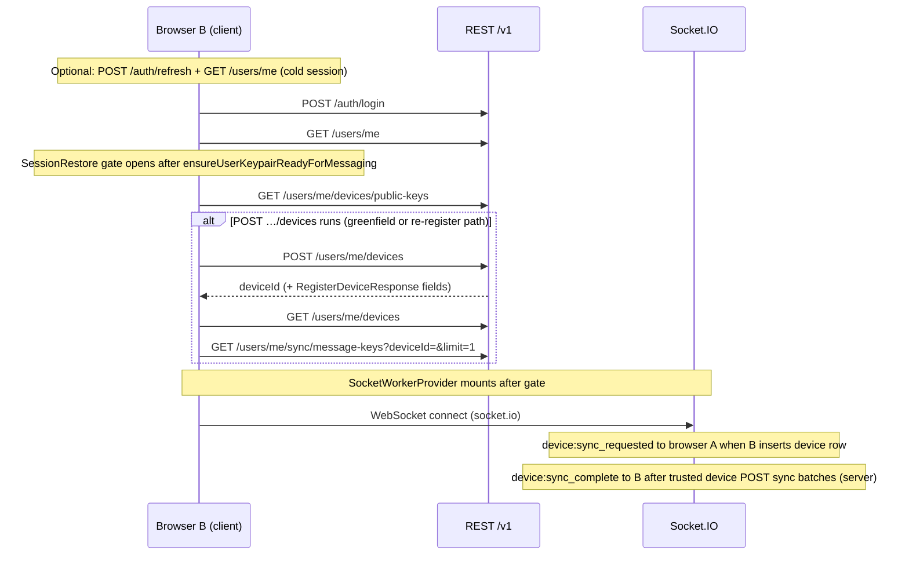

# Stable repro: second browser login — Feature 13 sync skipped / “Can’t decrypt on this device”

This document satisfies **TASK_CHECKLIST.md → Bugfix — Second browser login (sync skipped) → (1) Stable repro**, **(2) Network audit on browser B first login**, **(3) Capture four identifiers on browser B after login**, **(4) Capture on browser A while B logs in**, **(5) Bootstrap trace on B** (§ **Bootstrap trace on browser B (root-cause — web-client)**), **(6) Socket path on A** (§ **Socket path on A (trusted device)**), **(7) Sync orchestrator** (§ **Sync orchestrator (`useDeviceKeySync`)**), **(8) New device UI** (§ **New device UI (`NewDeviceSyncBanner`)**), **(9) Decrypt path on B** (§ **Decrypt path on browser B (peer inbound)**), and **(10) messaging-service** (§ **`POST /users/me/devices` emit + sync JWT (`sourceDeviceId`)**, § **`POST /users/me/sync/message-keys` authz + Mongo + errors**, § **`DEVICE_SYNC_RATE_LIMIT_*` vs browser B**), and **(11) Expected UX policy (browser B)** (§ **Expected UX policy — Feature 13 vs ciphertext**): fixed steps, **browser A / browser B** definitions, shared **`VITE_*`** configuration, **same-origin** parity with production, an **A online vs A offline** matrix when **B** first logs in, an **ordered REST + Socket.IO** reference derived from **`apps/web-client`** source, record sheets for **B** (Redux + IDB + devices + message keys) and **A** (**`device:sync_requested`**, **`DeviceSyncApprovalBanner`**, **`POST …/sync/message-keys`** after Approve).

**Related:** same-browser logout/relogin debugging — **`docs/repro-decrypt-after-relogin.md`**. Same browser **A → B → A** after B used another device + sync — Socket.IO reconnect storm on send — **`docs/repro-user-a-b-a-socket-reconnect.md`**.  
**Protocol:** **`docs/PROJECT_PLAN.md` §7.1** — New Device Sync Flow (Feature 13).

---

## Symptom

After **browser A** (original profile) has **registered**, exchanged **encrypted** 1:1 messages, **logged out**, and **relogged in on A** successfully, **browser B** (another browser or profile, same user account) **logs in** and:

- Feature 13 sync may appear **skipped** or **never approved**, and/or  
- Thread history shows **“Can’t decrypt on this device…”** / **“No encryption key for this browser”** (or equivalent),

while **new** messages that include **`encryptedMessageKeys[B’s deviceId]`** may still decrypt.

---

## Expected UX policy — Feature 13 vs ciphertext (**`docs/PROJECT_PLAN.md` §7.1**)

**Task (checklist):** Document expected UX — **browser B** must either complete **Feature 13** sync from **A**, or only see **new** messages that include **`encryptedMessageKeys[B]`**; historical ciphertext **cannot** decrypt without sync — banner copy aligns with **`docs/PROJECT_PLAN.md` §7.1**.

Aligned with **`docs/PROJECT_PLAN.md` §7.1** (**Multi-device Sync**, **Actual new device or wiped profile**, **New Device Sync Flow**):

| Expectation | Source meaning |
|---------------|----------------|
| **Past messages on a new device** | By default they **cannot** be decrypted until an **existing trusted device** runs **multi-device sync** — that device unwraps stored message keys locally and uploads **new wrapped keys** for B’s **`deviceId`**; **ciphertext on the server is unchanged** (**`PROJECT_PLAN.md` §7.1** — *Multi-device Sync*, *New Device Sync Flow*). |
| **Without Feature 13** | **Earlier** traffic **lacks** **`encryptedMessageKeys` for B’s `deviceId`** — there is **no** server-side way to derive plaintext without **either** sync **or** the old device’s private key (**§7.1** *Actual new device or wiped profile*). |
| **What still works** | **New** messages **after** B registers can include **`encryptedMessageKeys[B]`** when senders use the device directory — those decrypt normally on B **without** waiting for sync. |
| **Copy surfaces** | **`NewDeviceSyncBanner`** (B, pending sync), **`DeviceSyncApprovalBanner`** (A, approve), and inline **`PEER_DECRYPT_*`** when **`encryptedMessageKeys[myDeviceId]`** is missing — wording matches this policy (implementation in **`apps/web-client`**). |

This is **why** the second-browser repro may show **“can’t decrypt”** on **older** bubbles while **new** traffic works — it is expected until sync completes, not necessarily a transport bug.

---

## Definitions

| Term | Meaning |
|------|---------|
| **Browser A** | **Primary** environment: e.g. **Chrome profile 1** (chrome://settings/manageProfile), or “Browser A” = first browser you use for the account (Firefox, Safari, Edge — pick one and **keep it stable** for all A-steps). |
| **Browser B** | **Second** environment: e.g. **Chrome profile 2**, **Firefox**, **Safari**, or another machine — **must not share** IndexedDB / localStorage with A (fresh profile per vendor guidance). |

Do **not** mix **normal** and **Incognito** for the same labeled browser in one repro unless you document it — storage isolation differs.

---

## Shared configuration (`VITE_API_BASE_URL` and origins)

### Same API base for both browsers

Both builds used by A and B must target the **same** messaging API (same host, port, path prefix):

- **Typical dev:** **`VITE_API_BASE_URL=/v1`** (or **`http://localhost:5173/v1`** if explicitly absolute) so the SPA and Vite dev server share origin — see **`apps/web-client/vite.config.ts`** proxy and **`apps/web-client/.env.development`**.  
- **Variant:** **`VITE_API_BASE_URL=http://localhost:8080/v1`** (or **3001** per your **README** / Compose) — then **both** browsers must use the **same** value in the **built** env for the repro (rebuild/restart Vite after edits).

**Checklist:**

- [ ] **`echo` / inspect** built client: both sessions resolve REST + Socket.IO to the **same** API origin (Network tab: WebSocket URL + XHR base match).  
- [ ] No accidental mix (A on proxy **`/v1`**, B on direct **`localhost:8080`**) unless that **is** the variable under test — document if so.

### Same-origin rules as production

Production usually serves the SPA and routes API via **one site** (reverse proxy, path prefix). For a faithful repro:

- Prefer **both** A and B loading the app from the **same** SPA origin (e.g. **`http://localhost:5173`** for local Vite, or **`https://app.example.com`** behind nginx).  
- Avoid A on **`localhost:5173`** and B on **`127.0.0.1:5173`** unless you are explicitly testing **cross-origin** cookie/storage — they are different origins and can skew Socket.IO / storage behavior.

**Checklist:**

- [ ] **Location bar origin** (scheme + host + port) matches between A and B for the SPA.  
- [ ] If using cookies for refresh (future) or mixed deployments, note **SameSite** / proxy headers — default dev uses **localStorage** refresh token per **`authStorage`**; still keep SPA origin consistent.

---

## Environment matrix (document when filing bugs)

| Axis | Variant **1** | Variant **2** |
|------|----------------|----------------|
| **`VITE_API_BASE_URL`** | **`/v1`** (Vite proxy, same origin as SPA) | Absolute API URL (**`http://localhost:<api-port>/v1`**) — both browsers identical |
| **`VITE_REVOKE_DEVICE_ON_LOGOUT`** | **Unset** / **`false`** (typical dev) | **`true`** — note if A’s logout revokes server device row before B scenario |
| **Browser B** | Chrome **profile 2** | Firefox **or** Safari **or** Edge (second profile) |

Record **browser + version** for A and B separately.

**Backend:** messaging-service + deps running per **`README.md`** / **`infra`** so auth, conversations, messages, **`POST /users/me/devices`**, Socket.IO **`device:sync_requested`**, and sync REST routes work.

---

## Prerequisites

1. **Two browsers or two profiles** as defined above (A and B isolated).  
2. Optional third account **Peer C** for 1:1 chat — or use a single user across A/B only if your test is “second device decrypt” with messages from **Peer C** sent **before** B existed (historical **`encryptedMessageKeys`** lack B).  
3. Clean **B** profile: no prior Ekko IndexedDB for this origin (or use DevTools → Application → Clear site data for the SPA origin) if you need a pristine “new device” run.

---

## Phase 1 — Establish history on browser A only

Perform on **browser A** only:

1. Set **`VITE_*`** per matrix; restart **`npm run dev`** in **`apps/web-client`** if needed.  
2. **Register** user **U** (or log in).  
3. Open **Home**, create or open a **1:1** thread with **Peer C** (or second user).  
4. Exchange **at least two encrypted messages in both directions**; confirm plaintext renders.  
5. Optionally: **Settings → Sign out** on A, then **log in again on A** and confirm history still decrypts (**sanity check** — same doc as **`repro-decrypt-after-relogin.md`**).  

Stop when **U** has a **non-empty** encrypted history that predates **B’s** **`deviceId`**.

---

## Phase 2 — Browser B first login (pick matrix row)

### Matrix: **Row A-online** — trusted device online when B logs in

**Goal:** Observe Feature 13 path (approval on A, sync POSTs, eventual decrypt on B).

1. Keep **browser A** open and **logged in** as **U** (Socket.IO connected — e.g. Home visible, not sleeping).  
2. Open **browser B**, navigate to the **same SPA origin** as A (see [Shared configuration](#shared-configuration-vite_api_base_url-and-origins)).  
3. **Log in** as **U** on B (same credentials).  
4. **Observe:**  
   - **B:** **`NewDeviceSyncBanner`** or equivalent “new device / sync” UI; Redux / UI **`syncState`**.  
   - **A:** **`DeviceSyncApprovalBanner`** or toast — **Approve** when ready.  
5. After approval, wait for sync completion (**`device:sync_complete`** / banner dismiss / reload thread).  
6. Open the **same** 1:1 thread on **B** and inspect message rows.

**Expected (nominal):** historical messages decrypt on B once keys are re-wrapped for B’s **`deviceId`**.

**Failure mode under investigation:** sync UI never appears on A or B; **`encryptedMessageKeys`** on server still has **no** key for B’s **`deviceId`** → decrypt errors on history.

---

### Matrix: **Row A-offline** — A not connected when B first logs in

**Goal:** Observe behavior when **no** trusted session can receive **`device:sync_requested`** immediately.

1. On **browser A**, **sign out** or **close the tab** (or block network) so **U** is **not** connected via Socket.IO on A.  
2. On **browser B**, open the **same SPA origin**, **log in** as **U**.  
3. Note UI on **B** (pending sync banner, errors).  
4. Restore **browser A**: log in as **U**, ensure Socket connects.  
5. Check whether **A** retroactively shows **Approve sync** for B, or whether user must retry / refresh B.

**Expected (product-dependent):** **B** may stay in **pending** until **A** comes online and approves; document actual behavior vs bug.

---

## Capture four identifiers on browser B after login

**Task (checklist):** Redux **`cryptoSlice`** (**`deviceId`**, **`syncState`**, **`registeredOnServer`**) + IndexedDB **`deviceId`** + **`GET /v1/users/me/devices`** response + **one** fetched message’s **`encryptedMessageKeys`** keys (does it include B’s **`deviceId`**?).

**When:** Immediately after **browser B** finishes login / encryption gate (**Home** reachable), **before** relying on cached assumptions — same discipline as **`docs/repro-decrypt-after-relogin.md`** (**After relogin: capture three identifiers**).

**Implementation references:** **`cryptoSlice`** (**`apps/web-client/src/modules/crypto/stores/cryptoSlice.ts`**), selectors **`selectMessagingDeviceId`**, **`selectSyncState`**, **`selectPublicKeyRegistered`** (**`registeredOnServer`** — name legacy from public-key era; still maps to **`state.crypto.registeredOnServer`**) (**`apps/web-client/src/modules/crypto/stores/selectors.ts`**), **`getStoredDeviceId`** / **`deviceIdentity`** (**`apps/web-client/src/common/crypto/privateKeyStorage.ts`**), **`listMyDevices`** → **`GET /v1/users/me/devices`**, messages from **`GET /v1/conversations/{conversationId}/messages`** (see **`API_PATHS.conversations.messages`**).

### Record sheet (copy → bug notes / PR)

| # | Source | Fields | How to read |
|---|--------|--------|-------------|
| **1** | **Redux `cryptoSlice`** | **`deviceId`**, **`syncState`**, **`registeredOnServer`** | Redux DevTools → **`state.crypto`** → copy the three fields. **`syncState`:** **`idle`** \| **`pending`** \| **`in_progress`** \| **`complete`**. **`registeredOnServer`:** **`true`** after successful **`POST …/devices`** (**`registerDevice.fulfilled`**). |
| **2** | **IndexedDB `deviceId`** | **`deviceIdentity.deviceId`** | DevTools → **Application** → **IndexedDB** → **`messaging-client-crypto`** → **`deviceIdentity`** → row keyed by **`userId`** (**U**). Must match **`state.crypto.deviceId`** unless timing/hydration bug. |
| **3** | **`GET /v1/users/me/devices`** | All **`items[].deviceId`** (and optionally **`createdAt`**) | Network → **`GET`** **`…/users/me/devices`** → **Response** JSON **`items`**. Confirm **≥ 2** devices when **A** + **B** both registered. |
| **4** | **One `Message`** | **`Object.keys(message.encryptedMessageKeys ?? {})`** | Network → **`GET`** **`…/conversations/{id}/messages`** → pick **one** hybrid row → copy **key list** for **`encryptedMessageKeys`**. Compare to **(1)** **`deviceId`** (**B’s** id): **if B’s id is absent**, historical ciphertext cannot unwrap on B until Feature 13 sync adds that entry. |

**Comparison row (paste values)**

| Field | Value |
|-------|--------|
| **`state.crypto.deviceId`** | |
| **`state.crypto.syncState`** | |
| **`state.crypto.registeredOnServer`** | |
| **IDB `deviceIdentity.deviceId`** | |
| **Server `GET …/devices` → `items[].deviceId`** | *(list all)* |
| **Chosen message → `encryptedMessageKeys` keys** | *(list `Object.keys`)* |
| **Does (4) include same string as first row?** | yes / no |

### (2) IndexedDB — console snippet (browser B tab)

Replace **`USER_ID_HERE`** with signed-in **`user.id`** (**U**):

```js
(async () => {
  const userId = 'USER_ID_HERE';
  const req = indexedDB.open('messaging-client-crypto');
  const db = await new Promise((res, rej) => {
    req.onerror = () => rej(req.error);
    req.onsuccess = () => res(req.result);
  });
  const row = await new Promise((res, rej) => {
    const tx = db.transaction('deviceIdentity', 'readonly');
    const g = tx.objectStore('deviceIdentity').get(userId);
    g.onerror = () => rej(g.error);
    g.onsuccess = () => res(g.result);
  });
  db.close();
  console.log('IDB deviceIdentity:', row ?? null);
})();
```

### (4) Message wire payload — procedure

1. On **B**, open the thread that fails to decrypt (or any thread with history).  
2. DevTools → **Network** → **`messages`** → **`GET`** **`…/v1/conversations/<conversationId>/messages`**.  
3. In **Response**, find one **`Message`** with **`encryptedMessageKeys`** (object). Record **`Object.keys(message.encryptedMessageKeys)`**.  
4. Ask: does that **array** contain **exactly** **`state.crypto.deviceId`** from **(1)**?  
   - **No** → missing wrapped key for this device (Feature 13 not completed or send path omitted B).  
   - **Yes** → failure is likely elsewhere (unwrap, local key, ciphertext).

**Same analysis** as **`docs/repro-decrypt-after-relogin.md`** → **Message inspection** if you need UI error classification.

---

## Capture on browser A while B logs in

**Task (checklist):** Is **`device:sync_requested`** emitted / received (server logs or A’s DevTools)? Does **`DeviceSyncApprovalBanner`** render? Any **`POST /v1/users/me/sync/message-keys`** after **Approve**?

**When:** Run **browser A** and **browser B** side by side; keep **A** on **Home** with an **authenticated registered** session so Socket.IO can stay **connected** (see connection indicator). On **B**, perform **login** as the **same user** until **B** completes **`POST …/devices`** (see **Network audit**). Watch **A** during B’s registration window.

### Prerequisites on A

- **Registered user** (not **guest**) — banner is suppressed for guests (**`DeviceSyncApprovalBanner`** early `return null` when **`user.guest`**).  
- **Socket connected** before B finishes registering — otherwise A **misses** the in-memory Socket.IO emit (no durable queue). Same limitation as **Phase 2 — Row A-offline** in this doc.  
- **DevTools open** on **A** before B logs in if you want to preserve WebSocket frames (**Preserve log**).

### 1) Was **`device:sync_requested`** emitted / seen on A?

**Server (messaging-service):** **`emitDeviceSyncRequested`** (**`apps/messaging-service/src/utils/realtime/deviceSyncEvents.ts`**) calls **`io.to('user:<userId>').emit('device:sync_requested', { newDeviceId, newDevicePublicKey })`** when **`POST …/users/me/devices`** performs a **first insert** of a new device row. If the Socket.IO server handle is missing, you only get a **debug** log: **`device:sync_requested skipped (Socket.IO server not registered)`** — not a success line at default **info** log level. Use **process logs** when **`LOG_LEVEL=debug`** if you need confirmation from the server process, or rely on the client below.

**Browser A — DevTools:** **Network** → select the **`socket.io`** **WebSocket** → **Messages** (Frames). After B registers a **new** device, look for an inbound frame whose payload includes the event name **`device:sync_requested`** and JSON **`newDeviceId`** / **`newDevicePublicKey`** (Socket.IO packet encoding wraps event names in Engine.IO frames — search the **Data** column for **`device:sync_requested`**).

**Browser A — Redux:** **`SocketWorkerProvider`** handles **`device_sync_requested`** from the worker (**`socketBridge`**) and **`dispatch(syncRequested(payload))`** (**`apps/web-client/src/common/realtime/SocketWorkerProvider.tsx`**). In Redux DevTools, **`crypto.pendingSyncFromDeviceId`** and **`crypto.pendingSyncFromDevicePublicKey`** should become **non-empty** when the event arrived.

### 2) Does **`DeviceSyncApprovalBanner`** render?

**Implementation:** **`apps/web-client/src/modules/home/components/DeviceSyncApprovalBanner.tsx`**. It renders **only when** **`selectPendingSync`** is non-**`null`** (derived from **`pendingSyncFromDeviceId`** + **`pendingSyncFromDevicePublicKey`**) **and** the user is a **registered** account.

**How to verify**

- UI: heading text **“A new device is requesting access to your message history…”** with **Approve** / **Dismiss**.  
- DOM: **`data-testid="device-sync-approval-banner"`**, **`role="region"`**, **`aria-label="Device sync approval"`**.

If **`device:sync_requested`** never reaches A (A offline, wrong room, or B never completed first-insert **`POST …/devices`**), the banner **does not** render.

### 3) **`POST /v1/users/me/sync/message-keys`** after **Approve**

**Implementation:** **`executeApproveDeviceKeySync`** (**`apps/web-client/src/modules/crypto/hooks/useDeviceKeySync.ts`**). After **Approve**:

1. **`GET /v1/users/me/devices`** — verify **`newDeviceId`** + **`newDevicePublicKey`** match the Socket payload.  
2. **`POST /v1/auth/refresh`** with **`sourceDeviceId`** (trusted device’s **`deviceId`**) so the JWT carries the correct device for subsequent sync calls.  
3. Loop: **`GET /v1/users/me/sync/message-keys`** (paginated by **`afterMessageId`**) for **`deviceId: sourceDeviceId`**, then **`POST /v1/users/me/sync/message-keys`** with **`targetDeviceId: newDeviceId`** and **`keys: [...]`** per page. **Multiple** **`POST`**s are normal when history spans more than one batch.

**Network filter on A:** **`sync/message-keys`** — expect **GET**s (pagination) and at least one **POST** after **Approve** if there are messages to re-wrap. If **`GET`** returns **empty** pages immediately, there may be **no** **`POST`** (nothing to sync).

### Record sheet (browser A while B logs in)

| Question | Evidence to attach |
|----------|-------------------|
| **`device:sync_requested` seen?** | WS frame screenshot / copy, or Redux **`pendingSync`** fields set |
| **Banner visible?** | Screenshot or **`querySelector('[data-testid=device-sync-approval-banner]')`** |
| **`POST …/sync/message-keys` after Approve?** | HAR row(s) **`POST`** **`…/users/me/sync/message-keys`** + response status |

---

## Bootstrap trace on browser B (root-cause — web-client)

**Task (checklist):** **`sessionBootstrap`** → **`ensureUserKeypairReadyForMessaging`** / **`ensureMessagingKeypair`** → **`POST /users/me/devices`** → **`evaluateDeviceSyncBootstrapState`** — confirm **`syncState`** transitions and whether **`pending`** is set when **`encryptedMessageKeys[myDeviceId]`** is missing on loaded messages (or gated incorrectly).

This section documents the **implemented** control flow so you can compare Redux **`syncState`** and Network HAR to source — not “loaded conversation messages” as the primary signal for **`pending`** (that is a **REST** heuristic + optional **`message:new`** refresher).

### Naming

- **`sessionBootstrap`** — **`bootstrapSessionIfNeeded`** in **`apps/web-client/src/modules/auth/utils/sessionBootstrap.ts`** (runs on app load when **`localStorage`** has a refresh token: **`POST /auth/refresh`** → **`GET /users/me`** → optional **`hydrateMessagingDeviceId`** from IndexedDB). Fresh **credential login** uses **`LoginPage`** (**`login`** + **`getCurrentUser`**) instead of this helper, then the same **`SessionRestore`** gate below.
- **`ensureMessagingKeypair`** — file **`apps/web-client/src/common/crypto/ensureMessagingKeypair.ts`** exports **`ensureUserKeypairReadyForMessaging`** only (there is **no** separate **`ensureMessagingKeypair`** export; use the file name ↔ function name pairing when reading logs).
- **`evaluateDeviceSyncBootstrapState`** — **`apps/web-client/src/common/crypto/deviceBootstrapSync.ts`**.

### Mount order (`main.tsx`)

```text
SessionRestore → SocketWorkerProvider → App
```

1. **`SessionRestore`** (**`apps/web-client/src/modules/auth/components/SessionRestore.tsx`**) runs **`bootstrapSessionIfNeeded(dispatch)`** once → sets **`sessionReady`**.  
2. **`useSenderKeypairBootstrap(sessionReady)`** (**`apps/web-client/src/common/hooks/useSenderKeypairBootstrap.ts`**) — when **`sessionReady`** and session is authenticated + secure context, calls **`ensureUserKeypairReadyForMessaging(userId, dispatch)`**. Until it resolves, **`SessionRestore`** keeps **“Loading session…”** / **“Preparing encryption…”** and **does not render children** — so **`SocketWorkerProvider`** has **not** mounted yet (**Network audit**: REST device bootstrap completes **before** Socket **connect**).  
3. **`ensureUserKeypairReadyForMessaging`** (**`ensureMessagingKeypair.ts`**) — **`GET …/devices/public-keys`** first, then **`POST …/devices`** (**`registerDevice`** thunk) when needed, then **`evaluateDeviceSyncBootstrapState`** **after each successful registration / alignment path**.

### **`syncState`** classification (primary — **not** thread message list)

**`evaluateDeviceSyncBootstrapState`** does **not** iterate messages already loaded in the conversation UI. It uses:

| Step | REST call | Decision |
|------|-----------|----------|
| 1 | **`GET /v1/users/me/devices`** (`listMyDevices`) | If **`items.length ≤ 1`** → **`syncState = 'idle'`** (single-device account / only this row). |
| 2 | **`GET /v1/users/me/sync/message-keys?deviceId=<me>&limit=1`** (`listMySyncMessageKeys`) | If **any** row exists **`OR`** **`hasMore`** → wrapped keys exist for this **`deviceId`** server-side → **`idle`** (fresh device) **`or`** **`complete`** (was **`pending`** / **`in_progress`**). If **empty** first page **`and`** **`hasMore`** false → **no** keys indexed for this device → **`pending`** (**or** stay **`in_progress`** if already **`in_progress`**). |

So **`pending`** means: **multi-device account** **and** the sync-key listing API reports **no** wrapped key yet for **`myDeviceId`** — aligned in intent with **“historical **`encryptedMessageKeys[B]`** missing”** but implemented via **`GET …/sync/message-keys`**, not by scanning **`GET …/messages`** payloads in bootstrap.

If **`listMyDevices`** / **`listMySyncMessageKeys`** errors, implementation **falls back** to **`syncState = 'idle'`** (**`catch`** in **`evaluateDeviceSyncBootstrapState`**) — sign-in is not blocked; you can wrongly look **idle** while history is still undecryptable (**gated incorrectly** hypothesis for debugging).

### Secondary: **`message:new`** while **`pending`** / **`in_progress`**

**`SocketWorkerProvider`** (**`message_new`** branch) calls **`evaluateDeviceSyncBootstrapState(dispatch, deviceId)`** again when **`messageHasDeviceWrappedKey(message, deviceId)`** (**`deviceBootstrapSync.ts`**) — i.e. an **incoming** realtime message already includes **`encryptedMessageKeys[myDeviceId]`**. That can flip **`pending`** → **`complete`** without reloading the thread list.

### Mismatch / new-browser path (Feature 13)

If **browser B** has **no** local keyring, **`GET …/devices/public-keys`** is **non-empty**, and **either** there is **no** persisted **`deviceId`** in IndexedDB **or** the stored id is **not** in the server list, **`ensureUserKeypairReadyForMessaging`** mints a new keypair, **`POST …/users/me/devices`**, then **`evaluateDeviceSyncBootstrapState`** — **`syncState`** may become **`pending`** (**`NewDeviceSyncBanner`**).

### Still blocked (lost key material for a known server device)

If the persisted **`deviceId`** **matches** a returned directory row **but** the local keyring is **empty**, bootstrap **throws** (**restore from backup**) — **`POST …/devices`** does **not** run.

### **`syncState`** transition table (from **`evaluateDeviceSyncBootstrapState`**)

| Prior **`syncState`** | **`listMyDevices` count** | **`listMySyncMessageKeys` (limit 1)** | Next **`syncState`** |
|----------------------|----------------------------|--------------------------------------|----------------------|
| any | **≤ 1** | *(skipped)* | **`idle`** |
| **`idle`** / fresh | **> 1** | no rows, **`hasMore` false** | **`pending`** |
| **`in_progress`** | **> 1** | no rows, **`hasMore` false** | **`in_progress`** (hold) |
| **`pending`** or **`in_progress`** | **> 1** | has row or **`hasMore`** | **`complete`** |

### Debug checklist

- [ ] Confirm **`ensureUserKeypairReadyForMessaging`** completed (**gate** cleared, **`registeredOnServer`** **`true`** when **`POST`** ran).  
- [ ] Compare **`syncState`** to **`GET …/devices`** item count + **`GET …/sync/message-keys?deviceId=`** response for **B**.  
- [ ] If UI shows **`idle`** but history fails decrypt, check **catch** fallback and whether bootstrap hit the **lost-key** throw path (matched **`deviceId`**, empty keyring).

---

## Socket path on A (trusted device)

**Task (checklist):** **`socketWorker`** subscription to **`device:sync_requested`**; **`SocketWorkerProvider`** dispatch; **`DeviceSyncApprovalBanner`** visibility conditions (**`pendingSync`**, **`syncState`**).

### 1) Web Worker: `socket.on('device:sync_requested', …)`

**File:** **`apps/web-client/src/workers/socketWorker.ts`**

The worker’s Socket.IO client registers **`device:sync_requested`**, validates **`newDeviceId`** and **`newDevicePublicKey`**, and **`postMessage`s** to the main thread as **`{ type: 'device_sync_requested', payload: { newDeviceId, newDevicePublicKey } }`** (see **`socketWorkerProtocol.ts`**). No Redux here — only the bridge to the main thread.

### 2) Main thread: `SocketWorkerProvider` → `dispatch(syncRequested(…))`

**File:** **`apps/web-client/src/common/realtime/SocketWorkerProvider.tsx`**

In the worker message switch, case **`device_sync_requested`**:

1. Read **`myDeviceId`** from **`reduxStore.getState().crypto.deviceId`**.  
2. If **`msg.payload.newDeviceId`** equals **`myDeviceId`**, **drop** the event (this tab is the **new** device; it should not show “approve another device” to itself).  
3. Otherwise **`dispatch(syncRequested(msg.payload))`** — **`syncRequested`** is from **`cryptoSlice`**.

**Related event — `device:sync_complete` (on the new device, B):** the same file’s **`device_sync_complete`** handler **does** read **`syncState`**: it only calls **`evaluateDeviceSyncBootstrapState`** when **`syncState`** is **`pending`** or **`in_progress`** and **`targetDeviceId`** matches **`myDeviceId`**. That is **not** the approval banner path; it is the **new device** revalidation path.

### 3) Redux: `syncRequested` action

**File:** **`apps/web-client/src/modules/crypto/stores/cryptoSlice.ts`**

**`syncRequested`** sets:

- **`pendingSyncFromDeviceId`** = payload **`newDeviceId`**
- **`pendingSyncFromDevicePublicKey`** = payload **`newDevicePublicKey`**
- **`syncCompletedForNewDeviceId`** = **`null`**

Cleared by **`syncDismissed`**, **`syncCompleted`**, **`logout`**, and **`setPublicKeyMeta(null)`** (see reducers in the same file).

**`selectPendingSync`** (**`selectors.ts`**) returns **`{ newDeviceId, newDevicePublicKey }`** when both id and key strings are non-empty; else **`null`**. This is what the UI calls **“pending sync”** / **`pendingSync`**.

### 4) `DeviceSyncApprovalBanner` — visibility (what actually gates the UI)

**File:** **`apps/web-client/src/modules/home/components/DeviceSyncApprovalBanner.tsx`**

The banner renders **only if**:

- **`user`** is set, and  
- **`user.guest === false`**, and  
- **`selectPendingSync`** is **not** **`null`** (i.e. both **`pendingSyncFromDeviceId`** and **`pendingSyncFromDevicePublicKey`** are set in **`cryptoSlice`**).

**`syncState` is not read** in this component. The checklist’s mention of **`syncState`** next to the approval banner applies to **other** surfaces (e.g. **`device:sync_complete`** on **B**, or **`NewDeviceSyncBanner`** for **`syncState === 'pending'`** on a **new** device) — not to whether the **trusted** device shows **DeviceSyncApprovalBanner**. If the banner is missing, first check **guest** account, **self-filter** (event id === **`myDeviceId`**), or empty **`pendingSync`** fields, not **`syncState`**.

### 5) Flow summary (A)

```text
Server emit device:sync_requested
  → socketWorker receives
  → postMessage device_sync_requested
  → SocketWorkerProvider: (optional) ignore if newDeviceId === myDeviceId
  → dispatch syncRequested
  → selectPendingSync non-null
  → DeviceSyncApprovalBanner visible (if registered, non-guest)
```

---

## Sync orchestrator (`useDeviceKeySync`)

**Task (checklist):** **`useDeviceKeySync`** — Approve triggers pagination + **`unwrapMessageKey`** + **`wrapMessageKey`** + **`POST …/sync/message-keys`**; verify **`targetDeviceId`** matches browser **B’s** **`deviceId`** from the Socket event / **`GET …/devices`** listing.

### Entry point

- **Hook:** **`useDeviceKeySync`** (**`apps/web-client/src/modules/crypto/hooks/useDeviceKeySync.ts`**) exposes **`approveDeviceKeySync(payload)`**, where **`payload`** is **`DeviceSyncRequestedPayload`** (**`newDeviceId`**, **`newDevicePublicKey`**) — same shape as **`device:sync_requested`** / **`selectPendingSync`** on **A**.  
- **Core:** **`executeApproveDeviceKeySync`** runs the full orchestration (**exported** for tests).

### Ordered steps (`executeApproveDeviceKeySync`)

| Step | Action | Details |
|------|--------|---------|
| 1 | **`listMyDevices()`** | **`GET /v1/users/me/devices`**. Require a row where **`deviceId`** equals **`payload.newDeviceId`** **and** **`publicKey`** equals **`payload.newDevicePublicKey`** (both trimmed). **Throws** if no row — B’s registration may not have landed yet. |
| 2 | **`loadMessagingEcdhPrivateKey(userId)`** | Trusted device (**A**) local private key for **`unwrapMessageKey`**. |
| 3 | **`refreshTokens({ refreshToken, sourceDeviceId })`** | **`POST /v1/auth/refresh`** with **`sourceDeviceId`** = **A’s** **`crypto.deviceId`** so JWT claims match the **source** device for subsequent sync APIs. **`applyAuthResponse`** updates the session. |
| 4 | **Pagination loop** | **`GET /v1/users/me/sync/message-keys`** with **`deviceId: sourceDeviceId`** (**A’s** id), **`afterMessageId`** cursor, **`limit`** from **`resolveDeviceKeySyncPageLimit`** (default **100**, max **100** — **`deviceKeySyncLimits.ts`**, optional **`VITE_DEVICE_KEY_SYNC_PAGE_LIMIT`**). Repeat until **`page.items.length === 0`** or **`!hasMore`**. |
| 5 | **Per entry on each page** | For each **`{ messageId, encryptedMessageKey }`** from the API (that entry is **`encryptedMessageKeys[sourceDeviceId]`** on the server): **`unwrapMessageKey(encryptedMessageKey, privateKey)`** → symmetric **`messageKey`**; **`wrapMessageKey(messageKey, newDevicePublicKey)`** → string for **B** (uses **B’s SPKI** from the payload / listing, not **`deviceId`** as the crypto input). |
| 6 | **`postBatchSyncMessageKeys`** | **`POST /v1/users/me/sync/message-keys`** with body **`{ targetDeviceId, keys: [{ messageId, encryptedMessageKey }] }`**. **`targetDeviceId`** is **`newDeviceId`** from the payload — i.e. **browser B’s** **`deviceId`**. One **POST** per non-empty page of source keys. |
| 7 | **`dispatch(syncCompleted({ newDeviceId }))`** | Clears **`pendingSync`** fields; records **`syncCompletedForNewDeviceId`**. |

### Verifying **`targetDeviceId` === B’s **`deviceId`**

- **Source of truth for B’s id in the HTTP body:** **`postBatchSyncMessageKeys`** is called with **`targetDeviceId: newDeviceId`**, and **`newDeviceId`** is **`params.payload.newDeviceId.trim()`** — the same string as **`device:sync_requested.newDeviceId`** / **`pendingSyncFromDeviceId`**.  
- **Cross-check:** **`GET /v1/users/me/devices`** must already contain **`items[].deviceId === newDeviceId`** with matching **`publicKey`** (step 1). That **`deviceId`** is **B’s** row from **`POST …/devices`** on **B**.  
- **HAR:** Inspect **`POST …/sync/message-keys`** JSON — **`targetDeviceId`** must equal **B’s** **`deviceId`** from **B’s** capture sheet (**[Capture four identifiers](#capture-four-identifiers-on-browser-b-after-login)**) and the Socket payload.

### Crypto note

**`wrapMessageKey`** takes **B’s public key material** (**SPKI Base64**), not the UUID. **`deviceId`** appears only in **`targetDeviceId`** on the **POST** body and in URLs/query for **GET** pagination.

---

## New device UI (`NewDeviceSyncBanner`)

**Task (checklist):** **`NewDeviceSyncBanner`** — shows when **`syncState === 'pending'`** (or equivalent); confirm **B** sees instructions to open **A**; **blocked** modal behavior documented.

**File:** **`apps/web-client/src/modules/home/components/NewDeviceSyncBanner.tsx`**  
**Placement:** **`HomePage`** renders **`NewDeviceSyncBanner`** above the main conversation shell (**`apps/web-client/src/modules/home/pages/HomePage.tsx`**).

### When the banner appears (“or equivalent”)

**`active`** is **`true`** when **`selectSyncState`** is **`pending`** **or** **`in_progress`** — not only **`pending`**.

```text
const active = syncState === 'pending' || syncState === 'in_progress';
if (!user || !active) return null;
```

So **`idle`**, **`complete`**, or missing user → **no** banner.

### Instructions for browser **B** (new device)

Copy shown to the user (browser **B**):

- **Heading:** **“New device — sync message history”**  
- **Body:** **“This is a new device. Open the app on another device you trust to sync your message history.”**  
- Clarifies that **new** send/receive still works; **older** encrypted threads may stay locked until sync completes.

Below that, section **“Open one of these devices to approve sync”** lists **`GET /v1/users/me/devices`** rows **excluding** **`myDeviceId`** (**trusted** browsers / devices such as **A**). Each row shows **`deviceLabel`** or **`deviceId`**, plus **`createdAt`** when helpful.

### “Blocked modal” behavior — **non-blocking** UI

There is **no fullscreen modal** and **no route guard** hiding chat. The component docstring states **non-blocking**: **send/receive new messages** remains available; only **past** hybrid ciphertext may show decrypt errors until **`encryptedMessageKeys[myDeviceId]`** exists.

**Do not expect** a blocking overlay — if the checklist meant “modal blocks the app,” the **implemented** behavior is the **opposite** (banner + full **Home** shell).

### Secondary behavior

- **SWR** polls **`listMyDevices`** while **`active`** (`revalidateOnFocus: true`).  
- **`useEffect`** re-runs **`evaluateDeviceSyncBootstrapState`** when **`listMyDevices`** data updates so **`syncState`** can move to **`complete`**.  
- **`syncState === 'in_progress'`** shows an inline **“Syncing message keys…”** spinner inside the banner (not a separate modal).

### Selectors / test hooks

- **`data-testid="new-device-sync-banner"`**  
- **`role="region"`**, **`aria-label="New device sync"`**  
- Spinner: **`data-testid="new-device-sync-spinner"`** when **`in_progress`**

---

## Decrypt path on browser B (peer inbound)

**Task (checklist):** **`usePeerMessageDecryption`** / **`peerDecryptInline`** — confirm error strings match **missing map entry** vs **no local private key** (classification table in **`docs/repro-decrypt-after-relogin.md`**).

**Canonical classification** (full table, ambiguity notes, **`resolveMessageDisplayBody`**, **`isPeerDecryptInlineError`**): **`docs/repro-decrypt-after-relogin.md`** → **UI errors → code paths**. Below is the **browser B**–focused confirmation tied to **`usePeerMessageDecryption.ts`** (**`apps/web-client/src/modules/home/hooks/usePeerMessageDecryption.ts`**) and **`peerDecryptInline.ts`** (**`apps/web-client/src/modules/home/utils/peerDecryptInline.ts`**).

### Branch order (peer hybrid rows only)

For each **inbound** peer **`Message`** with **`isHybridE2eeMessage(m)`**:

1. **`loadMessagingEcdhPrivateKey(userId)`** — if **`null`** → **`PEER_DECRYPT_NO_LOCAL_KEY`** → user sees **`Can't decrypt on this device. No encryption key for this browser.`**  
   - **Root cause:** no usable PKCS#8 / keyring for this profile (**browser B** fresh install, throw path before **`POST …/devices`**, or storage failure).

2. **`getStoredDeviceId(userId)`** + **`m.encryptedMessageKeys?.[deviceId]`** — if **no** **`deviceId`** in IDB **or** **no** map entry for that id → **`PEER_DECRYPT_NO_DEVICE_KEY_ENTRY`** → user sees **`Can't decrypt on this device.`** (short line only).  
   - **Root cause:** Feature 13 not yet populated **`encryptedMessageKeys[B]`** for historical messages, **or** **`deviceIdentity`** missing so **`deviceId`** is absent at decrypt time.

3. **`decryptHybridMessageToUtf8`** — on **throw** → **`PEER_DECRYPT_CRYPTO_FAILED`** → **`Can't decrypt on this device. The ciphertext could not be decoded.`**

### Distinct user-visible lines

| Symptom line | Constant | Typical meaning on **B** |
|--------------|----------|---------------------------|
| **`Can't decrypt on this device. No encryption key for this browser.`** | **`PEER_DECRYPT_NO_LOCAL_KEY`** | **No local private key** — **not** “missing map entry.” |
| **`Can't decrypt on this device.`** (short) | **`PEER_DECRYPT_NO_DEVICE_KEY_ENTRY`** (= **`PEER_DECRYPT_INLINE_UNAVAILABLE`**) | **Missing `encryptedMessageKeys[myDeviceId]`** *or* missing **`deviceId`** in IDB for that user — **same** UI string for both sub-cases. |
| **`Can't decrypt on this device. The ciphertext could not be decoded.`** | **`PEER_DECRYPT_CRYPTO_FAILED`** | Unwrap/AES failure after a map entry existed. |

**You cannot infer “missing map” vs “opaque body” from the short line alone** — see **`repro-decrypt-after-relogin.md`** (**Ambiguity**). Use **`GET …/messages`** → **`Object.keys(encryptedMessageKeys)`** vs **`deviceIdentity.deviceId`**, or **`VITE_DEBUG_PEER_DECRYPT=true`** (console **`[peer-decrypt]`** logs which branch ran).

---

## Consistency checklist

- [ ] Same **`VITE_API_BASE_URL`** and **SPA origin** for A and B documented.  
- [ ] Matrix row (**A online** vs **A offline**) stated in the bug report.  
- [ ] Browsers (vendor + profile + version) for A and B recorded.  
- [ ] Symptom matches **historical** decrypt failure on B while **A** still decrypts same thread.

---

## Network audit on browser B first login

**Task (checklist):** Capture order of **`POST /v1/users/me/devices`** → response **`deviceId`** → **`GET /v1/users/me/devices`** → **`GET …/sync/message-keys`** → Socket **`connect`** / **`device:sync_requested`** / **`device:sync_complete`**; export HAR or annotate sequence diagram.

**Source references:** **`ensureUserKeypairReadyForMessaging`** (**`apps/web-client/src/common/crypto/ensureMessagingKeypair.ts`**), **`evaluateDeviceSyncBootstrapState`** (**`apps/web-client/src/common/crypto/deviceBootstrapSync.ts`**), **`SessionRestore`** + **`main.tsx`** tree (**`SocketWorkerProvider`** mounts only **after** the encryption gate opens), **`apps/web-client/src/workers/socketWorker.ts`** (Socket.IO listeners). REST paths use **`API_PATHS`** (**`apps/web-client/src/common/api/paths.ts`**) — all under the **`httpClient`** **`baseURL`** (includes **`/v1`**).

### A) Cold load with refresh token (browser B revisits SPA, already logged in)

Typical REST order **before** the messaging keypair gate:

| # | Method | Path (relative to API base) | Purpose |
|---|--------|------------------------------|---------|
| 1 | `POST` | `/auth/refresh` | **`bootstrapSessionIfNeeded`** (**`sessionBootstrap.ts`**) |
| 2 | `GET` | `/users/me` | Hydrate Redux user |

Then **`useSenderKeypairBootstrap`** runs **`ensureUserKeypairReadyForMessaging`** (same chain as below).

### B) Fresh credential login on browser B (**`LoginPage`**)

Immediately on successful submit (**`apps/web-client/src/modules/auth/pages/LoginPage.tsx`**):

| # | Method | Path | Purpose |
|---|--------|------|---------|
| 1 | `POST` | `/auth/login` | Tokens + session |
| 2 | `GET` | `/users/me` | **`getCurrentUser()`** → **`setUser`** |

Then navigation to **`/`** triggers the shell; **`SessionRestore`** has **`sessionReady`**; **`useSenderKeypairBootstrap`** runs **`ensureUserKeypairReadyForMessaging`**.

### C) Messaging bootstrap (`ensureUserKeypairReadyForMessaging`) — REST order inside the gate

Always starts with **directory lookup** (before any **`POST …/devices`**):

| Step | Method | Path | Caller |
|------|--------|------|--------|
| **C1** | `GET` | **`/users/me/devices/public-keys`** | **`listUserDevicePublicKeys('me')`** — **`ensureMessagingKeypair.ts`** |

Then **one** of:

- **Re-registration / existing keyring:** **`POST /users/me/devices`** with **`registerDevice`** thunk (`unwrap()`), then **`evaluateDeviceSyncBootstrapState`**.
- **Greenfield (empty directory + empty local keyring):** generate keys, **`POST /users/me/devices`** with **`deviceId`** + **`publicKey`**, then **`evaluateDeviceSyncBootstrapState`**.
- **Second browser / new device:** empty keyring + **≥ 1** directory row + **no** stored **`deviceId`** **or** stored id **not** on server → **`POST …/devices`** then **C2–C3** (see **§ D**).  
- **Lost keys for listed device:** empty keyring + persisted **`deviceId`** **matches** a server row → **throw** (no **`POST`**).

After a **successful** **`POST …/devices`**, **`evaluateDeviceSyncBootstrapState`** (**`deviceBootstrapSync.ts`**) runs:

| Step | Method | Path | Notes |
|------|--------|------|--------|
| **C2** | `GET` | **`/users/me/devices`** | **`listMyDevices()`** |
| **C3** | `GET` | **`/users/me/sync/message-keys`** | **`listMySyncMessageKeys({ deviceId, limit: 1 })`** — query params **`deviceId`** + **`limit`** (**default 1** for bootstrap classification) |

Response **`POST …/devices`** includes **`deviceId`** (and related fields per OpenAPI **`RegisterDeviceResponse`**).

### D) Second browser without local key material

If **`listKeyringVersions`** is **empty** and **`GET …/devices/public-keys`** lists **≥ 1** row:

| IndexedDB **`deviceId`** vs directory | Bootstrap |
|---------------------------------------|-------------|
| **Missing** **or** **not** among server **`deviceId`**s | New device: **`POST …/devices`**, then **C2–C3**, Feature 13 **`syncState`** possible. |
| **Matches** a returned row | **Throws** (**lost key material** — restore from backup); **no** **`POST …/devices`**. |

HAR should show **`POST …/devices`** → **`GET …/devices`** → **`GET …/sync/message-keys`** on the happy path above.

### E) Socket.IO vs REST ordering (why **`connect`** appears **after** device bootstrap on B)

In **`main.tsx`**:

```text
SessionRestore → SocketWorkerProvider → App
```

**`SessionRestore`** renders **`SocketWorkerProvider`** **only after** **`useSenderKeypairBootstrap`** sets the gate open (**“Preparing encryption…”** clears). Therefore on **browser B**:

1. REST sequence **§ B** / **§ C** (including **`POST …/devices`** when it runs, then **C2–C3**) completes **first**.
2. **`SocketWorkerProvider`** mounts and the worker opens the Socket.IO connection (**`socket_connecting` → `connected`** in **`SocketWorkerProvider`** bridge).

So DevTools usually shows **XHR/fetch** for **C1 → POST → C2 → C3** **before** the **WebSocket** / **`socket.io`** handshake. This matches **TASK_CHECKLIST** expectation to list **`POST …/devices`** before **`connect`** for B.

### F) Socket events (`device:sync_requested` vs `device:sync_complete`)

| Event | Who typically receives | When | Source |
|-------|----------------------|------|--------|
| **`device:sync_requested`** | **Browser A** (trusted, already connected — if online) | Server **first insert** of a new **`(userId, deviceId)`** row (**OpenAPI `registerMyDevice`**); emitted to **`user:<userId>`** room | **`socketWorker.ts`** → **`device_sync_requested`** → Redux **`syncRequested`** |
| **`device:sync_complete`** | Often **browser B** (**`targetDeviceId`**) after trusted device **`POST …/sync/message-keys`** | Server emits when batch applies keys for the new device | **`socketWorker.ts`** → **`device_sync_complete`**; **`NewDeviceSyncBanner`** may revalidate |

**Browser B** usually **does not** receive **`device:sync_requested`** for **its own** registration (that notify is for **other** tabs/devices). **`device:sync_complete`** appears **after** **`connect`** because the socket becomes available only **after** § **E**.

### G) Trusted device (**A**) during B’s **`POST …/devices`**

If **A** is online and already has Socket.IO **`connected`** **before** B finishes **C**, **A** may receive **`device:sync_requested`** **while B** is still in REST bootstrap or showing **“Preparing encryption…”**. Order across **two** browsers is **not** strictly serialized with B’s **`connect`** — correlate by **timestamp** and **`newDeviceId`**.

### H) Export HAR / annotate diagram

1. Chrome DevTools → **Network**: enable **Preserve log**; reproduce B login; filter **`Fetch/XHR`** for **`/v1`** paths; optionally filter **WS** for **`socket.io`**.  
2. **Export HAR** (context menu → Save all as HAR with content).  
3. Paste timings into the **Mermaid** template below if a diagram is preferred over raw HAR.



---

## `POST /users/me/devices` emit + sync JWT (`sourceDeviceId`) (messaging-service)

**Task (checklist):** When **B** registers a **new** device row (`POST /users/me/devices`), verify **`device:sync_requested`** on **`user:<userId>`**, payload fields, Socket.IO wiring, and how **`POST /users/me/sync/message-keys`** depends on JWT **`sourceDeviceId`** (not a **`deviceId`** claim).

### `device:sync_requested` — when and what

1. **`registerOrUpdateDevice`** (**`apps/messaging-service/src/data/userPublicKeys/repo.ts`**) returns **`isNewDeviceRow: true`** only when a **new** `(userId, deviceId)` document is **inserted** — not when the row already exists (idempotent refresh) or only the public key / label updates.
2. **`postRegisterDevice`** (**`apps/messaging-service/src/controllers/users.ts`**) calls **`emitDeviceSyncRequested`** **only if** **`outcome.isNewDeviceRow`**:

   - **`newDeviceId`** → **`outcome.document.deviceId`**
   - **`newDevicePublicKey`** → **`outcome.document.publicKey`**

3. **`emitDeviceSyncRequested`** (**`apps/messaging-service/src/utils/realtime/deviceSyncEvents.ts`**) emits to Socket.IO room **`user:${userId}`** with event **`device:sync_requested`** and JSON payload **`{ newDeviceId, newDevicePublicKey }`** only. If the Socket.IO server was never registered (`getMessagingSocketIoServer()` is **null**), the emit is skipped (debug log).

### Socket.IO adapter (same-node vs multi-replica)

- Clients join **`user:<userId>`** on connect when auth succeeds (**`attachSocketIo`** — **`apps/messaging-service/src/utils/realtime/socket.ts`**).
- **`device:sync_requested`** uses **in-process** **`io.to(\`user:${userId}\`).emit(...)`** — same pattern as **`device:sync_complete`**. It does **not** go through RabbitMQ (see comment in **`deviceSyncEvents.ts`**).
- Optional **`SOCKET_IO_REDIS_ADAPTER`** enables **`@socket.io/redis-adapter`**; startup logs warn that Redis-backed room fan-out is **discouraged** for rooms — cross-replica delivery for **`user:*`** rooms is primarily covered by **RabbitMQ → local emit** for message traffic (**`PROJECT_PLAN.md` §3.2.2**). For **device sync events**, if you run **multiple API replicas** without a shared room adapter, **`device:sync_requested`** only reaches sockets on the **same process** that handled **`POST /users/me/devices`** unless your deployment guarantees co-location or you extend fan-out.

### JWT: **`sourceDeviceId`** vs query **`deviceId`** on sync routes

| Route | **`deviceId` / `sourceDeviceId`** role |
|-------|----------------------------------------|
| **`GET /users/me/sync/message-keys`** | Query **`deviceId`** — which device’s wrapped keys to list (**validated against registered devices** in data layer). **`requireAuthMiddleware`** sets **`req.authUser`** only; **no** **`sourceDeviceId`** requirement on this handler. |
| **`POST /users/me/sync/message-keys`** | Body includes **`targetDeviceId`** + **`keys`**. **Authorization:** handler reads **`req.authSourceDeviceId`** (**`requireAuthenticatedUser`** → JWT claim **`sourceDeviceId`**, or dev **`X-Source-Device-Id`**). If missing or empty → **403** (“device-bound access token … **sourceDeviceId** claim”). The batch apply uses **`sourceDeviceId`** as the **existing** device that already holds wrapped keys; it is **not** taken from the JSON body for authz. Access tokens embed **`sourceDeviceId`** at **login / refresh** when the client passes a valid optional **`sourceDeviceId`** (**`apps/messaging-service/src/controllers/auth.ts`**, **`issueTokens`** / **`resolveBearer.ts`**). |

There is **no** JWT claim named **`deviceId`** for sync — the device-bound claim is **`sourceDeviceId`**.

---

## `POST /users/me/sync/message-keys` authz + Mongo + errors (messaging-service)

**Task (checklist):** **`POST /users/me/sync/message-keys`** — authorization (**caller device** registered), Mongo update shape, and HTTP errors (**400** / **403** / **429**).

### Caller device (must be a registered device)

1. **Access token:** **`requireAuthMiddleware`** exposes **`req.authSourceDeviceId`** from JWT **`sourceDeviceId`** (or dev **`X-Source-Device-Id`**). **`postBatchSyncMessageKeys`** rejects with **403** if it is missing or blank — device-bound session required for batch upload.
2. **Registry check:** **`applyBatchSyncMessageKeys`** (**`syncMessageKeys.ts`**) calls **`findUserDeviceRow(userId, sourceDeviceId)`**. If absent → **403** (`sourceDeviceId is not a registered device for this user`).
3. **Target:** **`findUserDeviceRow(userId, targetDeviceId)`** — if absent → **403** (`targetDeviceId is not a registered device for this user`).
4. **Per-message rule:** Each **`updateOne`** matches only when **`encryptedMessageKeys.<sourceDeviceId>`** exists (non-empty). The server never copies keys from a device the JWT does not represent; rows that fail the filter increment **`skipped`** (HTTP **200**), they are not auth errors.

### Mongo write

For each unique **`messageId`** in **`keys`**, **`updateOne`** uses **`$set: { [`encryptedMessageKeys.${targetDeviceId}`]: encryptedMessageKey }`** on the message document when **`id`**, **`conversationId ∈ user’s conversations`**, and **`encryptedMessageKeys.<sourceDeviceId>`** exist.

### Errors (client-visible)

| Status | When |
|--------|------|
| **400** | **`validateBody(batchSyncMessageKeysRequestSchema)`** — invalid JSON shape (e.g. missing **`keys`**, empty array, bad **`targetDeviceId`** charset/length, **`encryptedMessageKey`** bounds). Uses **`INVALID_REQUEST`** via **`AppError`. |
| **403** | Missing / empty JWT **`sourceDeviceId`** (**handler**); **or** **`sourceDeviceId`** / **`targetDeviceId`** not in **`user_device_public_keys`** for **`authUser.id`** (**`applyBatchSyncMessageKeys`**). |
| **429** | **`rateLimitDeviceSyncBatch`** — Redis fixed window per **`authUser.id`** (**`DEVICE_SYNC_RATE_LIMIT_*`**); message: *Too many device sync batch uploads*. |

Related: **401** if unauthenticated; **413** if JSON body exceeds **`DEVICE_SYNC_BATCH_JSON_BODY_MAX_BYTES`** (**`jsonBodyParserWithPublicKeyLimit.ts`** — applies before validation).

---

## **`DEVICE_SYNC_RATE_LIMIT_*`** vs browser B (after A approves)

**Task (checklist):** Confirm **`DEVICE_SYNC_RATE_LIMIT_*`** does **not** block **browser B’s** sync path **after browser A approves**.

### What the limit applies to

- **`rateLimitDeviceSyncBatch`** runs **only** on **`POST /users/me/sync/message-keys`** (**`apps/messaging-service/src/controllers/users.ts`**). Redis key **`ratelimit:device-sync-batch:user:${authUser.id}`** — one increment **per POST**, same **user id** across tabs (**`DEVICE_SYNC_RATE_LIMIT_WINDOW_SEC`** default **3600**, **`DEVICE_SYNC_RATE_LIMIT_MAX`** default **120** — **`README.md`** / **`env.ts`**).

### Who calls **`POST`** batch sync (web-client)

- **`executeApproveDeviceKeySync`** (**`apps/web-client/src/modules/crypto/hooks/useDeviceKeySync.ts`**) is the **trusted-device** path: it loops **GET …/sync/message-keys** (paged, default **100** per page — **`deviceKeySyncLimits.ts`**) then **`postBatchSyncMessageKeys`** once **per page**. **`postBatchSyncMessageKeys`** is **not** used elsewhere in the client tree.

### Why B is not blocked by this limit for normal Feature 13

- **Browser B** does **not** invoke **`postBatchSyncMessageKeys`** during approval — **browser A** uploads wrapped keys **for** B’s **`targetDeviceId`**. After keys land in Mongo, **B** consumes history via existing message/thread fetch + decrypt paths (**GET** routes, Socket.IO **`device:sync_complete`**, etc.) — none of those hit **`DEVICE_SYNC_RATE_LIMIT_*`**.
- So **`DEVICE_SYNC_RATE_LIMIT_*`** cannot **directly** throttle “B’s sync” as a separate POST budget on B; any **429** here would appear on **A’s** approve loop first if A issued too many batch POSTs in one window.

### Operational edge case

- A **very large** wrapped-key backlog makes **one** approve run issue **many** POSTs (**≈ one per 100 messages** at default page size). With defaults, **120** POSTs/hour caps **≈ 12 000** messages per approval window before **429** on **A** (which delays everyone until the window resets or **`DEVICE_SYNC_RATE_LIMIT_MAX`** is raised). That is separate from “B blocked after approve” in the usual flow.

---

## Related checklist

**`docs/TASK_CHECKLIST.md`** → **Bugfix — Second browser login (sync skipped)**.
